# Module 1: Introduction to Cyber Security Artificial Intelligence

## 50 Slides with Image Suggestions

---

## Slide 1: Course Introduction

**Title:** AI-Powered Cybersecurity: The Future of Digital Defense

- Welcome to Module 1: Introduction to Cyber Security AI
- Duration: 5 Days / 40 Hours
- Global Recognition and Career Advancement
- No Prerequisites Required

**Image Suggestion:** Futuristic digital shield with AI neural network patterns, cybersecurity professionals at work

---

## Slide 2: Course Learning Objectives

**What You'll Master:**

- Advanced knowledge in cyber security and AI intersection
- Python programming for security applications
- Machine learning techniques for threat detection
- Real-time anomaly detection and response
- AI-driven defense strategies

**Image Suggestion:** Roadmap infographic showing learning journey from beginner to expert

---

## Slide 3: The Digital Threat Landscape

**Current Cyber Threat Statistics:**

- 4.1 billion records exposed in first half of 2019
- Cybercrime damages predicted to reach $10.5 trillion by 2025
- New malware samples: 450,000 daily
- Average data breach cost: $4.35 million

**Image Suggestion:** World map showing cyber attack heat zones, statistics dashboard with rising threat numbers

---

## Slide 4: Why Traditional Security Isn't Enough

**The Challenge:**

- Manual analysis can't keep pace with threat volume
- Human analysts process ~100 alerts/day
- AI systems process millions of events/second
- 95% of successful cyber attacks due to human error
- Skill gap: 3.5 million unfilled cybersecurity jobs

**Image Suggestion:** Overwhelmed security analyst with multiple monitors showing alerts, comparison chart human vs AI processing speed

---

## Slide 5: What is Cybersecurity?

**Definition:** Practice of protecting digital systems, networks, and data from digital attacks **Core Principles:**

- Confidentiality: Information accessible only to authorized users
- Integrity: Data remains accurate and unaltered
- Availability: Systems accessible when needed

**Image Suggestion:** CIA triad diagram, digital fortress protecting data, lock and key symbolism

---

## Slide 6: Evolution of Cybersecurity

**Timeline:**

- 1970s: Basic password protection
- 1990s: Firewalls and antivirus software
- 2000s: Intrusion detection systems
- 2010s: Advanced threat protection
- 2020s: AI-powered security operations

**Image Suggestion:** Timeline infographic showing evolution from simple locks to AI-powered shields

Bạn có thể dùng Mermaid chart dạng **timeline** để thể hiện tiến trình này. Đây là đoạn mã phù hợp:


Bạn muốn tôi thêm **biểu tượng minh họa (emoji hoặc icon)** cho từng mốc (ví dụ 🔑 cho password, 🛡️ cho firewall, 🤖 cho AI) để chart trực quan hơn không?

---

## Slide 7: What is Artificial Intelligence?

**Definition:** Computer systems performing tasks typically requiring human intelligence **Key Capabilities:**

- Pattern recognition
- Decision making
- Learning from experience
- Natural language processing
- Predictive analysis

**Image Suggestion:** Human brain connected to computer circuits, AI robot analyzing data patterns

---

## Slide 8: AI vs Machine Learning vs Deep Learning

**Hierarchical Relationship:**

- AI: Broad concept of machine intelligence
- Machine Learning: Subset of AI using algorithms to learn
- Deep Learning: Subset of ML using neural networks
- All working together for cybersecurity

**Image Suggestion:** Nested circles diagram showing AI ⊃ ML ⊃ DL, layered architecture visualization

Rồi 👍 mình sẽ làm Mermaid chart cho **AI ⊃ ML ⊃ DL** theo dạng phân cấp (nested) và có màu giống ví dụ bạn đưa.  
Mình chọn flowchart với **style đổ màu** cho từng lớp để dễ hình dung mối quan hệ.

```mermaid
flowchart TD
    %% Nodes
    AI["🤖 Artificial Intelligence<br/>(Broad concept of machine intelligence)"]
    ML["📊 Machine Learning<br/>(Subset of AI using algorithms to learn)"]
    DL["🧠 Deep Learning<br/>(Subset of ML using neural networks)"]
    CyberSec["🛡️ All working together<br/>for Cybersecurity"]

    %% Hierarchy
    AI --> ML
    ML --> DL
    DL --> CyberSec

    %% Styling
    classDef ai fill:#e3f2fd,stroke:#1565c0,stroke-width:2px,color:#0d47a1
    classDef ml fill:#e8f5e9,stroke:#2e7d32,stroke-width:2px,color:#1b5e20
    classDef dl fill:#f3e5f5,stroke:#7b1fa2,stroke-width:2px,color:#4a148c
    classDef cyber fill:#fff3e0,stroke:#ef6c00,stroke-width:2px,color:#e65100

    class AI ai
    class ML ml
    class DL dl
    class CyberSec cyber
```



📌 Kết quả sẽ là một sơ đồ dạng **tầng bậc**:

- AI (màu xanh dương nhạt, khung to)

- ML (màu xanh lá nhạt, nằm trong AI)

- DL (màu tím nhạt, nằm trong ML)

- Tất cả dẫn đến Cybersecurity (màu cam nhạt, kết quả ứng dụng).

Bạn có muốn mình làm thêm một phiên bản **nested circles (Venn style)** bằng Mermaid để nhìn trực quan AI bao quanh ML, và ML bao quanh DL không?

---

## Slide 9: The Perfect Storm for AI in Cybersecurity

**Convergent Factors:**

- Exponential data growth
- Sophisticated attack techniques
- Real-time response requirements
- Global connectivity expansion
- IoT device proliferation

**Image Suggestion:** Storm cloud with data streams, interconnected devices, AI eye in the center

---

## Slide 10: Traditional Security vs AI Security

**Traditional Approach:**

- Reactive, rule-based
- Manual investigation
- Known threat signatures
- Limited scalability

**AI Approach:**

- Proactive, behavior-based
- Automated analysis
- Unknown threat detection
- Unlimited scalability

**Image Suggestion:** Side-by-side comparison: medieval castle vs futuristic AI fortress

Ok, lần này mình sẽ làm Mermaid chart kiểu **so sánh song song (side-by-side comparison)** giữa **Traditional Approach** và **AI Approach**, có màu sắc riêng cho từng cột để trực quan hơn.

```mermaid
flowchart LR
    subgraph T["🔒 Traditional Approach"]
        T1["⚡ Reactive, rule-based"]
        T2["👨‍💻 Manual investigation"]
        T3["📝 Known threat signatures"]
        T4["📉 Limited scalability"]
    end

    subgraph A["🤖 AI Approach"]
        A1["🔮 Proactive, behavior-based"]
        A2["⚙️ Automated analysis"]
        A3["❓ Unknown threat detection"]
        A4["📈 Unlimited scalability"]
    end

    %% Styling
    classDef traditional fill:#ffebee,stroke:#c62828,stroke-width:2px,color:#b71c1c
    classDef ai fill:#e8f5e9,stroke:#2e7d32,stroke-width:2px,color:#1b5e20

    class T,T1,T2,T3,T4 traditional
    class A,A1,A2,A3,A4 ai
```



👉 Sơ đồ này sẽ có hai “cột”:

- **Traditional** (màu đỏ nhạt)

- **AI** (màu xanh lá nhạt)

Bạn có muốn mình làm thêm bản **matrix-style (dạng bảng so sánh)** để từng dòng ghép cặp trực tiếp (Reactive vs Proactive, Manual vs Automated, …) không?

---

## Slide 11: Volume Challenge

**The Data Explosion:**

- Enterprise networks generate 50TB+ security data daily
- Average SOC analyst: 174 alerts per day
- 52% of alerts are false positives
- AI can process petabytes in real-time

**Image Suggestion:** Data tsunami overwhelming a small boat, AI lighthouse guiding through the storm

---

## Slide 12: Speed Challenge

**Attack Speed vs Response Time:**

- Malware propagation: Milliseconds
- Human detection: Hours to days
- AI detection: Microseconds
- Automated response: Real-time

**Image Suggestion:** Speedometer showing attack speed vs response time, racing cars representing AI vs human response

---

## Slide 13: Complexity Challenge

**Modern Attack Sophistication:**

- Multi-vector attacks
- Living-off-the-land techniques
- AI-powered attack tools
- Social engineering integration
- Zero-day exploits

**Image Suggestion:** Complex maze representing attack paths, AI detective with magnifying glass analyzing patterns

---

## Slide 14: Machine Learning Fundamentals

**Core Concept:** Algorithms that improve through experience without explicit programming **Types:**

- Supervised Learning: Learning with labeled examples
- Unsupervised Learning: Finding hidden patterns
- Reinforcement Learning: Learning through rewards/penalties

**Image Suggestion:** Three different learning scenarios - teacher with student, puzzle solver, game player with rewards

---

## Slide 15: Supervised Learning in Cybersecurity

**Process:**

1. Training data with labels (malicious/benign)
2. Algorithm learns patterns
3. Model predicts new data classifications

**Applications:**

- Malware detection
- Spam filtering
- Phishing identification

**Image Suggestion:** Teacher showing examples of good vs bad files to an AI student, classification diagram

---

## Slide 16: Unsupervised Learning Applications

**No Labels Required:**

- Anomaly detection in network traffic
- User behavior clustering
- Attack pattern discovery
- Unusual data access identification

**Real Example:** Detecting insider threats by identifying users whose behavior deviates from peer groups

**Image Suggestion:** Clustering diagram showing normal vs abnormal behavior groups, outlier detection visualization

---

## Slide 17: Reinforcement Learning in Security

**Learning Through Interaction:**

- Agent takes actions in environment
- Receives rewards/penalties
- Learns optimal strategies

**Security Applications:**

- Automated incident response
- Dynamic defense adaptation
- Game theory against attackers

**Image Suggestion:** Game board with AI player learning moves, reward/penalty system visualization

---

## Slide 18: Deep Learning Architecture

**Neural Network Layers:**

- Input layer: Raw data
- Hidden layers: Feature extraction
- Output layer: Decision/classification

**Power:** Can learn complex, non-linear relationships in data

**Image Suggestion:** Multi-layered neural network diagram, brain-like structure with interconnected nodes

---

## Slide 19: Deep Learning in Malware Detection

**Traditional Method:** Signature matching **Deep Learning Method:** Behavioral analysis

**Process:**

1. Convert malware to visual representation
2. CNN analyzes image patterns
3. Classifies malware family
4. Detects zero-day variants

**Image Suggestion:** Malware code transformed into colorful visual patterns, CNN analyzing images

---

## Slide 20: Natural Language Processing (NLP)

**Enabling Computers to Understand Human Language:**

- Text analysis and understanding
- Sentiment analysis
- Language translation
- Information extraction

**Security Applications:**

- Threat intelligence parsing
- Social engineering detection
- Dark web monitoring

**Image Suggestion:** Computer reading and understanding human text, language translation visualization

---

## Slide 21: NLP for Threat Intelligence

**Automated Intelligence Gathering:**

- Scan security blogs and forums
- Extract threat indicators
- Identify attack trends
- Generate threat reports

**Real Example:** AI system reads 10,000 security reports daily, extracts IOCs automatically

**Image Suggestion:** AI reading multiple documents simultaneously, information extraction visualization

---

## Slide 22: Decision Trees in Cybersecurity

**How It Works:**

- Tree-like decision structure
- Each node represents a feature test
- Leaves represent classifications

**Security Example:**

```
Login attempts > 5? 
├─ Yes → Different countries?
│   ├─ Yes → ALERT: Suspicious
│   └─ No → Monitor
└─ No → Allow
```

**Image Suggestion:** Decision tree flowchart, branching paths leading to security decisions

Rõ rồi 👍 mình sẽ vẽ Mermaid chart **decision tree** theo ví dụ bạn đưa, thể hiện cấu trúc cây quyết định trong an ninh mạng.

```mermaid
flowchart TD
    A["🔑 Login attempts > 5?"]

    A -->|Yes| B["🌍 Different countries?"]
    A -->|No| C["✅ Allow"]

    B -->|Yes| D["🚨 ALERT: Suspicious"]
    B -->|No| E["👀 Monitor"]

    %% Styling
    classDef decision fill:#e3f2fd,stroke:#1565c0,stroke-width:2px,color:#0d47a1
    classDef action fill:#e8f5e9,stroke:#2e7d32,stroke-width:2px,color:#1b5e20
    classDef alert fill:#ffebee,stroke:#c62828,stroke-width:2px,color:#b71c1c
    classDef monitor fill:#fff3e0,stroke:#ef6c00,stroke-width:2px,color:#e65100

    class A,B decision
    class C action
    class D alert
    class E monitor
```



📌 Cây quyết định này minh họa:

- **Node quyết định (màu xanh dương nhạt):** kiểm tra số lần đăng nhập, vị trí địa lý.

- **Lá (leaf nodes):** hành động bảo mật — **Allow (xanh lá)**, **Monitor (cam)**, **Alert (đỏ)**.

Bạn có muốn mình mở rộng thêm **1-2 nhánh phụ khác** (ví dụ kiểm tra thiết bị lạ, IP blacklist) để cây trông phức tạp và thực tế hơn không?

---

## Slide 23: Support Vector Machines (SVM)

**Finding Optimal Boundaries:**

- Separates data into classes
- Maximizes margin between classes
- Works with high-dimensional data

**Cybersecurity Use:** Distinguishing between legitimate and malicious network traffic

**Image Suggestion:** 2D plot showing data points separated by optimal line, margin visualization

---

## Slide 24: Random Forest Algorithm

**Ensemble of Decision Trees:**

- Combines multiple decision trees
- Reduces overfitting
- Improves accuracy
- Provides feature importance

**Security Application:** Network intrusion detection with 95%+ accuracy

**Image Suggestion:** Forest of decision trees, voting mechanism showing consensus

---

## Slide 25: Neural Networks Architecture

**Mimicking Human Brain:**

- Interconnected artificial neurons
- Weighted connections
- Activation functions
- Backpropagation learning

**Security Power:** Pattern recognition in complex, high-dimensional security data

**Image Suggestion:** Artificial neural network structure, synaptic connections, brain-computer hybrid

---

## Slide 26: Clustering Algorithms

**Unsupervised Grouping:**

- K-means: Groups into k clusters
- DBSCAN: Density-based clustering
- Hierarchical: Tree-like groupings

**Security Use:** User behavior analysis, attack pattern identification

**Image Suggestion:** Data points grouped into colored clusters, user behavior groupings

---

## Slide 27: Ensemble Methods

**Strength in Numbers:**

- Combines multiple algorithms
- Reduces individual model weaknesses
- Improves overall performance
- Provides redundancy

**Example:** Antivirus using signature + behavior + reputation analysis

**Image Suggestion:** Multiple AI models working together, orchestra of algorithms

---

## Slide 28: Convolutional Neural Networks (CNNs)

**Specialized for Pattern Recognition:**

- Convolutional layers detect features
- Pooling layers reduce dimensions
- Excellent for image analysis

**Security Applications:**

- Malware visualization analysis
- CAPTCHA breaking
- Document authenticity verification

**Image Suggestion:** CNN architecture diagram, image processing layers, pattern recognition visualization

---

## Slide 29: Recurrent Neural Networks (RNNs)

**Memory for Sequential Data:**

- Processes sequences over time
- Maintains internal memory
- LSTM variant prevents vanishing gradients

**Security Use:** Network traffic analysis, command sequence detection

**Image Suggestion:** RNN unfolded over time, memory cells, sequential data flow

---

## Slide 30: Generative Adversarial Networks (GANs)

**Two Networks Competing:**

- Generator: Creates fake data
- Discriminator: Detects fake data
- Adversarial training improves both

**Dual Security Use:**

- Defense: Generate training data
- Attack: Create evasive malware

**Image Suggestion:** Two AI networks facing off, generator vs discriminator battle

---

## Slide 31: AI Threat Detection Pipeline

**Six-Stage Process:**

1. Data Collection: Multi-source gathering
2. Preprocessing: Cleaning and normalization
3. Feature Extraction: Relevant characteristic identification
4. Model Training: Pattern learning
5. Real-time Analysis: Continuous monitoring
6. Response: Automated or guided action

**Image Suggestion:** Pipeline flowchart with data flowing through stages, factory assembly line concept

---

## Slide 32: Data Collection Sources

**Comprehensive Monitoring:**

- Network traffic logs
- System event logs
- User activity logs
- Endpoint telemetry
- Threat intelligence feeds
- Social media monitoring

**Image Suggestion:** Multiple data streams converging into central collection point, data sources visualization

---

## Slide 33: Feature Engineering

**Extracting Meaningful Patterns:**

- Statistical features: Mean, variance, frequency
- Temporal features: Time-based patterns
- Behavioral features: User action sequences
- Network features: Traffic characteristics

**Critical for AI Success:** Quality features = Better detection

**Image Suggestion:** Raw data being transformed into meaningful features, extraction process visualization

---

## Slide 34: Signature-Based Detection Enhanced by AI

**Evolution of Signatures:**

- Traditional: Manual rule creation
- AI-Enhanced: Automatic signature generation
- Dynamic updates based on new threats
- Behavioral signatures vs. static patterns

**Image Suggestion:** Traditional signature matching vs. AI-generated dynamic signatures

---

## Slide 35: Anomaly Detection Fundamentals

**Defining "Normal":**

- Baseline establishment through learning
- Statistical deviation identification
- Behavioral pattern analysis
- Context-aware anomaly scoring

**Challenge:** Distinguishing anomalies from legitimate unusual behavior

**Image Suggestion:** Normal behavior baseline with anomaly spikes highlighted, statistical distribution curves

---

## Slide 36: User Behavior Analytics (UBA)

**Understanding Human Patterns:**

- Login times and locations
- Application usage patterns
- Data access behaviors
- Communication patterns

**Real Example:** Employee accessing financial data at 3 AM triggers alert

**Image Suggestion:** User activity timeline with normal patterns and anomalous behavior highlighted

---

## Slide 37: Network Behavior Analysis

**Traffic Pattern Recognition:**

- Protocol usage analysis
- Communication flow mapping
- Bandwidth utilization patterns
- Geographic traffic analysis

**AI Advantage:** Learns complex network topology and usage patterns

**Image Suggestion:** Network topology with traffic flows, normal vs. abnormal communication patterns

---

## Slide 38: Real-Time Processing Architecture

**Speed Requirements:**

- Stream processing frameworks
- In-memory computing
- Parallel processing
- Edge computing integration

**Goal:** Decision making in milliseconds, not minutes

**Image Suggestion:** High-speed data processing visualization, real-time dashboard, speed indicators

---

## Slide 39: False Positive Reduction

**The Accuracy Challenge:**

- Traditional systems: 90%+ false positive rates
- AI systems: <5% false positive rates
- Context-aware decision making
- Continuous learning and adaptation

**Business Impact:** Reduced alert fatigue, focused analyst attention

**Image Suggestion:** Comparison charts showing false positive reduction, accurate vs. inaccurate alerts

---

## Slide 40: Case Study - Email Threat Detection

**Multi-Layered AI Approach:**

1. Sender reputation analysis
2. Content linguistic analysis
3. Link and attachment scanning
4. Behavioral pattern matching

**Result:** 99.9% accuracy in phishing detection

**Image Suggestion:** Email security layers, AI analyzing different email components

---

## Slide 41: Case Study - Advanced Persistent Threats (APTs)

**Long-Term Attack Detection:**

- Correlates events across weeks/months
- Identifies slow, stealthy progressions
- Maps attack kill chain stages
- Predicts next attack phases

**Traditional Failure:** Missed due to low individual event significance

**Image Suggestion:** Timeline showing gradual APT progression, connected attack stages

---

## Slide 42: Case Study - Insider Threat Detection

**Behavioral Deviation Analysis:**

- Establishes individual user baselines
- Detects privilege escalation attempts
- Monitors data access patterns
- Identifies potential data exfiltration

**Success Story:** Financial firm detected insider trading through AI analysis

**Image Suggestion:** User behavior analysis dashboard, insider threat indicators

---

## Slide 43: Adversarial AI - The Arms Race

**Attackers Fight Back:**

- Adversarial examples: Inputs designed to fool AI
- Model inversion: Extracting training data
- Evasion techniques: Avoiding detection
- Poisoning attacks: Corrupting training data

**Defense Evolution:** Robust AI, adversarial training, ensemble methods

**Image Suggestion:** Chess game between attacker and defender AI, arms race visualization

---

## Slide 44: AI-Powered Attacks

**When Attackers Use AI:**

- Automated vulnerability discovery
- Personalized phishing campaigns
- Password cracking optimization
- Social engineering chatbots

**Example:** DeepLocker malware using AI to hide until reaching target

**Image Suggestion:** Dark side AI, malicious robot, automated attack tools

---

## Slide 45: Ethical Considerations in AI Security

**Important Questions:**

- Privacy vs. security trade-offs
- Algorithmic bias in security decisions
- Transparency vs. security through obscurity
- Human oversight requirements

**Balance:** Effective security while respecting rights

**Image Suggestion:** Balance scales with security and privacy, ethical decision making

---

## Slide 46: Human-AI Collaboration

**Best of Both Worlds:**

- AI: Speed, scale, pattern recognition
- Human: Context, creativity, ethical judgment
- Combined: Optimal security outcomes

**Partnership Model:** AI augments human capabilities, doesn't replace

**Image Suggestion:** Human and AI working together, collaboration visualization

---

## Slide 47: Industry Applications

**Sector-Specific AI Security:**

- Banking: Fraud detection and prevention
- Healthcare: Patient data protection
- Government: National security applications
- Retail: Payment security and customer protection

**Customization:** AI models tailored to industry-specific threats

**Image Suggestion:** Different industry icons with AI security shields

---

## Slide 48: Future Trends in AI Cybersecurity

**Emerging Developments:**

- Quantum-resistant algorithms
- Explainable AI for security decisions
- Autonomous security operations
- AI-powered threat hunting
- Zero-trust architecture integration

**Image Suggestion:** Futuristic cybersecurity operations center, emerging technology visualization

---

## Slide 49: Getting Started - Your Learning Path

**Next Steps:**

- Module 2: Python Programming for Security
- Module 3: Machine Learning Applications
- Module 4-9: Specialized AI Security Techniques
- Hands-on labs and practical exercises

**Preparation:** Set up Python environment, basic ML libraries

**Image Suggestion:** Learning pathway roadmap, student progressing through modules

---

## Slide 50: Module 1 Summary and Key Takeaways

**What We've Covered:**

- AI and cybersecurity intersection
- Core AI technologies and algorithms
- Threat detection methodologies
- Real-world applications and case studies
- Future challenges and opportunities

**Remember:** AI enhances human capability, continuous learning is essential

**Image Suggestion:** Summary infographic, key concepts visualization, graduation cap with AI elements

---

**Additional Image Categories to Search For:**

- Cybersecurity dashboard screenshots
- AI algorithm flowcharts
- Network security diagrams
- Threat detection visualizations
- Data science and analytics graphics
- Futuristic technology concepts
- Security operations center (SOC) photos
- Artificial intelligence and machine learning icons
- Cyber threat landscape infographics
- Real-time monitoring displays
