# Module 1 - Part 3: Wrap-up (Slides 36-40)

---

## Slide 36: AI Security Across Industries

**Industry-Specific Applications:**

**1. Banking & Finance**
- Real-time fraud detection on transactions
- Anti-money laundering (AML) pattern detection
- Trading anomaly detection
- **Example:** Bank of America blocks 1.5M fraudulent transactions daily using AI

**2. Healthcare**
- Patient data breach prevention
- Medical device security (IoT)
- HIPAA compliance monitoring
- Ransomware protection for hospital systems
- **Example:** AI detected unauthorized access to 2M patient records before data exfiltration

**3. E-commerce & Retail**
- Payment fraud prevention
- Account takeover detection
- Bot detection (credential stuffing attacks)
- Customer data protection
- **Example:** Amazon blocks 98% of fraudulent orders using ML

**4. Government & Defense**
- Nation-state attack detection
- Critical infrastructure protection
- Intelligence analysis automation
- Cyber warfare defense
- **Example:** US DoD uses AI to analyze 10M+ security events per hour

**Image Suggestion:** Industry icons with security shields, sector-specific dashboards, global business protection visualization

---

## Slide 37: Ethical & Privacy Considerations

**Critical Questions We Must Address:**

**1. Privacy vs. Security Trade-off**
- **Challenge:** AI needs data to learn, but data contains personal information
- **Question:** How much monitoring is too much?
- **Example:** Employee monitoring AI - effective for insider threat detection, but raises privacy concerns
- **Balance:** Anonymization, minimum necessary data, clear policies

**2. Algorithmic Bias**
- **Challenge:** AI learns from historical data that may contain biases
- **Example:** Facial recognition less accurate for minorities → unfair false positives
- **Impact:** Certain users flagged more often as "suspicious"
- **Solution:** Diverse training data, regular bias audits, human oversight

**3. Transparency vs. Security**
- **Dilemma:** Explaining AI decisions helps trust but reveals defense mechanisms
- **Question:** Should we tell users exactly why they were blocked?
- **Risk:** Attackers can learn to evade detection
- **Approach:** Explainable AI for internal teams, general explanations for users

**4. Accountability**
- **Question:** Who is responsible when AI makes wrong decision?
- False positive blocks legitimate user → Lost business
- False negative misses attack → Data breach
- **Need:** Clear governance frameworks, human-in-the-loop for critical decisions

**Image Suggestion:** Balance scales (privacy vs. security), diverse faces, ethical dilemma visualization, responsibility chain diagram

---

## Slide 38: Limitations & Challenges of AI in Security

**AI Is Powerful, But Not Perfect:**

**1. Data Dependency**
- **Challenge:** AI is only as good as its training data
- Garbage in = Garbage out
- Requires massive amounts of quality data
- **Reality:** Small organizations may lack sufficient data

**2. Adversarial Attacks**
- **Challenge:** Attackers can fool AI systems
- Slight modifications to malware bypass detection
- Adversarial examples designed to trick models
- **Arms Race:** Attackers using AI to defeat AI

**3. False Positives & Alert Fatigue**
- **Challenge:** AI can be too sensitive
- Legitimate activities flagged as threats
- Teams ignore alerts → Real threats missed
- **Balance:** Tuning sensitivity vs. coverage

**4. Explainability Problem**
- **Challenge:** Neural networks are "black boxes"
- Hard to explain why AI made certain decision
- **Issue:** Compliance, legal, troubleshooting
- **Solution:** Explainable AI (XAI) - ongoing research

**5. Resource Requirements**
- **Challenge:** Training and running AI models expensive
- Requires computing power, storage, expertise
- **Reality:** Not all organizations can afford enterprise AI

**6. Human Element Still Critical**
- **Truth:** AI augments humans, doesn't replace them
- Context, creativity, ethical judgment still need humans
- **Danger:** Over-reliance on AI without understanding

**Key Message:** Use AI as a powerful tool, but maintain critical thinking

**Image Suggestion:** Caution signs, challenges visualization, AI with limitations, human-AI partnership needed

---

## Slide 39: Getting Started - Your Journey Ahead

**Roadmap for This Course:**

**✅ Module 1 Complete - Foundation Set**
You now understand:
- Why AI is essential for modern cybersecurity
- Core AI concepts (ML, DL, NLP)
- Main algorithms and their applications
- Real-world use cases

**🔜 Next Steps in This Course:**

**Module 2: Python Programming (Week 2)**
- Python basics for security
- Essential libraries: NumPy, Pandas, Matplotlib
- Data manipulation and visualization
- **Outcome:** Write your first security scripts

**Module 3: Machine Learning in Practice (Week 3)**
- Hands-on ML implementation
- Training and testing models
- Feature engineering
- Model evaluation
- **Outcome:** Build your first ML security model

**Modules 4-9: Specialized Applications (Weeks 4-9)**
- Email threat detection (spam, phishing)
- Malware analysis and detection
- Network anomaly detection
- User authentication security
- GANs for security
- AI-powered penetration testing

**📚 Recommended Preparation:**

**Before Module 2:**
- Install Python 3.x on your computer
- Set up Jupyter Notebook
- Review basic programming concepts
- Join course Slack channel

**Optional Resources:**
- Python.org tutorials
- Kaggle learn courses (free)
- Practice on Google Colab (free cloud environment)

**Image Suggestion:** Learning roadmap, course timeline, module progression, student journey from beginner to expert

---

## Slide 40: Module 1 - Complete Summary & Q&A

**🎯 What You've Mastered Today:**

**Part 1: Fundamentals**
✓ The cybersecurity crisis requiring AI solutions
✓ Core concepts: AI, ML, DL, NLP
✓ Why traditional security fails at scale, speed, complexity
✓ AI threat detection pipeline

**Part 2: Techniques**
✓ Three types of ML: Supervised, Unsupervised, Reinforcement
✓ Key algorithms: Decision Trees, Random Forest, SVM, Neural Networks, CNNs
✓ Ensemble methods for robust detection
✓ Real case studies: JPMorgan, Darktrace, Google

**Part 3: Reality Check**
✓ Industry-specific applications
✓ Ethical considerations and privacy
✓ Limitations and challenges
✓ Future trends and your learning path

**🎓 Key Takeaways:**

1. **AI is not optional** - Modern threats require AI-speed responses
2. **AI augments humans** - Not replacement, but enhancement
3. **Multiple techniques work together** - No single algorithm solves everything
4. **Ethics matter** - Power comes with responsibility
5. **Continuous learning required** - Both for you and your AI systems

**💡 Quote to Remember:**

*"In cybersecurity, standing still is moving backwards. AI gives us the speed to move forward."*

**❓ Q&A Session - Your Questions:**

Common questions we'll address:
- Do I need strong math background for this course?
- What if I'm not a programmer?
- How long until I can build my own AI security model?
- What career opportunities exist in AI security?
- Which tools/platforms will we use?

**📝 Module 1 Assessment:**
- Short quiz (10 questions) - Available on course portal
- Passing score: 70%
- Purpose: Reinforce learning, identify gaps

**🚀 See You in Module 2!**

**Before Next Class:**
- Complete Module 1 quiz
- Set up Python environment
- Read provided Python refresher materials
- Bring questions about installation issues

**Image Suggestion:** Completion certificate badge, achievement unlocked, roadmap with Module 1 checked off, students asking questions, graduation cap, thumbs up

---

**End of Module 1**

**Final Thoughts:**

You've just completed your introduction to AI-powered cybersecurity. The concepts may seem overwhelming now, but remember:
- Every expert was once a beginner
- Hands-on practice in upcoming modules will solidify understanding
- Learning is iterative - concepts will become clearer as we apply them

**Stay Curious. Stay Secure. 🛡️🤖**

**Instructor Contact:**
[Your contact information]
Office hours: [Times]
Course forum: [Link]

**Image Suggestion:** Inspiring/motivational image, journey beginning, excited students, bright future in cybersecurity

---

**Optional Bonus Slide for Engaged Students:**

## Slide 41 (Bonus): Recommended Resources

**Free Learning Resources:**

**Online Platforms:**
- Kaggle (practice datasets and competitions)
- Google Colab (free GPU for AI experiments)
- TensorFlow Playground (visualize neural networks)
- Cybrary (cybersecurity courses)

**Books:**
- "Hands-On Machine Learning" by Aurélien Géron
- "Machine Learning for Cybersecurity Cookbook" by Emmanuel Tsukerman
- "AI for Cybersecurity" by Arun Sudhakaran

**Communities:**
- r/MachineLearning (Reddit)
- r/netsec (Reddit)
- AI Village (DEF CON)
- Local cybersecurity meetups

**Practice Datasets:**
- NSL-KDD (network intrusion)
- Kaggle Malware Detection
- Phishing Websites Dataset (UCI)

**Follow These Thought Leaders:**
- Bruce Schneier (Security expert)
- Andrew Ng (AI expert)
- Katie Moussouris (Bug bounties & ethics)

**Image Suggestion:** Book stack, online learning platforms logos, community icons, resource library


# 2 Bài Thực Hành Module 1

---

## 🔬 **Lab 1: AI Security Detective - Multi-Algorithm Comparison**
**Duration:** 90 minutes  
**Difficulty:** Beginner-friendly  
**Platform:** Google Colab (no installation needed)

### **Mục Tiêu:**
Students sẽ thực hành **toàn bộ AI threat detection pipeline** và so sánh nhiều algorithms

### **Nội Dung Phủ:**
✅ Data preprocessing  
✅ Supervised Learning (Decision Tree, Random Forest, SVM, Neural Network)  
✅ Model training and testing  
✅ Performance evaluation  
✅ Algorithm comparison

### **Scenario:**
Bạn là Security Analyst tại một công ty. Hệ thống nhận được 10,000 emails mỗi ngày. Nhiệm vụ: xây dựng AI system để phát hiện phishing emails.

---

### **Lab Structure:**

#### **Part 1: Understanding the Data (15 mins)**
- Load email dataset (pre-provided)
- Explore features: sender, subject, links, keywords
- Visualize spam vs legitimate emails
- **Students do:** Run cells, observe outputs, answer questions

**Questions:**
- How many emails in dataset?
- What percentage is phishing?
- Which features seem most important?

---

#### **Part 2: Data Preprocessing (15 mins)**
- Clean the data
- Convert text to numbers (feature extraction)
- Split train/test sets (70/30)
- **Students observe:** How raw text becomes ML-ready data

**Key Learning:** "AI can't read text directly - must convert to numbers"

---

#### **Part 3: Algorithm Battle (40 mins)**

**Students train 4 different models:**

**Model 1: Decision Tree**
```python
# Pre-written code - students just click "Run"
# Shows decision tree visualization
```
- **Accuracy:** ~85%
- **Speed:** Very fast
- **Pros:** Easy to understand
- **Cons:** Can overfit

**Model 2: Random Forest**
```python
# Students run and compare
```
- **Accuracy:** ~92%
- **Speed:** Fast
- **Pros:** More accurate than single tree
- **Cons:** Less interpretable

**Model 3: SVM**
```python
# Students run and compare
```
- **Accuracy:** ~88%
- **Speed:** Medium
- **Pros:** Good with high-dimensional data
- **Cons:** Hard to tune

**Model 4: Neural Network**
```python
# Students run and compare
```
- **Accuracy:** ~94%
- **Speed:** Slower to train
- **Pros:** Best accuracy
- **Cons:** Needs more data, harder to explain

---

#### **Part 4: Comparison & Analysis (20 mins)**

**Automatic comparison table generated:**

| Algorithm | Accuracy | Precision | Recall | F1-Score | Training Time | False Positives |
|-----------|----------|-----------|--------|----------|---------------|-----------------|
| Decision Tree | 85% | 83% | 87% | 85% | 0.5s | 150 |
| Random Forest | 92% | 91% | 93% | 92% | 2.3s | 80 |
| SVM | 88% | 86% | 90% | 88% | 3.1s | 120 |
| Neural Network | 94% | 95% | 93% | 94% | 8.5s | 60 |

**Discussion Questions:**
1. Which algorithm would you choose for production? Why?
2. What if training time is critical? Your choice?
3. What if you need to explain decisions to regulators?
4. How would you reduce false positives further?

---

#### **Part 5: Test on New Emails (Bonus - 10 mins)**

Students paste real email text (provided examples) and see predictions:

**Example 1:**
```
Subject: URGENT: Verify your account NOW
From: security@paypa1.com (notice the "1")
Body: Click here immediately or account suspended!
```
**All models predict:** 🚨 **PHISHING - 98% confidence**

**Example 2:**
```
Subject: Meeting notes from today
From: colleague@yourcompany.com
Body: Attached are the notes from our team meeting...
```
**All models predict:** ✅ **LEGITIMATE - 95% confidence**

---

### **Deliverables:**
1. Completed notebook with all cells executed
2. Screenshot of comparison table
3. Short reflection (5 questions):
   - Which algorithm surprised you most? Why?
   - What did you learn about trade-offs?
   - How would you improve the system?
   - Which real-world scenario would benefit from each algorithm?
   - One thing you found confusing?

---

### **Technical Setup:**
- **Pre-built Google Colab notebook** (students just click "Run All")
- Dataset: Phishing email dataset (~5MB, cleaned)
- All libraries pre-installed
- Clear comments explaining each step
- Visual outputs at every stage

**Image Suggestion:** Colab interface, algorithm comparison charts, confusion matrices, ROC curves

---

---

## 🕵️ **Lab 2: Anomaly Hunter - Detecting the Invisible Threat**
**Duration:** 60 minutes  
**Difficulty:** Beginner-friendly  
**Platform:** Interactive web tool OR Google Colab

### **Mục Tiêu:**
Students thực hành **Unsupervised Learning** và **Anomaly Detection** - phát hiện threats chưa từng thấy

### **Nội Dung Phủ:**
✅ Unsupervised Learning concepts  
✅ Clustering and anomaly detection  
✅ User Behavior Analytics (UBA)  
✅ Visualization of normal vs. abnormal  
✅ False positive management

### **Scenario:**
Bạn là SOC Analyst. Công ty có 500 employees. Một tài khoản bị compromise nhưng bạn không biết tài khoản nào. Traditional signature-based tools không phát hiện được vì attacker đang hành động như legitimate user. Nhiệm vụ: dùng AI tìm tài khoản bất thường.

---

### **Lab Structure:**

#### **Part 1: Visualizing Normal Behavior (15 mins)**

**Dataset provided:** 30 days of employee login activity
- Login times
- Login locations
- Files accessed
- Applications used
- Data downloaded

**Interactive Visualization:**
Students see scatter plots showing:
- Most employees login 8AM-6PM
- Most access 10-50 files/day
- Most download <100MB/day

**Students identify patterns:**
- "Cluster A" - Early birds (7AM-9AM)
- "Cluster B" - Normal hours (9AM-5PM)
- "Cluster C" - Night owls (work late)

**Key Learning:** "Normal" is different for different people

**Image Suggestion:** Scatter plots with colored clusters, heatmaps of activity patterns, time-series graphs

---

#### **Part 2: AI Learns Normal (15 mins)**

**Students run clustering algorithm:**
```python
# K-means clustering - pre-written
# AI automatically groups similar users
```

**Output:** 
- 5 user behavior groups identified
- Each employee assigned to a group
- Group characteristics described

**Example Groups:**
- Group 1: Sales team (frequent external access, travel)
- Group 2: Developers (late hours, code repos)
- Group 3: HR team (predictable 9-5, sensitive data)
- Group 4: Executives (mobile access, varied locations)
- Group 5: Support team (shift work, ticket systems)

**Students answer:**
- Does grouping make sense?
- Can you identify your own work pattern?

---

#### **Part 3: The Hunt Begins (20 mins)**

**AI Anomaly Detection activates:**

System flags 3 anomalies:

**🔴 ALERT 1: User "Sarah_Chen"**
- Normal pattern: HR team, 9AM-5PM, accesses 15-20 files/day
- Today's behavior:
  - Login at 3:47 AM (unusual time)
  - Accessed 847 files (57x normal)
  - Downloaded 2.3GB data (100x normal)
  - Accessed finance and legal folders (never accessed before)
- **Anomaly Score: 98/100**

**Discussion Question:** Is this legitimate or attack? What would you do?

---

**🟡 ALERT 2: User "Mike_Johnson"**
- Normal pattern: Developer, works late, accesses code repos
- Today's behavior:
  - Accessed HR database (first time)
  - Downloaded salary spreadsheet
  - Normal time and volume otherwise
- **Anomaly Score: 65/100**

**Discussion Question:** False positive or real threat? How to investigate?

---

**🟢 ALERT 3: User "Lisa_Wang"**
- Normal pattern: Marketing, predictable hours
- Today's behavior:
  - Login from airport (traveling for conference)
  - Unusual location but still within work hours
  - Access patterns normal
- **Anomaly Score: 45/100**

**Discussion Question:** Likely false positive? How to reduce these?

---

#### **Part 4: Investigation & Decision (10 mins)**

**Students get additional context (simulated):**

**Sarah_Chen Investigation:**
- IT logs show: Password reset at 3:30 AM (not initiated by Sarah)
- Sarah's phone shows: She was asleep (phone inactive)
- Security cameras: No entry to office
- **Conclusion:** 🚨 **Compromised account - CONFIRMED THREAT**
- **Action:** Immediate password reset, account lockdown, forensics

**Mike_Johnson Investigation:**
- Mike is HR manager (job changed last month, system not updated)
- Legitimate access for performance review process
- **Conclusion:** ✅ **False positive - Update user profile**
- **Action:** Update role in system, adjust baseline

**Lisa_Wang Investigation:**
- Travel request on file
- Email shows conference confirmation
- **Conclusion:** ✅ **False positive - Known travel**
- **Action:** Temporary exception, resume monitoring

**Key Learning:** AI finds anomalies, humans provide context

---

#### **Part 5: Tune the System (Bonus)**

**Students adjust settings:**
- Sensitivity slider: High (more alerts) vs Low (fewer alerts)
- Baseline period: 7 days vs 30 days vs 90 days
- Threshold: What anomaly score triggers alert?

**See impact on:**
- True positives caught
- False positives generated
- Alert volume

**Students find optimal balance**

**Image Suggestion:** Alert dashboard, anomaly scores, investigation workflows, tuning interfaces

---

### **Deliverables:**
1. Completed investigation report:
   - Which anomalies were real threats?
   - Which were false positives?
   - Your reasoning for each
2. Recommended system settings:
   - Sensitivity level
   - Alert threshold
   - Why you chose these values
3. Reflection questions:
   - How is unsupervised learning different from supervised?
   - Why can't we use supervised learning here?
   - How would you improve anomaly detection?
   - What role does human judgment play?

---

### **Technical Setup:**
**Option A:** Interactive web tool (easier)
- Custom-built simulation
- No coding required
- Visual interface
- Gamified experience

**Option B:** Google Colab (more technical)
- Pre-built notebook
- Students run cells
- More data science feel
- Better for those interested in technical details

---

---

## 📊 **How These Labs Cover Module 1:**

| Module 1 Topic | Covered in Lab 1 | Covered in Lab 2 |
|----------------|------------------|------------------|
| AI/ML/DL concepts | ✅ Hands-on ML | ✅ Unsupervised ML |
| Supervised Learning | ✅ Main focus | ❌ |
| Unsupervised Learning | ❌ | ✅ Main focus |
| Multiple Algorithms | ✅ Compare 4 types | ✅ Clustering |
| Threat Detection Pipeline | ✅ Full pipeline | ✅ Anomaly detection |
| Real-world Application | ✅ Phishing detection | ✅ Insider threat |
| Performance Evaluation | ✅ Metrics explained | ✅ False positive handling |
| Decision Making | ✅ Algorithm selection | ✅ Human judgment |
| Ethics & Challenges | Discussed in reflection | ✅ Privacy considerations |

---

## 🎯 **Suggested Approach:**

**Option 1: Do Both Labs** (Comprehensive - recommended)
- Lab 1 in one session (90 mins)
- Lab 2 in another session (60 mins)
- Covers supervised + unsupervised
- Students see full picture

**Option 2: Choose One** (If time limited)
- Lab 1 if focusing on algorithm comparison
- Lab 2 if focusing on real-world investigation

**Option 3: Combined Mega-Lab** (120 mins total)
- Part A: Lab 1 (phishing detection)
- Part B: Lab 2 (anomaly detection)
- Part C: Final discussion comparing both approaches

---

## 💡 **Teaching Tips:**

**Before Labs:**
- Quick 10-min recap of key concepts
- Demo the interface first
- Set expectations: "You don't need to understand every line of code"

**During Labs:**
- Circulate and help students
- Pause for group discussions at key points
- Encourage questions
- Show common mistakes

**After Labs:**
- Group debrief: What surprised you?
- Connect back to theory
- Preview Module 2: "Now you'll learn to build this yourself"

---

**Bạn muốn tôi:**
1. Tạo detailed code cho Lab 1 (Colab notebook)?
2. Tạo detailed code cho Lab 2?
3. Tạo grading rubric cho cả 2 labs?
4. Thiết kế interactive web tool cho Lab 2?
5. Hoặc điều chỉnh gì khác?

# Module 1 - Part 3: Wrap-up (Slides 36-40)

---

## Slide 36: AI Security Across Industries

**Industry-Specific Applications:**

**1. Banking & Finance**
- Real-time fraud detection on transactions
- Anti-money laundering (AML) pattern detection
- Trading anomaly detection
- **Example:** Bank of America blocks 1.5M fraudulent transactions daily using AI

**2. Healthcare**
- Patient data breach prevention
- Medical device security (IoT)
- HIPAA compliance monitoring
- Ransomware protection for hospital systems
- **Example:** AI detected unauthorized access to 2M patient records before data exfiltration

**3. E-commerce & Retail**
- Payment fraud prevention
- Account takeover detection
- Bot detection (credential stuffing attacks)
- Customer data protection
- **Example:** Amazon blocks 98% of fraudulent orders using ML

**4. Government & Defense**
- Nation-state attack detection
- Critical infrastructure protection
- Intelligence analysis automation
- Cyber warfare defense
- **Example:** US DoD uses AI to analyze 10M+ security events per hour

**Image Suggestion:** Industry icons with security shields, sector-specific dashboards, global business protection visualization

---

## Slide 37: Ethical & Privacy Considerations

**Critical Questions We Must Address:**

**1. Privacy vs. Security Trade-off**
- **Challenge:** AI needs data to learn, but data contains personal information
- **Question:** How much monitoring is too much?
- **Example:** Employee monitoring AI - effective for insider threat detection, but raises privacy concerns
- **Balance:** Anonymization, minimum necessary data, clear policies

**2. Algorithmic Bias**
- **Challenge:** AI learns from historical data that may contain biases
- **Example:** Facial recognition less accurate for minorities → unfair false positives
- **Impact:** Certain users flagged more often as "suspicious"
- **Solution:** Diverse training data, regular bias audits, human oversight

**3. Transparency vs. Security**
- **Dilemma:** Explaining AI decisions helps trust but reveals defense mechanisms
- **Question:** Should we tell users exactly why they were blocked?
- **Risk:** Attackers can learn to evade detection
- **Approach:** Explainable AI for internal teams, general explanations for users

**4. Accountability**
- **Question:** Who is responsible when AI makes wrong decision?
- False positive blocks legitimate user → Lost business
- False negative misses attack → Data breach
- **Need:** Clear governance frameworks, human-in-the-loop for critical decisions

**Image Suggestion:** Balance scales (privacy vs. security), diverse faces, ethical dilemma visualization, responsibility chain diagram

---

## Slide 38: Limitations & Challenges of AI in Security

**AI Is Powerful, But Not Perfect:**

**1. Data Dependency**
- **Challenge:** AI is only as good as its training data
- Garbage in = Garbage out
- Requires massive amounts of quality data
- **Reality:** Small organizations may lack sufficient data

**2. Adversarial Attacks**
- **Challenge:** Attackers can fool AI systems
- Slight modifications to malware bypass detection
- Adversarial examples designed to trick models
- **Arms Race:** Attackers using AI to defeat AI

**3. False Positives & Alert Fatigue**
- **Challenge:** AI can be too sensitive
- Legitimate activities flagged as threats
- Teams ignore alerts → Real threats missed
- **Balance:** Tuning sensitivity vs. coverage

**4. Explainability Problem**
- **Challenge:** Neural networks are "black boxes"
- Hard to explain why AI made certain decision
- **Issue:** Compliance, legal, troubleshooting
- **Solution:** Explainable AI (XAI) - ongoing research

**5. Resource Requirements**
- **Challenge:** Training and running AI models expensive
- Requires computing power, storage, expertise
- **Reality:** Not all organizations can afford enterprise AI

**6. Human Element Still Critical**
- **Truth:** AI augments humans, doesn't replace them
- Context, creativity, ethical judgment still need humans
- **Danger:** Over-reliance on AI without understanding

**Key Message:** Use AI as a powerful tool, but maintain critical thinking

**Image Suggestion:** Caution signs, challenges visualization, AI with limitations, human-AI partnership needed

---

## Slide 39: Getting Started - Your Journey Ahead

**Roadmap for This Course:**

**✅ Module 1 Complete - Foundation Set**
You now understand:
- Why AI is essential for modern cybersecurity
- Core AI concepts (ML, DL, NLP)
- Main algorithms and their applications
- Real-world use cases

**🔜 Next Steps in This Course:**

**Module 2: Python Programming (Week 2)**
- Python basics for security
- Essential libraries: NumPy, Pandas, Matplotlib
- Data manipulation and visualization
- **Outcome:** Write your first security scripts

**Module 3: Machine Learning in Practice (Week 3)**
- Hands-on ML implementation
- Training and testing models
- Feature engineering
- Model evaluation
- **Outcome:** Build your first ML security model

**Modules 4-9: Specialized Applications (Weeks 4-9)**
- Email threat detection (spam, phishing)
- Malware analysis and detection
- Network anomaly detection
- User authentication security
- GANs for security
- AI-powered penetration testing

**📚 Recommended Preparation:**

**Before Module 2:**
- Install Python 3.x on your computer
- Set up Jupyter Notebook
- Review basic programming concepts
- Join course Slack channel

**Optional Resources:**
- Python.org tutorials
- Kaggle learn courses (free)
- Practice on Google Colab (free cloud environment)

**Image Suggestion:** Learning roadmap, course timeline, module progression, student journey from beginner to expert

---

## Slide 40: Module 1 - Complete Summary & Q&A

**🎯 What You've Mastered Today:**

**Part 1: Fundamentals**
✓ The cybersecurity crisis requiring AI solutions
✓ Core concepts: AI, ML, DL, NLP
✓ Why traditional security fails at scale, speed, complexity
✓ AI threat detection pipeline

**Part 2: Techniques**
✓ Three types of ML: Supervised, Unsupervised, Reinforcement
✓ Key algorithms: Decision Trees, Random Forest, SVM, Neural Networks, CNNs
✓ Ensemble methods for robust detection
✓ Real case studies: JPMorgan, Darktrace, Google

**Part 3: Reality Check**
✓ Industry-specific applications
✓ Ethical considerations and privacy
✓ Limitations and challenges
✓ Future trends and your learning path

**🎓 Key Takeaways:**

1. **AI is not optional** - Modern threats require AI-speed responses
2. **AI augments humans** - Not replacement, but enhancement
3. **Multiple techniques work together** - No single algorithm solves everything
4. **Ethics matter** - Power comes with responsibility
5. **Continuous learning required** - Both for you and your AI systems

**💡 Quote to Remember:**

*"In cybersecurity, standing still is moving backwards. AI gives us the speed to move forward."*

**❓ Q&A Session - Your Questions:**

Common questions we'll address:
- Do I need strong math background for this course?
- What if I'm not a programmer?
- How long until I can build my own AI security model?
- What career opportunities exist in AI security?
- Which tools/platforms will we use?

**📝 Module 1 Assessment:**
- Short quiz (10 questions) - Available on course portal
- Passing score: 70%
- Purpose: Reinforce learning, identify gaps

**🚀 See You in Module 2!**

**Before Next Class:**
- Complete Module 1 quiz
- Set up Python environment
- Read provided Python refresher materials
- Bring questions about installation issues

**Image Suggestion:** Completion certificate badge, achievement unlocked, roadmap with Module 1 checked off, students asking questions, graduation cap, thumbs up

---

**End of Module 1**

**Final Thoughts:**

You've just completed your introduction to AI-powered cybersecurity. The concepts may seem overwhelming now, but remember:
- Every expert was once a beginner
- Hands-on practice in upcoming modules will solidify understanding
- Learning is iterative - concepts will become clearer as we apply them

**Stay Curious. Stay Secure. 🛡️🤖**

**Instructor Contact:**
[Your contact information]
Office hours: [Times]
Course forum: [Link]

**Image Suggestion:** Inspiring/motivational image, journey beginning, excited students, bright future in cybersecurity

---

**Optional Bonus Slide for Engaged Students:**

## Slide 41 (Bonus): Recommended Resources

**Free Learning Resources:**

**Online Platforms:**
- Kaggle (practice datasets and competitions)
- Google Colab (free GPU for AI experiments)
- TensorFlow Playground (visualize neural networks)
- Cybrary (cybersecurity courses)

**Books:**
- "Hands-On Machine Learning" by Aurélien Géron
- "Machine Learning for Cybersecurity Cookbook" by Emmanuel Tsukerman
- "AI for Cybersecurity" by Arun Sudhakaran

**Communities:**
- r/MachineLearning (Reddit)
- r/netsec (Reddit)
- AI Village (DEF CON)
- Local cybersecurity meetups

**Practice Datasets:**
- NSL-KDD (network intrusion)
- Kaggle Malware Detection
- Phishing Websites Dataset (UCI)

**Follow These Thought Leaders:**
- Bruce Schneier (Security expert)
- Andrew Ng (AI expert)
- Katie Moussouris (Bug bounties & ethics)

**Image Suggestion:** Book stack, online learning platforms logos, community icons, resource library

# Module 1 - Part 2: AI Techniques Overview (Slides 21-35)

---

## Slide 21: Supervised Learning Deep Dive

**Remember:** Learning with labeled examples (teacher-guided)

**Key Cybersecurity Applications:**

**1. Malware Classification**
- Train on millions of known malware samples
- AI learns to identify malware families
- Classifies new files as malicious or benign

**2. Spam/Phishing Detection**
- Learn from labeled spam vs. legitimate emails
- 99%+ accuracy in email filtering

**3. Network Intrusion Detection**
- Trained on normal vs. attack traffic
- Identifies attacks in real-time

**Success Rate:** 90-99% accuracy when properly trained

**The Catch:** Needs large amounts of labeled data (expensive and time-consuming)

**Image Suggestion:** Teacher showing examples to student AI, classification results dashboard, training data visualization

---

## Slide 22: Unsupervised Learning Deep Dive

**Remember:** Learning without labels (self-discovery)

**Key Cybersecurity Applications:**

**1. Anomaly Detection**
- No need to know what attacks look like
- Just learn "normal" and flag deviations
- Perfect for zero-day threats

**2. User Behavior Analytics (UBA)**
- Groups users by behavior patterns
- Detects compromised accounts
- Identifies insider threats

**3. Network Traffic Analysis**
- Discovers unusual communication patterns
- Detects command & control servers
- Identifies data exfiltration

**The Power:** Can find threats nobody has seen before

**The Challenge:** Higher false positive rates than supervised learning

**Image Suggestion:** Clustering visualization, outlier detection scatter plot, normal vs. abnormal behavior patterns

---

## Slide 23: Reinforcement Learning Deep Dive

**Remember:** Learning through trial and error (reward-based)

**Key Cybersecurity Applications:**

**1. Automated Incident Response**
- AI agent learns best response strategies
- Gets rewarded for successful threat mitigation
- Improves over time

**2. Adaptive Defense Systems**
- System learns to adapt defenses based on attacker behavior
- Like playing chess against hackers

**3. Penetration Testing Automation**
- AI learns to find vulnerabilities
- Explores systems like human pentester

**Real Example:** AI system learns to patch vulnerabilities 40% faster than human teams

**The Future:** Self-healing systems that automatically respond to threats

**Image Suggestion:** Game board with AI player learning moves, reward/penalty system, adaptive shield visualization

---

## Slide 24: Hybrid Approaches - Best of All Worlds

**Combining Multiple ML Types:**

**Real-World Security Systems Use All Three:**

**Example: Advanced Email Security**
1. **Supervised Learning:** Check against known phishing patterns
2. **Unsupervised Learning:** Detect unusual sender behavior
3. **Reinforcement Learning:** Optimize filtering rules over time

**Result:** 99.99% detection rate with <0.1% false positives

**Why Hybrid Works:**
- Supervised catches known threats
- Unsupervised catches unknown threats
- Reinforcement optimizes overall system

**Key Lesson:** No single technique is perfect; combination is key

**Image Suggestion:** Three circles overlapping (Venn diagram), layered security approach, combined defense shield

---

## Slide 25: Decision Trees - The "If-Then" Algorithm

**Simplest AI Algorithm to Understand:**

**How It Works (Simple Analogy):**
Like a flowchart with yes/no questions

**Example: Is This Login Suspicious?**
```
├─ Login from new country? 
   ├─ YES → Failed password attempts > 3?
   │   ├─ YES → 🚨 HIGH RISK - Block
   │   └─ NO → ⚠️ MEDIUM RISK - Require 2FA
   └─ NO → Login time unusual?
       ├─ YES → ⚠️ LOW RISK - Monitor
       └─ NO → ✅ SAFE - Allow
```

**Advantages:**
- Easy to understand and explain
- Fast decisions
- Works well with categorical data

**Limitations:**
- Can be fooled if attackers know the rules
- May oversimplify complex patterns

**Image Suggestion:** Decision tree flowchart, branching paths, yes/no decision nodes

---

## Slide 26: Random Forest - Democracy of Trees

**Concept:** Many decision trees voting together

**Simple Analogy:**
Instead of asking one expert, ask 100 experts and go with majority vote

**How It Works in Security:**
1. Create 100+ different decision trees
2. Each tree analyzes the same threat
3. Trees vote on classification
4. Majority wins

**Example Result:**
- Tree 1: "Malware" (80% confidence)
- Tree 2: "Malware" (75% confidence)
- Tree 3: "Safe" (60% confidence)
- ...
- **Final: 87 trees say "Malware" → BLOCKED**

**Why Better Than Single Tree:**
- More accurate
- Less likely to be fooled
- Handles complex patterns better

**Real Performance:** 95%+ accuracy in malware detection

**Image Suggestion:** Forest of trees each with different decisions, voting/democracy visualization, ensemble concept

---

## Slide 27: Support Vector Machines (SVM) - The Boundary Drawer

**Core Idea:** Find the best line (boundary) separating good from bad

**Simple Visual Concept:**
Imagine plotting files on a graph:
- Green dots = Safe files
- Red dots = Malware files
- SVM draws the best line separating them

**Cybersecurity Use:**

**Network Traffic Classification:**
- Safe traffic on one side
- Attack traffic on other side
- New traffic? Check which side of line it falls

**Advantages:**
- Excellent for binary classification (malicious/benign)
- Works well with high-dimensional data
- Effective with limited training data

**Real Application:** Used in many antivirus engines for quick file scanning

**Image Suggestion:** 2D scatter plot with line separating two groups, boundary visualization, classification diagram

---

## Slide 28: Neural Networks - Artificial Brain

**Inspired by Human Brain:**
Network of artificial neurons connected together

**Three Main Parts:**

**1. Input Layer**
- Receives data (file, network packet, log entry)

**2. Hidden Layers**
- Process and transform data
- Each layer extracts different features
- More layers = "deeper" learning

**3. Output Layer**
- Final decision (malware/safe, attack/normal)

**Why Powerful:**
- Can learn very complex patterns
- Automatically discovers important features
- Handles messy, real-world data

**Cybersecurity Success:**
- Malware detection: 98% accuracy
- Phishing detection: 99.9% accuracy
- Network intrusion: 95% accuracy

**Trade-off:** Requires lots of data and computing power

**Image Suggestion:** Neural network diagram with layers, brain-computer hybrid, neurons firing visualization

---

## Slide 29: Convolutional Neural Networks (CNN) - The Visual Expert

**Special Type of Neural Network for Images:**

**How It's Used in Cybersecurity:**

**1. Malware Visualization**
- Convert malware code into images
- CNN analyzes visual patterns
- Different malware families create different patterns
- Can identify malware variants humans can't see

**2. CAPTCHA Breaking (Security Testing)**
- Analyzes distorted text images
- Tests strength of CAPTCHA systems

**3. Document Authentication**
- Verifies if documents are genuine or forged

**Real Breakthrough:**
Traditional antivirus: 55% detection of new malware
CNN-based: 92% detection of new malware

**Simple Explanation:** Teaches AI to "see" patterns in data we can't visualize

**Image Suggestion:** Malware code converted to colorful image patterns, CNN layers processing image, pattern recognition visualization

---

## Slide 30: Ensemble Methods - Team of AIs

**Concept:** Multiple AI models working together as a team

**Three Common Approaches:**

**1. Bagging (Bootstrap Aggregating)**
- Train multiple models on different data subsets
- Average their predictions
- Example: Random Forest

**2. Boosting**
- Train models sequentially
- Each new model focuses on previous mistakes
- Example: XGBoost (very popular in competitions)

**3. Stacking**
- Combine different types of models
- One "master" model makes final decision

**Real Security Application:**
Modern antivirus uses 5-10 different AI models simultaneously:
- Signature matching
- Behavioral analysis
- Reputation scoring
- Heuristic analysis
- Cloud-based threat intelligence

**Result:** If one model misses, others catch it

**Image Suggestion:** Multiple AI agents working together, team collaboration, orchestra of algorithms

---

## Slide 31: Case Study 1 - JPMorgan Chase Fraud Detection

**The Challenge:**
- Process 1 trillion dollars in transactions daily
- Detect fraud in real-time
- Minimize false positives (don't block legitimate transactions)

**AI Solution Implemented:**

**Multi-Layer AI System:**
1. **Neural Network:** Analyzes transaction patterns
2. **Anomaly Detection:** Flags unusual behavior
3. **NLP:** Reads fraud reports to learn new tactics
4. **Reinforcement Learning:** Optimizes fraud rules

**Results:**
- **Before AI:** 1% of fraud caught proactively
- **After AI:** 40% of fraud caught before completion
- False positives reduced by 50%
- Saved estimated $1 billion annually

**Key Takeaway:** AI doesn't just detect more fraud; it detects it FASTER

**Image Suggestion:** Banking transaction flow, fraud detection dashboard, before/after comparison graphs

---

## Slide 32: Case Study 2 - Darktrace Immune System

**The Innovation:**
AI that works like human immune system

**How Human Immune System Works:**
1. Learns what's "normal" for your body
2. Attacks anything unusual
3. Adapts to new threats
4. No need to know specific diseases beforehand

**How Darktrace AI Works:**
1. Learns normal network behavior for each organization
2. Detects subtle deviations
3. Responds autonomously to threats
4. No signature updates needed

**Real Success Story:**
- UK company infected with novel ransomware
- Darktrace detected unusual file encryption patterns in 3 seconds
- Automatically isolated infected systems
- Ransomware contained before spreading
- Traditional antivirus missed it completely (zero-day)

**Key Takeaway:** AI can defend against threats that don't exist yet

**Image Suggestion:** Human immune system analogy, network immune system visualization, threat containment diagram

---

## Slide 33: Case Study 3 - Google's Fraud Detection (Gmail)

**The Challenge:**
- 319 billion emails sent daily globally
- Need to filter spam and phishing in real-time
- Can't let false positives block important emails

**AI Solution:**

**TensorFlow-Based System:**
1. **NLP:** Understands email content and context
2. **Image Recognition:** Detects fake logos and suspicious images
3. **Sender Reputation:** Analyzes sender behavior patterns
4. **Link Analysis:** Checks destination URLs

**Impressive Results:**
- Blocks 99.9% of spam and phishing
- False positive rate: Less than 0.05%
- Processes 100+ billion emails per day
- Updates models every few hours with new threats

**Innovation:**
AI learns from user actions (marking spam) across billions of users globally

**Impact:** Users now see <1 spam email per week vs. 50+ before AI

**Image Suggestion:** Email filtering visualization, spam/legitimate classification, global email protection network

---

## Slide 34: Future Trends in AI Security

**What's Coming in Next 3-5 Years:**

**1. Autonomous Security Operations Centers (SOC)**
- AI handles 90% of routine security tasks
- Human analysts focus only on strategic decisions
- Self-healing systems

**2. Quantum-Resistant AI**
- Preparing for quantum computing threats
- AI designing new encryption algorithms
- Post-quantum cryptography

**3. Explainable AI (XAI)**
- AI that can explain its decisions
- "I blocked this because..."
- Required for compliance and trust

**4. AI vs. AI Warfare**
- Attackers using AI to create smarter malware
- Defenders using AI to counter AI-powered attacks
- Arms race of intelligent systems

**5. Zero Trust + AI Integration**
- Continuous authentication
- Micro-segmentation with AI
- Real-time risk assessment

**Image Suggestion:** Futuristic SOC, quantum computer, AI battle visualization, timeline of future technologies

---

## Slide 35: Part 2 Summary & Key Takeaways

**What We've Covered:**

**ML Types in Security:**
✓ Supervised: For known threats with labeled data
✓ Unsupervised: For unknown threats and anomalies
✓ Reinforcement: For adaptive, self-improving defenses

**Key Algorithms (High-Level):**
✓ Decision Trees: Simple, explainable rules
✓ Random Forest: Ensemble of trees voting
✓ SVM: Boundary-based classification
✓ Neural Networks: Complex pattern recognition
✓ CNNs: Visual/pattern analysis
✓ Ensemble Methods: Team-based approach

**Real-World Impact:**
✓ JPMorgan: $1B saved in fraud prevention
✓ Darktrace: Zero-day threat detection
✓ Google: 99.9% email protection

**The Future:** AI-powered, autonomous, explainable security

**Remember:** AI enhances human capability, doesn't replace human judgment

**Next:** Part 3 - Practical considerations, ethics, and implementation

**Image Suggestion:** Summary infographic with key concepts, roadmap showing progress, checkmark list of accomplishments

---

**End of Part 2**

**Questions to Ponder:**
- Which AI technique do you find most interesting for your security needs?
- What concerns do you have about AI in security?
- How can AI help your organization specifically?

**Break Time:** 15 minutes before Part 3

**Image Suggestion:** Coffee break icon, question marks, thinking person, discussion bubbles

# Mermaid Diagrams cho Module 1 - Kiến Thức Chính

---

## 1️⃣ **AI Family Tree - Hierarchy**

```mermaid
graph TD
    AI["🤖 Artificial Intelligence<br/><b>Machines that mimic human intelligence</b><br/>Examples: Chess AI, Siri, Chatbots"]
    
    AI --> ML["📊 Machine Learning<br/><b>Systems that learn from data</b><br/>Examples: Spam filters, Recommendations"]
    AI --> Other["Other AI:<br/>Expert Systems<br/>Rule-based Systems"]
    
    ML --> SL["Supervised Learning<br/>Learns with labels"]
    ML --> UL["Unsupervised Learning<br/>Finds patterns"]
    ML --> RL["Reinforcement Learning<br/>Learns from rewards"]
    
    ML --> DL["🧠 Deep Learning<br/><b>Neural networks with many layers</b><br/>Examples: Image recognition, Voice AI"]
    
    DL --> CNN["Convolutional NN<br/>For images"]
    DL --> RNN["Recurrent NN<br/>For sequences"]
    DL --> GAN["GANs<br/>For generation"]
    
    SL --> Cyber1["🛡️ Malware Detection<br/>Phishing Detection"]
    UL --> Cyber2["🛡️ Anomaly Detection<br/>Insider Threats"]
    RL --> Cyber3["🛡️ Auto Response<br/>Adaptive Defense"]
    
    style AI fill:#e3f2fd,stroke:#1565c0,stroke-width:3px,color:#0d47a1
    style ML fill:#e8f5e9,stroke:#2e7d32,stroke-width:3px,color:#1b5e20
    style DL fill:#f3e5f5,stroke:#7b1fa2,stroke-width:3px,color:#4a148c
    style SL fill:#fff3e0,stroke:#ef6c00,stroke-width:2px
    style UL fill:#fff3e0,stroke:#ef6c00,stroke-width:2px
    style RL fill:#fff3e0,stroke:#ef6c00,stroke-width:2px
    style CNN fill:#fce4ec,stroke:#c2185b,stroke-width:2px
    style RNN fill:#fce4ec,stroke:#c2185b,stroke-width:2px
    style GAN fill:#fce4ec,stroke:#c2185b,stroke-width:2px
    style Cyber1 fill:#c8e6c9,stroke:#388e3c,stroke-width:2px
    style Cyber2 fill:#c8e6c9,stroke:#388e3c,stroke-width:2px
    style Cyber3 fill:#c8e6c9,stroke:#388e3c,stroke-width:2px
    style Other fill:#eceff1,stroke:#546e7a,stroke-width:1px
```

---

## 2️⃣ **Three Types of Machine Learning**

```mermaid
graph LR
    subgraph SL["🎓 SUPERVISED LEARNING"]
        SL1["Training Data<br/>with Labels"]
        SL2["Algorithm<br/>Learns Patterns"]
        SL3["Predicts<br/>New Data"]
        SL1 --> SL2 --> SL3
        
        SL_Ex["<b>Examples:</b><br/>✓ Malware Detection<br/>✓ Spam Filtering<br/>✓ Phishing Detection"]
    end
    
    subgraph UL["🔍 UNSUPERVISED LEARNING"]
        UL1["Raw Data<br/>No Labels"]
        UL2["Algorithm<br/>Finds Patterns"]
        UL3["Discovers<br/>Groups/Anomalies"]
        UL1 --> UL2 --> UL3
        
        UL_Ex["<b>Examples:</b><br/>✓ Anomaly Detection<br/>✓ User Clustering<br/>✓ Insider Threats"]
    end
    
    subgraph RL["🎮 REINFORCEMENT LEARNING"]
        RL1["Agent Takes<br/>Actions"]
        RL2["Environment<br/>Gives Feedback"]
        RL3["Learns Optimal<br/>Strategy"]
        RL1 --> RL2 --> RL3
        RL3 --> RL1
        
        RL_Ex["<b>Examples:</b><br/>✓ Auto Response<br/>✓ Adaptive Defense<br/>✓ Penetration Testing"]
    end
    
    style SL fill:#e8f5e9,stroke:#2e7d32,stroke-width:3px
    style UL fill:#e3f2fd,stroke:#1565c0,stroke-width:3px
    style RL fill:#fff3e0,stroke:#ef6c00,stroke-width:3px
    style SL_Ex fill:#c8e6c9,stroke:#388e3c,stroke-width:2px
    style UL_Ex fill:#bbdefb,stroke:#1976d2,stroke-width:2px
    style RL_Ex fill:#ffe0b2,stroke:#f57c00,stroke-width:2px
```

---

## 3️⃣ **AI Threat Detection Pipeline**

```mermaid
graph TB
    Start["🌐 SECURITY EVENTS<br/>Network • Endpoints • Users<br/>Logs • Alerts • Packets"]
    
    Start --> Collect["📥 STAGE 1: DATA COLLECTION<br/>━━━━━━━━━━━━━━━━<br/>Firewalls, IDS, SIEM<br/>Endpoint agents<br/>User activity logs<br/><i>Volume: TB per day</i>"]
    
    Collect --> Preprocess["🧹 STAGE 2: PREPROCESSING<br/>━━━━━━━━━━━━━━━━<br/>Clean & normalize<br/>Remove duplicates<br/>Handle missing data<br/><i>Clean data = Better AI</i>"]
    
    Preprocess --> Extract["🔬 STAGE 3: FEATURE EXTRACTION<br/>━━━━━━━━━━━━━━━━<br/>Extract patterns<br/>Statistical features<br/>Behavioral signatures<br/><i>Convert to ML-ready format</i>"]
    
    Extract --> Train["🎓 STAGE 4: MODEL TRAINING<br/>━━━━━━━━━━━━━━━━<br/>Train ML algorithms<br/>Learn attack patterns<br/>Optimize parameters<br/><i>One-time or periodic</i>"]
    
    Train --> Analyze["⚡ STAGE 5: REAL-TIME ANALYSIS<br/>━━━━━━━━━━━━━━━━<br/>Classify threats<br/>Detect anomalies<br/>Calculate risk scores<br/><i>Milliseconds response</i>"]
    
    Analyze --> Respond["🛡️ STAGE 6: RESPONSE<br/>━━━━━━━━━━━━━━━━<br/>Block threats<br/>Quarantine files<br/>Alert analysts<br/>Update defenses<br/><i>Automated + Human</i>"]
    
    Respond -->|Continuous Learning| Train
    Respond -->|New Threats| Collect
    
    style Start fill:#ffebee,stroke:#c62828,stroke-width:3px,color:#b71c1c
    style Collect fill:#e3f2fd,stroke:#1565c0,stroke-width:2px,color:#0d47a1
    style Preprocess fill:#f3e5f5,stroke:#7b1fa2,stroke-width:2px,color:#4a148c
    style Extract fill:#fff3e0,stroke:#ef6c00,stroke-width:2px,color:#e65100
    style Train fill:#e8f5e9,stroke:#2e7d32,stroke-width:2px,color:#1b5e20
    style Analyze fill:#e1f5fe,stroke:#0277bd,stroke-width:2px,color:#01579b
    style Respond fill:#c8e6c9,stroke:#388e3c,stroke-width:3px,color:#2e7d32
```

---

## 4️⃣ **Traditional vs AI Security - Detailed Comparison**

```mermaid
graph TB
    subgraph Traditional["🔒 TRADITIONAL SECURITY"]
        T1["⚡ REACTIVE<br/>━━━━━━━━<br/>Responds after attack<br/>Manual analysis<br/>Hours to days delay"]
        T2["📋 RULE-BASED<br/>━━━━━━━━<br/>IF-THEN rules<br/>Static signatures<br/>Manual updates"]
        T3["👁️ KNOWN THREATS<br/>━━━━━━━━<br/>Signature matching<br/>Blacklists only<br/>Misses new variants"]
        T4["📉 LIMITED SCALE<br/>━━━━━━━━<br/>100s alerts/day<br/>Human bottleneck<br/>Cannot process all data"]
        
        T1 -.-> T2 -.-> T3 -.-> T4
    end
    
    subgraph AI["🤖 AI-POWERED SECURITY"]
        A1["🔮 PROACTIVE<br/>━━━━━━━━<br/>Predicts attacks<br/>Real-time response<br/>Milliseconds detection"]
        A2["🧠 BEHAVIOR-BASED<br/>━━━━━━━━<br/>Learns patterns<br/>Adapts automatically<br/>Self-updating"]
        A3["❓ UNKNOWN THREATS<br/>━━━━━━━━<br/>Anomaly detection<br/>Zero-day capable<br/>Catches variants"]
        A4["📈 UNLIMITED SCALE<br/>━━━━━━━━<br/>Millions events/sec<br/>No alert fatigue<br/>Processes everything"]
        
        A1 -.-> A2 -.-> A3 -.-> A4
    end
    
    Problem["⚠️ THE CHALLENGE<br/>━━━━━━━━━━━<br/>560,000 new malware/day<br/>Attack every 39 seconds<br/>207 days to detect breach<br/>95% breaches from human error"]
    
    Problem --> Traditional
    Problem --> AI
    
    Traditional --> Result1["📊 RESULTS<br/>━━━━━━━━<br/>52% false positives<br/>Misses 60% new threats<br/>Alert fatigue<br/>Slow response"]
    
    AI --> Result2["✅ RESULTS<br/>━━━━━━━━<br/><5% false positives<br/>95%+ detection rate<br/>Focused alerts<br/>Instant response"]
    
    style Traditional fill:#ffebee,stroke:#c62828,stroke-width:3px
    style AI fill:#e8f5e9,stroke:#2e7d32,stroke-width:3px
    style Problem fill:#fff3e0,stroke:#ef6c00,stroke-width:3px,color:#e65100
    style Result1 fill:#ffcdd2,stroke:#d32f2f,stroke-width:2px
    style Result2 fill:#c8e6c9,stroke:#388e3c,stroke-width:2px
    style T1 fill:#ffebee,stroke:#c62828,stroke-width:2px,color:#b71c1c
    style T2 fill:#ffebee,stroke:#c62828,stroke-width:2px,color:#b71c1c
    style T3 fill:#ffebee,stroke:#c62828,stroke-width:2px,color:#b71c1c
    style T4 fill:#ffebee,stroke:#c62828,stroke-width:2px,color:#b71c1c
    style A1 fill:#e8f5e9,stroke:#2e7d32,stroke-width:2px,color:#1b5e20
    style A2 fill:#e8f5e9,stroke:#2e7d32,stroke-width:2px,color:#1b5e20
    style A3 fill:#e8f5e9,stroke:#2e7d32,stroke-width:2px,color:#1b5e20
    style A4 fill:#e8f5e9,stroke:#2e7d32,stroke-width:2px,color:#1b5e20
```

---

## 5️⃣ **Supervised Learning Process - Step by Step**

```mermaid
graph LR
    subgraph Training["🎓 TRAINING PHASE"]
        Data["📚 LABELED DATA<br/>━━━━━━━━━━<br/>10,000 malware samples ✓<br/>10,000 safe files ✓<br/>Each labeled clearly"]
        
        Learn["🧠 LEARNING<br/>━━━━━━━━━━<br/>Algorithm analyzes:<br/>• File size patterns<br/>• Code structures<br/>• Behavioral signatures<br/>• API calls"]
        
        Model["🎯 TRAINED MODEL<br/>━━━━━━━━━━<br/>Learned patterns:<br/>IF entropy high +<br/>suspicious API +<br/>no signature<br/>THEN malware"]
        
        Data --> Learn --> Model
    end
    
    subgraph Testing["✅ TESTING PHASE"]
        NewData["📄 NEW FILE<br/>━━━━━━━━━━<br/>Unknown file<br/>Never seen before<br/>Need classification"]
        
        Predict["⚡ PREDICTION<br/>━━━━━━━━━━<br/>Model analyzes:<br/>Matches learned<br/>patterns against<br/>new file"]
        
        Result["🎯 RESULT<br/>━━━━━━━━━━<br/>Malware: 94% ✓<br/>or<br/>Safe: 6% ✗<br/>Action: BLOCK"]
        
        NewData --> Predict --> Result
    end
    
    Model -.->|Apply| Predict
    
    Eval["📊 EVALUATION<br/>━━━━━━━━━━<br/>Accuracy: 95%<br/>False Positive: 2%<br/>False Negative: 3%<br/>F1-Score: 96%"]
    
    Result --> Eval
    Eval -.->|Improve| Learn
    
    style Training fill:#e8f5e9,stroke:#2e7d32,stroke-width:3px
    style Testing fill:#e3f2fd,stroke:#1565c0,stroke-width:3px
    style Data fill:#c8e6c9,stroke:#388e3c,stroke-width:2px
    style Learn fill:#a5d6a7,stroke:#388e3c,stroke-width:2px
    style Model fill:#66bb6a,stroke:#2e7d32,stroke-width:3px,color:#fff
    style NewData fill:#bbdefb,stroke:#1976d2,stroke-width:2px
    style Predict fill:#90caf9,stroke:#1976d2,stroke-width:2px
    style Result fill:#42a5f5,stroke:#1565c0,stroke-width:3px,color:#fff
    style Eval fill:#fff3e0,stroke:#ef6c00,stroke-width:2px
```

---

## 6️⃣ **Decision Tree in Action**

```mermaid
graph TD
    Start["🔐 NEW LOGIN ATTEMPT<br/>Analyze Security Risk"]
    
    Start --> Q1["❓ Login attempts > 5<br/>in last hour?"]
    
    Q1 -->|YES| Q2["❓ From different<br/>countries?"]
    Q1 -->|NO| Q3["❓ Login time<br/>unusual?"]
    
    Q2 -->|YES| Alert1["🚨 HIGH RISK<br/>━━━━━━━━━<br/>BLOCK LOGIN<br/>Lock account<br/>Alert security team<br/>Require 2FA reset"]
    Q2 -->|NO| Q4["❓ New device<br/>detected?"]
    
    Q3 -->|YES| Q5["❓ Location<br/>unusual?"]
    Q3 -->|NO| Allow["✅ LOW RISK<br/>━━━━━━━━━<br/>ALLOW LOGIN<br/>Normal activity<br/>Continue monitoring"]
    
    Q4 -->|YES| Alert2["⚠️ MEDIUM RISK<br/>━━━━━━━━━<br/>REQUIRE 2FA<br/>Send verification<br/>Log for review"]
    Q4 -->|NO| Monitor["👁️ MONITOR<br/>━━━━━━━━━<br/>Allow but watch<br/>Enhanced logging<br/>Track behavior"]
    
    Q5 -->|YES| Alert2
    Q5 -->|NO| Allow
    
    style Start fill:#e3f2fd,stroke:#1565c0,stroke-width:3px,color:#0d47a1
    style Q1 fill:#fff3e0,stroke:#ef6c00,stroke-width:2px,color:#e65100
    style Q2 fill:#fff3e0,stroke:#ef6c00,stroke-width:2px,color:#e65100
    style Q3 fill:#fff3e0,stroke:#ef6c00,stroke-width:2px,color:#e65100
    style Q4 fill:#fff3e0,stroke:#ef6c00,stroke-width:2px,color:#e65100
    style Q5 fill:#fff3e0,stroke:#ef6c00,stroke-width:2px,color:#e65100
    style Alert1 fill:#ffcdd2,stroke:#d32f2f,stroke-width:3px,color:#b71c1c
    style Alert2 fill:#ffe0b2,stroke:#f57c00,stroke-width:2px,color:#e65100
    style Monitor fill:#fff9c4,stroke:#f9a825,stroke-width:2px,color:#f57f17
    style Allow fill:#c8e6c9,stroke:#388e3c,stroke-width:2px,color:#2e7d32
```

---

## 7️⃣ **Unsupervised Learning - Clustering Example**

```mermaid
graph TB
    Data["📊 RAW DATA: Employee Login Behaviors<br/>━━━━━━━━━━━━━━━━━━━━━━━━<br/>500 employees, 30 days activity<br/>No labels, no categories, just data"]
    
    Data --> Algorithm["🔍 CLUSTERING ALGORITHM<br/>━━━━━━━━━━━━━━━━━━<br/>K-Means finds natural groups<br/>Based on similarity patterns"]
    
    Algorithm --> Clusters["📍 DISCOVERED 5 CLUSTERS"]
    
    Clusters --> C1["👥 Cluster 1: Sales Team<br/>━━━━━━━━━━━━━━━<br/>• Login: 8AM-6PM<br/>• External access frequent<br/>• Travel patterns<br/>• CRM usage high<br/><i>85 employees</i>"]
    
    Clusters --> C2["💻 Cluster 2: Developers<br/>━━━━━━━━━━━━━━━<br/>• Login: Flexible hours<br/>• Late night common<br/>• Code repos access<br/>• SSH/Git activity<br/><i>120 employees</i>"]
    
    Clusters --> C3["📋 Cluster 3: HR/Admin<br/>━━━━━━━━━━━━━━━<br/>• Login: 9AM-5PM strict<br/>• Predictable patterns<br/>• Document access<br/>• Sensitive data<br/><i>45 employees</i>"]
    
    Clusters --> C4["📱 Cluster 4: Executives<br/>━━━━━━━━━━━━━━━<br/>• Login: Irregular times<br/>• Mobile access heavy<br/>• Multiple locations<br/>• High privileges<br/><i>30 employees</i>"]
    
    Clusters --> C5["🎧 Cluster 5: Support<br/>━━━━━━━━━━━━━━━<br/>• Login: Shift-based<br/>• 24/7 coverage<br/>• Ticket systems<br/>• Customer data<br/><i>220 employees</i>"]
    
    Anomaly["🚨 ANOMALY DETECTED!<br/>━━━━━━━━━━━━━━━━━<br/>User 'Sarah_Chen' from HR cluster<br/>suddenly behaving like Developer<br/>+ accessing Finance data<br/>+ at 3 AM<br/>━━━━━━━━━━━━━━━━━<br/>⚠️ Potential Compromise!"]
    
    C3 -.->|Deviation| Anomaly
    
    style Data fill:#e3f2fd,stroke:#1565c0,stroke-width:3px,color:#0d47a1
    style Algorithm fill:#f3e5f5,stroke:#7b1fa2,stroke-width:3px,color:#4a148c
    style Clusters fill:#fff3e0,stroke:#ef6c00,stroke-width:3px,color:#e65100
    style C1 fill:#e8f5e9,stroke:#2e7d32,stroke-width:2px,color:#1b5e20
    style C2 fill:#e1f5fe,stroke:#0277bd,stroke-width:2px,color:#01579b
    style C3 fill:#fce4ec,stroke:#c2185b,stroke-width:2px,color:#880e4f
    style C4 fill:#f3e5f5,stroke:#7b1fa2,stroke-width:2px,color:#4a148c
    style C5 fill:#fff9c4,stroke:#f9a825,stroke-width:2px,color:#f57f17
    style Anomaly fill:#ffcdd2,stroke:#d32f2f,stroke-width:3px,color:#b71c1c
```

---

## 8️⃣ **Neural Network Architecture**


---

## 9️⃣ **Ensemble Methods - Stronger Together**

```mermaid
graph TB
    File["📄 SUSPICIOUS FILE<br/>Need Classification"]
    
    File --> E1["🌳 Model 1: Decision Tree<br/>━━━━━━━━━━━━━<br/>Analysis: File structure<br/>Prediction: MALWARE<br/>Confidence: 78%"]
    
    File --> E2["🌲 Model 2: Random Forest<br/>━━━━━━━━━━━━━<br/>Analysis: Behavioral patterns<br/>Prediction: MALWARE<br/>Confidence: 89%"]
    
    File --> E3["🎯 Model 3: SVM<br/>━━━━━━━━━━━━━<br/>Analysis: Binary classification<br/>Prediction: MALWARE<br/>Confidence: 85%"]
    
    File --> E4["🧠 Model 4: Neural Network<br/>━━━━━━━━━━━━━<br/>Analysis: Deep patterns<br/>Prediction: MALWARE<br/>Confidence: 92%"]
    
    File --> E5["📊 Model 5: Naive Bayes<br/>━━━━━━━━━━━━━<br/>Analysis: Probabilistic<br/>Prediction: SAFE<br/>Confidence: 65%"]
    
    E1 & E2 & E3 & E4 & E5 --> Vote["🗳️ ENSEMBLE VOTING<br/>━━━━━━━━━━━━━━━<br/>4 models say: MALWARE<br/>1 model says: SAFE<br/>━━━━━━━━━━━━━━━<br/>Weighted average: 85.8%"]
    
    Vote --> Final["✅ FINAL DECISION<br/>━━━━━━━━━━━━━━━<br/>Classification: MALWARE<br/>Confidence: 86%<br/>Action: BLOCK + QUARANTINE<br/>━━━━━━━━━━━━━━━<br/>Why Ensemble Better:<br/>• More robust<br/>• Reduces false positives<br/>• Harder to fool<br/>• Multiple perspectives"]
    
    style File fill:#e3f2fd,stroke:#1565c0,stroke-width:3px,color:#0d47a1
    style E1 fill:#fff9c4,stroke:#f9a825,stroke-width:2px
    style E2 fill:#c8e6c9,stroke:#388e3c,stroke-width:2px
    style E3 fill:#e1f5fe,stroke:#0277bd,stroke-width:2px
    style E4 fill:#f3e5f5,stroke:#7b1fa2,stroke-width:2px
    style E5 fill:#ffccbc,stroke:#d84315,stroke-width:2px
    style Vote fill:#fff3e0,stroke:#ef6c00,stroke-width:3px,color:#e65100
    style Final fill:#c8e6c9,stroke:#2e7d32,stroke-width:3px,color:#1b5e20
```

---

## 🔟 **AI in Cybersecurity - Complete Use Case Map**

```mermaid
graph TB
    AI["🤖 AI IN CYBERSECURITY<br/>Complete Applications"]
    
    AI --> Email["📧 EMAIL SECURITY"]
    AI --> Network["🌐 NETWORK SECURITY"]
    AI --> Endpoint["💻 ENDPOINT SECURITY"]
    AI --> User["👤 USER SECURITY"]
    AI --> Cloud["☁️ CLOUD SECURITY"]
    
    Email --> E1["Spam Detection<br/>99.9% accuracy"]
    Email --> E2["Phishing Detection<br/>Real-time analysis"]
    Email --> E3["Malware Attachment<br/>Behavioral scanning"]
    
    Network --> N1["DDoS Detection<br/>Traffic analysis"]
    Network --> N2["Intrusion Detection<br/>Anomaly-based"]
    Network --> N3["Botnet Detection<br/>Communication patterns"]
    Network --> N4["Data Exfiltration<br/>Usage anomalies"]
    
    Endpoint --> EP1["Malware Detection<br/>Zero-day capable"]
    Endpoint --> EP2["Ransomware Prevention<br/>Behavioral blocking"]
    Endpoint --> EP3["Application Control<br/>Risk scoring"]
    
    User --> U1["Insider Threat<br/>Behavior analytics"]
    User --> U2["Account Compromise<br/>Login pattern analysis"]
    User --> U3["Privilege Escalation<br/>Access anomalies"]
    
    Cloud --> C1["Configuration Errors<br/>Policy violations"]
    Cloud --> C2["API Security<br/>Usage monitoring"]
    Cloud --> C3["Data Loss Prevention<br/>Content inspection"]
    
    style AI fill:#e3f2fd,stroke:#1565c0,stroke-width:4px,color:#0d47a1
    style Email fill:#fff3e0,stroke:#ef6c00,stroke-width:3px
    style Network fill:#e8f5e9,stroke:#2e7d32,stroke-width:3px
    style Endpoint fill:#f3e5f5,stroke:#7b1fa2,stroke-width:3px
    style User fill:#fce4ec,stroke:#c2185b,stroke-width:3px
    style Cloud fill:#e1f5fe,stroke:#0277bd,stroke-width:3px
    style E1 fill:#ffe0b2,stroke:#f57c00,stroke-width:2px
    style E2 fill:#ffe0b2,stroke:#f57c00,stroke-width:2px
    style E3 fill:#ffe0b2,stroke:#f57c00,stroke-width:2px
    style N1 fill:#c8e6c9,stroke:#388e3c,stroke-width:2px
    style N2 fill:#c8e6c9,stroke:#388e3c,stroke-width:2px
    style N3 fill:#c8e6c9,stroke:#388e3c,stroke-width:2px
    style N4 fill:#c8e6c9,stroke:#388e3c,stroke-width:2px
    style EP1 fill:#e1bee7,stroke:#8e24aa,stroke-width:2px
    style EP2 fill:#e1bee7,stroke:#8e24aa,stroke-width:2px
    style EP3 fill:#e1bee7,stroke:#8e24aa,stroke-width:2px
    style U1 fill:#f8bbd0,stroke:#c2185b,stroke-width:2px
    style U2 fill:#f8bbd0,stroke:#c2185b,stroke-width:2px
    style U3 fill:#f8bbd0,stroke:#c2185b,stroke-width:2px
    style C1 fill:#b3e5fc,stroke:#0277bd,stroke-width:2px
    style C2 fill:#b3e5fc,stroke:#0277bd,stroke-width:2px
    style C3 fill:#b3e5fc,stroke:#0277bd,stroke-width:2px
```

---

## 📊 **Cách Sử Dụng Các Diagrams:**

**Trong Slides:**
- Mỗi diagram = 1 slide riêng
- Giải thích từng phần khi present
- Point vào các nodes quan trọng

**Trong Handouts:**
- Print cho students làm tài liệu
- Reference trong labs
- Study guide cho exam

**Trong Labs:**
- Students refer back khi code
- Visual reminder của concepts
- Connect theory với practice

**Bạn muốn tôi:**
1. Tạo thêm diagrams cho concepts khác?
2. Simplify hoặc elaborate bất kỳ diagram nào?
3. Tạo animated versions (step-by-step reveal)?
4. Export sang format khác (PNG, SVG)?

# Module 1: Introduction to Cyber Security Artificial Intelligence

## 50 Slides with Image Suggestions

---

## Slide 1: Course Introduction

**Title:** AI-Powered Cybersecurity: The Future of Digital Defense

- Welcome to Module 1: Introduction to Cyber Security AI
- Duration: 5 Days / 40 Hours
- Global Recognition and Career Advancement
- No Prerequisites Required

**Image Suggestion:** Futuristic digital shield with AI neural network patterns, cybersecurity professionals at work

---

## Slide 2: Course Learning Objectives

**What You'll Master:**

- Advanced knowledge in cyber security and AI intersection
- Python programming for security applications
- Machine learning techniques for threat detection
- Real-time anomaly detection and response
- AI-driven defense strategies

**Image Suggestion:** Roadmap infographic showing learning journey from beginner to expert

---

## Slide 3: The Digital Threat Landscape

**Current Cyber Threat Statistics:**

- 4.1 billion records exposed in first half of 2019
- Cybercrime damages predicted to reach $10.5 trillion by 2025
- New malware samples: 450,000 daily
- Average data breach cost: $4.35 million

**Image Suggestion:** World map showing cyber attack heat zones, statistics dashboard with rising threat numbers

---

## Slide 4: Why Traditional Security Isn't Enough

**The Challenge:**

- Manual analysis can't keep pace with threat volume
- Human analysts process ~100 alerts/day
- AI systems process millions of events/second
- 95% of successful cyber attacks due to human error
- Skill gap: 3.5 million unfilled cybersecurity jobs

**Image Suggestion:** Overwhelmed security analyst with multiple monitors showing alerts, comparison chart human vs AI processing speed

---

## Slide 5: What is Cybersecurity?

**Definition:** Practice of protecting digital systems, networks, and data from digital attacks **Core Principles:**

- Confidentiality: Information accessible only to authorized users
- Integrity: Data remains accurate and unaltered
- Availability: Systems accessible when needed

**Image Suggestion:** CIA triad diagram, digital fortress protecting data, lock and key symbolism

---

## Slide 6: Evolution of Cybersecurity

**Timeline:**

- 1970s: Basic password protection
- 1990s: Firewalls and antivirus software
- 2000s: Intrusion detection systems
- 2010s: Advanced threat protection
- 2020s: AI-powered security operations

**Image Suggestion:** Timeline infographic showing evolution from simple locks to AI-powered shields

Bạn có thể dùng Mermaid chart dạng **timeline** để thể hiện tiến trình này. Đây là đoạn mã phù hợp:


Bạn muốn tôi thêm **biểu tượng minh họa (emoji hoặc icon)** cho từng mốc (ví dụ 🔑 cho password, 🛡️ cho firewall, 🤖 cho AI) để chart trực quan hơn không?

---

## Slide 7: What is Artificial Intelligence?

**Definition:** Computer systems performing tasks typically requiring human intelligence **Key Capabilities:**

- Pattern recognition
- Decision making
- Learning from experience
- Natural language processing
- Predictive analysis

**Image Suggestion:** Human brain connected to computer circuits, AI robot analyzing data patterns

---

## Slide 8: AI vs Machine Learning vs Deep Learning

**Hierarchical Relationship:**

- AI: Broad concept of machine intelligence
- Machine Learning: Subset of AI using algorithms to learn
- Deep Learning: Subset of ML using neural networks
- All working together for cybersecurity

**Image Suggestion:** Nested circles diagram showing AI ⊃ ML ⊃ DL, layered architecture visualization

Rồi 👍 mình sẽ làm Mermaid chart cho **AI ⊃ ML ⊃ DL** theo dạng phân cấp (nested) và có màu giống ví dụ bạn đưa.  
Mình chọn flowchart với **style đổ màu** cho từng lớp để dễ hình dung mối quan hệ.

```mermaid
flowchart TD
    %% Nodes
    AI["🤖 Artificial Intelligence<br/>(Broad concept of machine intelligence)"]
    ML["📊 Machine Learning<br/>(Subset of AI using algorithms to learn)"]
    DL["🧠 Deep Learning<br/>(Subset of ML using neural networks)"]
    CyberSec["🛡️ All working together<br/>for Cybersecurity"]

    %% Hierarchy
    AI --> ML
    ML --> DL
    DL --> CyberSec

    %% Styling
    classDef ai fill:#e3f2fd,stroke:#1565c0,stroke-width:2px,color:#0d47a1
    classDef ml fill:#e8f5e9,stroke:#2e7d32,stroke-width:2px,color:#1b5e20
    classDef dl fill:#f3e5f5,stroke:#7b1fa2,stroke-width:2px,color:#4a148c
    classDef cyber fill:#fff3e0,stroke:#ef6c00,stroke-width:2px,color:#e65100

    class AI ai
    class ML ml
    class DL dl
    class CyberSec cyber
```

📌 Kết quả sẽ là một sơ đồ dạng **tầng bậc**:

- AI (màu xanh dương nhạt, khung to)

- ML (màu xanh lá nhạt, nằm trong AI)

- DL (màu tím nhạt, nằm trong ML)

- Tất cả dẫn đến Cybersecurity (màu cam nhạt, kết quả ứng dụng).

Bạn có muốn mình làm thêm một phiên bản **nested circles (Venn style)** bằng Mermaid để nhìn trực quan AI bao quanh ML, và ML bao quanh DL không?

---

## Slide 9: The Perfect Storm for AI in Cybersecurity

**Convergent Factors:**

- Exponential data growth
- Sophisticated attack techniques
- Real-time response requirements
- Global connectivity expansion
- IoT device proliferation

**Image Suggestion:** Storm cloud with data streams, interconnected devices, AI eye in the center

---

## Slide 10: Traditional Security vs AI Security

**Traditional Approach:**

- Reactive, rule-based
- Manual investigation
- Known threat signatures
- Limited scalability

**AI Approach:**

- Proactive, behavior-based
- Automated analysis
- Unknown threat detection
- Unlimited scalability

**Image Suggestion:** Side-by-side comparison: medieval castle vs futuristic AI fortress

Ok, lần này mình sẽ làm Mermaid chart kiểu **so sánh song song (side-by-side comparison)** giữa **Traditional Approach** và **AI Approach**, có màu sắc riêng cho từng cột để trực quan hơn.

```mermaid
flowchart LR
    subgraph T["🔒 Traditional Approach"]
        T1["⚡ Reactive, rule-based"]
        T2["👨‍💻 Manual investigation"]
        T3["📝 Known threat signatures"]
        T4["📉 Limited scalability"]
    end

    subgraph A["🤖 AI Approach"]
        A1["🔮 Proactive, behavior-based"]
        A2["⚙️ Automated analysis"]
        A3["❓ Unknown threat detection"]
        A4["📈 Unlimited scalability"]
    end

    %% Styling
    classDef traditional fill:#ffebee,stroke:#c62828,stroke-width:2px,color:#b71c1c
    classDef ai fill:#e8f5e9,stroke:#2e7d32,stroke-width:2px,color:#1b5e20

    class T,T1,T2,T3,T4 traditional
    class A,A1,A2,A3,A4 ai
```

👉 Sơ đồ này sẽ có hai “cột”:

- **Traditional** (màu đỏ nhạt)

- **AI** (màu xanh lá nhạt)

Bạn có muốn mình làm thêm bản **matrix-style (dạng bảng so sánh)** để từng dòng ghép cặp trực tiếp (Reactive vs Proactive, Manual vs Automated, …) không?

---

## Slide 11: Volume Challenge

**The Data Explosion:**

- Enterprise networks generate 50TB+ security data daily
- Average SOC analyst: 174 alerts per day
- 52% of alerts are false positives
- AI can process petabytes in real-time

**Image Suggestion:** Data tsunami overwhelming a small boat, AI lighthouse guiding through the storm

---

## Slide 12: Speed Challenge

**Attack Speed vs Response Time:**

- Malware propagation: Milliseconds
- Human detection: Hours to days
- AI detection: Microseconds
- Automated response: Real-time

**Image Suggestion:** Speedometer showing attack speed vs response time, racing cars representing AI vs human response

---

## Slide 13: Complexity Challenge

**Modern Attack Sophistication:**

- Multi-vector attacks
- Living-off-the-land techniques
- AI-powered attack tools
- Social engineering integration
- Zero-day exploits

**Image Suggestion:** Complex maze representing attack paths, AI detective with magnifying glass analyzing patterns

---

## Slide 14: Machine Learning Fundamentals

**Core Concept:** Algorithms that improve through experience without explicit programming **Types:**

- Supervised Learning: Learning with labeled examples
- Unsupervised Learning: Finding hidden patterns
- Reinforcement Learning: Learning through rewards/penalties

**Image Suggestion:** Three different learning scenarios - teacher with student, puzzle solver, game player with rewards

---

## Slide 15: Supervised Learning in Cybersecurity

**Process:**

1. Training data with labels (malicious/benign)
2. Algorithm learns patterns
3. Model predicts new data classifications

**Applications:**

- Malware detection
- Spam filtering
- Phishing identification

**Image Suggestion:** Teacher showing examples of good vs bad files to an AI student, classification diagram

---

## Slide 16: Unsupervised Learning Applications

**No Labels Required:**

- Anomaly detection in network traffic
- User behavior clustering
- Attack pattern discovery
- Unusual data access identification

**Real Example:** Detecting insider threats by identifying users whose behavior deviates from peer groups

**Image Suggestion:** Clustering diagram showing normal vs abnormal behavior groups, outlier detection visualization

---

## Slide 17: Reinforcement Learning in Security

**Learning Through Interaction:**

- Agent takes actions in environment
- Receives rewards/penalties
- Learns optimal strategies

**Security Applications:**

- Automated incident response
- Dynamic defense adaptation
- Game theory against attackers

**Image Suggestion:** Game board with AI player learning moves, reward/penalty system visualization

---

## Slide 18: Deep Learning Architecture

**Neural Network Layers:**

- Input layer: Raw data
- Hidden layers: Feature extraction
- Output layer: Decision/classification

**Power:** Can learn complex, non-linear relationships in data

**Image Suggestion:** Multi-layered neural network diagram, brain-like structure with interconnected nodes

---

## Slide 19: Deep Learning in Malware Detection

**Traditional Method:** Signature matching **Deep Learning Method:** Behavioral analysis

**Process:**

1. Convert malware to visual representation
2. CNN analyzes image patterns
3. Classifies malware family
4. Detects zero-day variants

**Image Suggestion:** Malware code transformed into colorful visual patterns, CNN analyzing images

---

## Slide 20: Natural Language Processing (NLP)

**Enabling Computers to Understand Human Language:**

- Text analysis and understanding
- Sentiment analysis
- Language translation
- Information extraction

**Security Applications:**

- Threat intelligence parsing
- Social engineering detection
- Dark web monitoring

**Image Suggestion:** Computer reading and understanding human text, language translation visualization

---

## Slide 21: NLP for Threat Intelligence

**Automated Intelligence Gathering:**

- Scan security blogs and forums
- Extract threat indicators
- Identify attack trends
- Generate threat reports

**Real Example:** AI system reads 10,000 security reports daily, extracts IOCs automatically

**Image Suggestion:** AI reading multiple documents simultaneously, information extraction visualization

---

## Slide 22: Decision Trees in Cybersecurity

**How It Works:**

- Tree-like decision structure
- Each node represents a feature test
- Leaves represent classifications

**Security Example:**

```
Login attempts > 5? 
├─ Yes → Different countries?
│   ├─ Yes → ALERT: Suspicious
│   └─ No → Monitor
└─ No → Allow
```

**Image Suggestion:** Decision tree flowchart, branching paths leading to security decisions

Rõ rồi 👍 mình sẽ vẽ Mermaid chart **decision tree** theo ví dụ bạn đưa, thể hiện cấu trúc cây quyết định trong an ninh mạng.

```mermaid
flowchart TD
    A["🔑 Login attempts > 5?"]

    A -->|Yes| B["🌍 Different countries?"]
    A -->|No| C["✅ Allow"]

    B -->|Yes| D["🚨 ALERT: Suspicious"]
    B -->|No| E["👀 Monitor"]

    %% Styling
    classDef decision fill:#e3f2fd,stroke:#1565c0,stroke-width:2px,color:#0d47a1
    classDef action fill:#e8f5e9,stroke:#2e7d32,stroke-width:2px,color:#1b5e20
    classDef alert fill:#ffebee,stroke:#c62828,stroke-width:2px,color:#b71c1c
    classDef monitor fill:#fff3e0,stroke:#ef6c00,stroke-width:2px,color:#e65100

    class A,B decision
    class C action
    class D alert
    class E monitor
```

📌 Cây quyết định này minh họa:

- **Node quyết định (màu xanh dương nhạt):** kiểm tra số lần đăng nhập, vị trí địa lý.

- **Lá (leaf nodes):** hành động bảo mật — **Allow (xanh lá)**, **Monitor (cam)**, **Alert (đỏ)**.

Bạn có muốn mình mở rộng thêm **1-2 nhánh phụ khác** (ví dụ kiểm tra thiết bị lạ, IP blacklist) để cây trông phức tạp và thực tế hơn không?

---

## Slide 23: Support Vector Machines (SVM)

**Finding Optimal Boundaries:**

- Separates data into classes
- Maximizes margin between classes
- Works with high-dimensional data

**Cybersecurity Use:** Distinguishing between legitimate and malicious network traffic

**Image Suggestion:** 2D plot showing data points separated by optimal line, margin visualization

---

## Slide 24: Random Forest Algorithm

**Ensemble of Decision Trees:**

- Combines multiple decision trees
- Reduces overfitting
- Improves accuracy
- Provides feature importance

**Security Application:** Network intrusion detection with 95%+ accuracy

**Image Suggestion:** Forest of decision trees, voting mechanism showing consensus

---

## Slide 25: Neural Networks Architecture

**Mimicking Human Brain:**

- Interconnected artificial neurons
- Weighted connections
- Activation functions
- Backpropagation learning

**Security Power:** Pattern recognition in complex, high-dimensional security data

**Image Suggestion:** Artificial neural network structure, synaptic connections, brain-computer hybrid

---

## Slide 26: Clustering Algorithms

**Unsupervised Grouping:**

- K-means: Groups into k clusters
- DBSCAN: Density-based clustering
- Hierarchical: Tree-like groupings

**Security Use:** User behavior analysis, attack pattern identification

**Image Suggestion:** Data points grouped into colored clusters, user behavior groupings

---

## Slide 27: Ensemble Methods

**Strength in Numbers:**

- Combines multiple algorithms
- Reduces individual model weaknesses
- Improves overall performance
- Provides redundancy

**Example:** Antivirus using signature + behavior + reputation analysis

**Image Suggestion:** Multiple AI models working together, orchestra of algorithms

---

## Slide 28: Convolutional Neural Networks (CNNs)

**Specialized for Pattern Recognition:**

- Convolutional layers detect features
- Pooling layers reduce dimensions
- Excellent for image analysis

**Security Applications:**

- Malware visualization analysis
- CAPTCHA breaking
- Document authenticity verification

**Image Suggestion:** CNN architecture diagram, image processing layers, pattern recognition visualization

---

## Slide 29: Recurrent Neural Networks (RNNs)

**Memory for Sequential Data:**

- Processes sequences over time
- Maintains internal memory
- LSTM variant prevents vanishing gradients

**Security Use:** Network traffic analysis, command sequence detection

**Image Suggestion:** RNN unfolded over time, memory cells, sequential data flow

---

## Slide 30: Generative Adversarial Networks (GANs)

**Two Networks Competing:**

- Generator: Creates fake data
- Discriminator: Detects fake data
- Adversarial training improves both

**Dual Security Use:**

- Defense: Generate training data
- Attack: Create evasive malware

**Image Suggestion:** Two AI networks facing off, generator vs discriminator battle

---

## Slide 31: AI Threat Detection Pipeline

**Six-Stage Process:**

1. Data Collection: Multi-source gathering
2. Preprocessing: Cleaning and normalization
3. Feature Extraction: Relevant characteristic identification
4. Model Training: Pattern learning
5. Real-time Analysis: Continuous monitoring
6. Response: Automated or guided action

**Image Suggestion:** Pipeline flowchart with data flowing through stages, factory assembly line concept

---

## Slide 32: Data Collection Sources

**Comprehensive Monitoring:**

- Network traffic logs
- System event logs
- User activity logs
- Endpoint telemetry
- Threat intelligence feeds
- Social media monitoring

**Image Suggestion:** Multiple data streams converging into central collection point, data sources visualization

---

## Slide 33: Feature Engineering

**Extracting Meaningful Patterns:**

- Statistical features: Mean, variance, frequency
- Temporal features: Time-based patterns
- Behavioral features: User action sequences
- Network features: Traffic characteristics

**Critical for AI Success:** Quality features = Better detection

**Image Suggestion:** Raw data being transformed into meaningful features, extraction process visualization

---

## Slide 34: Signature-Based Detection Enhanced by AI

**Evolution of Signatures:**

- Traditional: Manual rule creation
- AI-Enhanced: Automatic signature generation
- Dynamic updates based on new threats
- Behavioral signatures vs. static patterns

**Image Suggestion:** Traditional signature matching vs. AI-generated dynamic signatures

---

## Slide 35: Anomaly Detection Fundamentals

**Defining "Normal":**

- Baseline establishment through learning
- Statistical deviation identification
- Behavioral pattern analysis
- Context-aware anomaly scoring

**Challenge:** Distinguishing anomalies from legitimate unusual behavior

**Image Suggestion:** Normal behavior baseline with anomaly spikes highlighted, statistical distribution curves

---

## Slide 36: User Behavior Analytics (UBA)

**Understanding Human Patterns:**

- Login times and locations
- Application usage patterns
- Data access behaviors
- Communication patterns

**Real Example:** Employee accessing financial data at 3 AM triggers alert

**Image Suggestion:** User activity timeline with normal patterns and anomalous behavior highlighted

---

## Slide 37: Network Behavior Analysis

**Traffic Pattern Recognition:**

- Protocol usage analysis
- Communication flow mapping
- Bandwidth utilization patterns
- Geographic traffic analysis

**AI Advantage:** Learns complex network topology and usage patterns

**Image Suggestion:** Network topology with traffic flows, normal vs. abnormal communication patterns

---

## Slide 38: Real-Time Processing Architecture

**Speed Requirements:**

- Stream processing frameworks
- In-memory computing
- Parallel processing
- Edge computing integration

**Goal:** Decision making in milliseconds, not minutes

**Image Suggestion:** High-speed data processing visualization, real-time dashboard, speed indicators

---

## Slide 39: False Positive Reduction

**The Accuracy Challenge:**

- Traditional systems: 90%+ false positive rates
- AI systems: <5% false positive rates
- Context-aware decision making
- Continuous learning and adaptation

**Business Impact:** Reduced alert fatigue, focused analyst attention

**Image Suggestion:** Comparison charts showing false positive reduction, accurate vs. inaccurate alerts

---

## Slide 40: Case Study - Email Threat Detection

**Multi-Layered AI Approach:**

1. Sender reputation analysis
2. Content linguistic analysis
3. Link and attachment scanning
4. Behavioral pattern matching

**Result:** 99.9% accuracy in phishing detection

**Image Suggestion:** Email security layers, AI analyzing different email components

---

## Slide 41: Case Study - Advanced Persistent Threats (APTs)

**Long-Term Attack Detection:**

- Correlates events across weeks/months
- Identifies slow, stealthy progressions
- Maps attack kill chain stages
- Predicts next attack phases

**Traditional Failure:** Missed due to low individual event significance

**Image Suggestion:** Timeline showing gradual APT progression, connected attack stages

---

## Slide 42: Case Study - Insider Threat Detection

**Behavioral Deviation Analysis:**

- Establishes individual user baselines
- Detects privilege escalation attempts
- Monitors data access patterns
- Identifies potential data exfiltration

**Success Story:** Financial firm detected insider trading through AI analysis

**Image Suggestion:** User behavior analysis dashboard, insider threat indicators

---

## Slide 43: Adversarial AI - The Arms Race

**Attackers Fight Back:**

- Adversarial examples: Inputs designed to fool AI
- Model inversion: Extracting training data
- Evasion techniques: Avoiding detection
- Poisoning attacks: Corrupting training data

**Defense Evolution:** Robust AI, adversarial training, ensemble methods

**Image Suggestion:** Chess game between attacker and defender AI, arms race visualization

---

## Slide 44: AI-Powered Attacks

**When Attackers Use AI:**

- Automated vulnerability discovery
- Personalized phishing campaigns
- Password cracking optimization
- Social engineering chatbots

**Example:** DeepLocker malware using AI to hide until reaching target

**Image Suggestion:** Dark side AI, malicious robot, automated attack tools

---

## Slide 45: Ethical Considerations in AI Security

**Important Questions:**

- Privacy vs. security trade-offs
- Algorithmic bias in security decisions
- Transparency vs. security through obscurity
- Human oversight requirements

**Balance:** Effective security while respecting rights

**Image Suggestion:** Balance scales with security and privacy, ethical decision making

---

## Slide 46: Human-AI Collaboration

**Best of Both Worlds:**

- AI: Speed, scale, pattern recognition
- Human: Context, creativity, ethical judgment
- Combined: Optimal security outcomes

**Partnership Model:** AI augments human capabilities, doesn't replace

**Image Suggestion:** Human and AI working together, collaboration visualization

---

## Slide 47: Industry Applications

**Sector-Specific AI Security:**

- Banking: Fraud detection and prevention
- Healthcare: Patient data protection
- Government: National security applications
- Retail: Payment security and customer protection

**Customization:** AI models tailored to industry-specific threats

**Image Suggestion:** Different industry icons with AI security shields

---

## Slide 48: Future Trends in AI Cybersecurity

**Emerging Developments:**

- Quantum-resistant algorithms
- Explainable AI for security decisions
- Autonomous security operations
- AI-powered threat hunting
- Zero-trust architecture integration

**Image Suggestion:** Futuristic cybersecurity operations center, emerging technology visualization

---

## Slide 49: Getting Started - Your Learning Path

**Next Steps:**

- Module 2: Python Programming for Security
- Module 3: Machine Learning Applications
- Module 4-9: Specialized AI Security Techniques
- Hands-on labs and practical exercises

**Preparation:** Set up Python environment, basic ML libraries

**Image Suggestion:** Learning pathway roadmap, student progressing through modules

---

## Slide 50: Module 1 Summary and Key Takeaways

**What We've Covered:**

- AI and cybersecurity intersection
- Core AI technologies and algorithms
- Threat detection methodologies
- Real-world applications and case studies
- Future challenges and opportunities

**Remember:** AI enhances human capability, continuous learning is essential

**Image Suggestion:** Summary infographic, key concepts visualization, graduation cap with AI elements

---

**Additional Image Categories to Search For:**

- Cybersecurity dashboard screenshots
- AI algorithm flowcharts
- Network security diagrams
- Threat detection visualizations
- Data science and analytics graphics
- Futuristic technology concepts
- Security operations center (SOC) photos
- Artificial intelligence and machine learning icons
- Cyber threat landscape infographics
- Real-time monitoring displays


