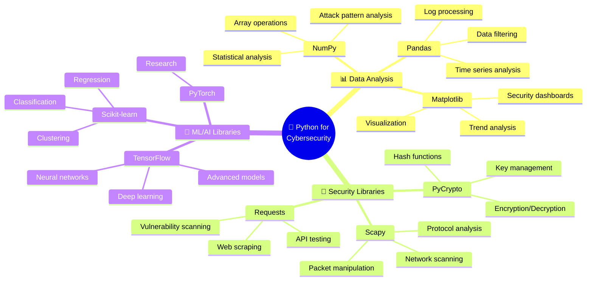

# Module 8: Generative Adversarial Networks (GANs) for Cyber Security

## 50-Slide Presentation Text

---

# Mermaid Diagrams cho CÁC MODULE CHÍNH của Khóa Học CSAI

Tôi sẽ tạo diagrams minh họa cho **tất cả các modules** (không chỉ Module 8):

---

## **MODULE 1: Introduction to Cyber Security AI**

### 1. AI, ML, DL Hierarchy & Applications

```mermaid
flowchart TB
    subgraph AI["🤖 Artificial Intelligence (Broadest)"]
        direction TB
        AI_DESC["Machines performing<br/>intelligent tasks"]
        
        subgraph ML["📊 Machine Learning (Subset of AI)"]
            ML_DESC["Learning from data<br/>without explicit programming"]
            
            subgraph DL["🧠 Deep Learning (Subset of ML)"]
                DL_DESC["Neural networks with<br/>multiple layers"]
                
                CNN["🖼️ CNN<br/>Image recognition<br/>Malware visualization"]
                RNN["🔄 RNN<br/>Sequence analysis<br/>Network traffic"]
                GAN["🎭 GAN<br/>Data generation<br/>Attack simulation"]
            end
            
            SVM["⚖️ SVM<br/>Binary classification<br/>Spam detection"]
            DT["🌳 Decision Tree<br/>Rule extraction<br/>Threat categorization"]
            RF["🌲 Random Forest<br/>Ensemble method<br/>Malware detection"]
        end
        
        NLP["💬 Natural Language Processing"]
        CV["👁️ Computer Vision"]
        RL["🎮 Reinforcement Learning"]
    end
    
    subgraph Apps["🔐 Cybersecurity Applications"]
        APP1["🛡️ Threat Detection<br/>Real-time monitoring"]
        APP2["🔍 Anomaly Detection<br/>Behavioral analysis"]
        APP3["🎯 Malware Analysis<br/>Classification & prediction"]
        APP4["📧 Email Security<br/>Spam & phishing"]
        APP5["🌐 Network Security<br/>Intrusion detection"]
    end
    
    CNN --> APP1
    RNN --> APP2
    SVM --> APP4
    DT --> APP3
    RF --> APP3
    GAN --> APP5
    
    style AI fill:#e8eaf6,stroke:#3f51b5,stroke-width:3px
    style ML fill:#e3f2fd,stroke:#1565c0,stroke-width:3px
    style DL fill:#e8f5e9,stroke:#2e7d32,stroke-width:3px
    style Apps fill:#fff3e0,stroke:#ef6c00,stroke-width:2px
```



---

### 2. Traditional vs AI-Powered Security

```mermaid
flowchart LR
    subgraph Trad["🔒 Traditional Security"]
        T1["📝 Rule-based<br/>Static signatures"]
        T2["👤 Manual analysis<br/>Human-dependent"]
        T3["⏱️ Slow response<br/>Hours to days"]
        T4["❌ Known threats only<br/>Miss zero-days"]
        T5["📉 Limited scale<br/>100s alerts/day"]
    end
    
    subgraph AI["🤖 AI-Powered Security"]
        A1["🧠 Behavior-based<br/>Pattern learning"]
        A2["⚡ Automated analysis<br/>Machine speed"]
        A3["🚀 Real-time response<br/>Milliseconds"]
        A4["✅ Unknown threats<br/>Anomaly detection"]
        A5["📈 Massive scale<br/>Millions events/sec"]
    end
    
    subgraph Challenge["⚠️ The Challenge"]
        C1["450K new malware daily"]
        C2["95% attacks via human error"]
        C3["$4.35M avg breach cost"]
        C4["3.5M unfilled security jobs"]
    end
    
    Challenge --> Trad
    Challenge --> AI
    
    Trad -->|"Can't handle"| FAIL["❌ Overwhelmed"]
    AI -->|"Addresses"| SUCCESS["✅ Effective Defense"]
    
    style Trad fill:#ffebee,stroke:#c62828,stroke-width:2px
    style AI fill:#e8f5e9,stroke:#2e7d32,stroke-width:3px
    style Challenge fill:#fff3e0,stroke:#ef6c00,stroke-width:2px
    style FAIL fill:#ffcdd2,stroke:#d32f2f,stroke-width:2px
    style SUCCESS fill:#c8e6c9,stroke:#388e3c,stroke-width:3px
```



---

## **MODULE 2: Python for Cybersecurity**

### 3. Python Cybersecurity Ecosystem



---
**Slide 1: Title Slide**

# Module 8: Generative Adversarial Networks (GANs) for Cyber Security

## AI-Driven Cyber Defense and Attack Techniques

### University Course: AI in Cybersecurity

*Suggested Image: Split-screen showing a digital brain (AI) and shield/sword (cybersecurity) with binary code background*

---

**Slide 2: Learning Objectives**

# Learning Objectives

By the end of this module, you will be able to:
• Understand the fundamental architecture of GANs
• Identify common Python libraries for GAN implementation
• Analyze network attacks using model substitution
• Evaluate IDS evasion techniques with GANs
• Assess facial recognition attack vectors
• Design defensive strategies against GAN-based threats

*Suggested Image: Bullseye target with arrows representing different learning goals*

---

**Slide 3: Module Overview**

# What We'll Cover Today

1. Introduction to Generative Adversarial Networks
2. GAN Architecture and Theory
3. Python Libraries for GAN Development
4. Network Attack via Model Substitution
5. IDS Evasion Techniques
6. Facial Recognition Attacks
7. Defense Strategies
8. Ethical Considerations

*Suggested Image: Roadmap or journey path with 8 milestone markers*

---

**Slide 4: The AI Revolution in Cybersecurity**

# The Changing Landscape

• Traditional cybersecurity: Rule-based, signature detection
• Modern threats: AI-powered, adaptive attacks
• The emergence of GANs: Double-edged sword
• 2024 statistics: 73% increase in AI-assisted cyberattacks
• The need for AI-powered defenses

*Suggested Image: Timeline showing evolution from traditional locks to AI-powered security systems*

---

**Slide 5: What is a GAN?**

# Generative Adversarial Networks: The Basics

A GAN consists of two neural networks competing in a zero-sum game:
• **Generator**: Creates fake data that mimics real data
• **Discriminator**: Distinguishes between real and fake data
• **Training Process**: Adversarial competition improves both networks
• **End Goal**: Generator produces data indistinguishable from real data

*Suggested Image: Two chess players facing each other, one labeled "Generator" and one "Discriminator"*

---

**Slide 6: The Counterfeiter Analogy**

# Understanding GANs Through Analogy

**The Counterfeiter (Generator):** • Tries to create perfect fake money
• Learns from detective's feedback
• Improves techniques over time

**The Detective (Discriminator):** • Examines money to spot fakes
• Gets better at detection with experience
• Provides feedback to improve skills

**The Result:** Both become experts in their domains

*Suggested Image: Split image showing counterfeiter with fake money and detective with magnifying glass*

---

**Slide 7: GAN Architecture Diagram**

# Basic GAN Architecture

```
Random Noise → Generator → Fake Data
                    ↓
Real Data → Discriminator ← Fake Data
     ↓           ↓
   Real      Fake/Real
 (Label)    (Classification)
```

The generator learns to fool the discriminator
The discriminator learns to detect fakes better

*Suggested Image: Technical diagram showing data flow between generator and discriminator components*

---

**Slide 8: Mathematical Foundation**

# The Math Behind GANs

**Objective Function:**

```
min_G max_D V(D,G) = E[log D(x)] + E[log(1-D(G(z)))]
```

**Where:** • x = real data samples
• z = random noise input
• G(z) = generated fake data
• D(x) = discriminator's probability that x is real
• The generator minimizes while discriminator maximizes

*Suggested Image: Mathematical equations on a blackboard with graphs showing optimization curves*

---

**Slide 9: Training Process**

# How GANs Learn

**Phase 1 - Train Discriminator:** • Feed real data (label: 1)
• Feed fake data from generator (label: 0)
• Update discriminator weights

**Phase 2 - Train Generator:** • Generate fake data
• Try to fool discriminator (want label: 1)
• Update generator weights based on discriminator feedback

**Repeat:** Until equilibrium is reached

*Suggested Image: Circular flow diagram showing alternating training phases*

---

**Slide 10: Types of GANs**

# GAN Variants Relevant to Cybersecurity

• **DCGAN**: Deep Convolutional GANs for images
• **StyleGAN**: High-quality face generation
• **CycleGAN**: Domain transfer (e.g., day to night)
• **Conditional GAN**: Controlled generation
• **Wasserstein GAN**: Improved training stability
• **Progressive GAN**: High-resolution image generation

*Suggested Image: Grid showing different GAN types with example outputs*

---

**Slide 11: Python Libraries Overview**

# Essential Python Libraries for GANs

**Deep Learning Frameworks:** • TensorFlow/Keras - Google's framework
• PyTorch - Facebook's framework
• JAX - Google's research framework

**Data Processing:** • NumPy - Numerical computing
• Pandas - Data manipulation
• OpenCV - Computer vision

**Visualization:** • Matplotlib - Plotting
• Seaborn - Statistical visualization

*Suggested Image: Python logo surrounded by library logos (TensorFlow, PyTorch, etc.)*

---

**Slide 12: TensorFlow for GANs**

# TensorFlow Implementation

```python
import tensorflow as tf
from tensorflow.keras import layers, models

# Generator model
def make_generator_model():
    model = tf.keras.Sequential()
    model.add(layers.Dense(7*7*256, use_bias=False, input_shape=(100,)))
    model.add(layers.BatchNormalization())
    model.add(layers.LeakyReLU())
    model.add(layers.Reshape((7, 7, 256)))
    # Additional layers...
    return model
```

*Suggested Image: Code editor screenshot with TensorFlow GAN implementation*

---

**Slide 13: PyTorch for GANs**

# PyTorch Implementation

```python
import torch
import torch.nn as nn

class Generator(nn.Module):
    def __init__(self, nz=100, ngf=64, nc=3):
        super(Generator, self).__init__()
        self.main = nn.Sequential(
            nn.ConvTranspose2d(nz, ngf * 8, 4, 1, 0, bias=False),
            nn.BatchNorm2d(ngf * 8),
            nn.ReLU(True),
            # Additional layers...
        )
```

*Suggested Image: PyTorch logo with neural network visualization*

---

**Slide 14: Specialized GAN Libraries**

# Specialized Tools and Libraries

**High-level Frameworks:** • **TensorFlow Hub** - Pre-trained models
• **Hugging Face** - Transformer-based models
• **NVIDIA StyleGAN** - State-of-the-art face generation
• **OpenAI GPT models** - Text generation

**Utilities:** • **Pillow (PIL)** - Image processing
• **scikit-learn** - Machine learning utilities
• **matplotlib** - Visualization

*Suggested Image: Collection of tool icons representing different specialized libraries*

---

**Slide 15: Development Environment Setup**

# Setting Up Your GAN Development Environment

**Requirements:**

```bash
pip install tensorflow>=2.8.0
pip install torch torchvision
pip install numpy pandas matplotlib
pip install opencv-python pillow
pip install scikit-learn seaborn
```

**Hardware Recommendations:** • GPU with 8GB+ VRAM (NVIDIA preferred)
• 16GB+ RAM
• Fast SSD storage

*Suggested Image: Computer setup with multiple monitors showing code and GPU specifications*

---

**Slide 16: Model Substitution Attack Theory**

# Network Attack via Model Substitution

**Core Concept:** Create a substitute model that mimics the target system's behavior, then use it to craft attacks.

**Why It Works:** • Many ML models have similar decision boundaries
• Adversarial examples often transfer between models
• Black-box systems can be probed and replicated

**Attack Vector:** Exploit the transferability of adversarial examples

*Suggested Image: Diagram showing original model being copied/substituted with arrows indicating attack flow*

---

**Slide 17: Model Substitution Process**

# The Attack Process - Step by Step

1. **Query Phase:** Send inputs to target system, collect responses
2. **Training Phase:** Train substitute model on collected data
3. **Generation Phase:** Create adversarial examples using substitute
4. **Transfer Phase:** Apply adversarial examples to original system
5. **Validation Phase:** Verify attack success

**Key Insight:** Substitute doesn't need to be perfect, just similar enough

*Suggested Image: Flowchart showing 5-step process with icons for each phase*

---

**Slide 18: Query Strategy**

# Efficient Querying Techniques

**Random Sampling:** • Send random inputs to explore decision space
• Good for initial exploration
• May miss important regions

**Active Learning:** • Query regions where substitute is uncertain
• More efficient use of query budget
• Focuses on decision boundaries

**Gradient-based Querying:** • Use substitute model gradients to guide queries
• Targets areas likely to transfer

*Suggested Image: 3D visualization showing different sampling strategies on a decision surface*

---

**Slide 19: Real-World Example - Cloud API Attack**

# Case Study: Attacking Cloud Vision APIs

**Scenario:** Target a cloud-based image classification service

**Attack Process:**

1. Query API with diverse image dataset
2. Train local CNN on query results
3. Generate adversarial images using local model
4. Test adversarial images against original API

**Success Rate:** Studies show 80%+ transferability **Cost:** Under $20 in API calls for effective attack

*Suggested Image: Cloud infrastructure diagram with attacker laptop connected via API calls*

---

**Slide 20: Model Substitution Defense**

# Defending Against Model Substitution

**Query Limiting:** • Rate limiting per user/IP
• Maximum queries per time period
• Unusual query pattern detection

**Output Randomization:** • Add controlled noise to predictions
• Return top-K predictions instead of single answer
• Confidence score thresholding

**Query Analysis:** • Monitor for systematic exploration
• Detect artificial/adversarial inputs

*Suggested Image: Shield with multiple layers representing different defense mechanisms*

---

**Slide 21: IDS Evasion Introduction**

# Intrusion Detection Systems and GANs

**Traditional IDS:** • Rule-based pattern matching
• Statistical anomaly detection
• Machine learning classifiers

**GAN Threat:** • Generate malicious traffic that appears normal
• Learn legitimate traffic patterns
• Create adversarial network packets

**Impact:** Up to 90% evasion rates reported in research

*Suggested Image: Network diagram showing IDS being bypassed by GAN-generated traffic*

---

**Slide 22: How IDS Evasion Works**

# GAN-Based IDS Evasion Process

1. **Data Collection:** Gather legitimate network traffic samples
2. **GAN Training:** Train generator to produce realistic traffic
3. **Payload Injection:** Embed malicious content in realistic packets
4. **Optimization:** Fine-tune to minimize IDS detection probability
5. **Deployment:** Use generated traffic for actual attacks

**Key Challenge:** Maintaining attack functionality while evading detection

*Suggested Image: Step-by-step diagram showing traffic transformation from malicious to evasive*

---

**Slide 23: Network Traffic Features**

# Understanding Network Packet Features

**Header Information:** • Source/Destination IP addresses
• Port numbers
• Protocol types (TCP, UDP, ICMP)
• Packet size and timing

**Payload Characteristics:** • Content patterns
• Entropy levels
• String frequencies
• Byte distributions

**Behavioral Patterns:** • Communication flow
• Connection duration
• Request-response timing

*Suggested Image: Packet header diagram with highlighted fields used by IDS*

---

**Slide 24: GAN Architecture for Traffic Generation**

# Network Traffic GAN Design

```python
class TrafficGenerator(nn.Module):
    def __init__(self, noise_dim=100, output_dim=41):
        super().__init__()
        self.network = nn.Sequential(
            nn.Linear(noise_dim, 256),
            nn.ReLU(),
            nn.Linear(256, 512),
            nn.ReLU(),
            nn.Linear(512, output_dim),
            nn.Tanh()
        )
```

**Features:** 41-dimensional vectors representing packet characteristics

*Suggested Image: Neural network architecture diagram for traffic generation*

---

**Slide 25: Training for IDS Evasion**

# Training Process for Evasive Traffic

**Multi-objective Loss Function:**

```python
total_loss = gan_loss + lambda * ids_loss + gamma * functionality_loss
```

**Components:** • **GAN Loss:** Fool the discriminator
• **IDS Loss:** Evade the target IDS
• **Functionality Loss:** Maintain attack payload effectiveness

**Balance:** Must optimize all three objectives simultaneously

*Suggested Image: Graph showing multi-objective optimization with three loss curves*

---

**Slide 26: IDS Evasion Examples**

# Real-World IDS Evasion Scenarios

**Botnet Communication:** • Hide command-and-control traffic
• Mimic legitimate web browsing
• Use common ports and protocols

**Data Exfiltration:** • Disguise stolen data as normal uploads
• Fragment large transfers
• Use steganography techniques

**Malware Delivery:** • Hide malicious payloads in normal traffic
• Mimic software update processes

*Suggested Image: Network topology showing hidden malicious traffic flowing alongside legitimate traffic*

---

**Slide 27: Advanced IDS Evasion Techniques**

# Sophisticated Evasion Methods

**Temporal Evasion:** • Spread attacks over extended time periods
• Match normal traffic timing patterns
• Avoid burst detection algorithms

**Protocol Mimicry:** • Generate traffic matching specific applications
• HTTP, HTTPS, DNS tunneling
• Custom protocol implementation

**Statistical Matching:** • Ensure generated traffic matches legitimate statistics
• Packet size distributions
• Inter-arrival time patterns

*Suggested Image: Time-series graph showing normal vs. evasive traffic patterns*

---

**Slide 28: IDS Defense Strategies**

# Defending Against GAN-based IDS Evasion

**Ensemble Detection:** • Multiple IDS with different approaches
• Voting systems for final decisions
• Reduced single-point-of-failure risk

**Adversarial Training:** • Train IDS on GAN-generated adversarial examples
• Continuous model updates
• Improved robustness to evasion

**Behavioral Analysis:** • Focus on long-term patterns
• Multi-layer correlation
• Context-aware detection

*Suggested Image: Multi-layered defense system diagram with different detection mechanisms*

---

**Slide 29: Facial Recognition Systems**

# Understanding Face Recognition Technology

**Core Components:** • Face detection and alignment
• Feature extraction (embeddings)
• Similarity matching
• Decision thresholds

**Applications:** • Access control systems
• Border security
• Mobile device unlocking
• Surveillance systems

**Vulnerabilities:** Susceptible to various GAN-based attacks

*Suggested Image: Face recognition system pipeline showing detection, extraction, and matching steps*

---

**Slide 30: Types of Face Recognition Attacks**

# GAN-Based Face Recognition Attacks

**Face Morphing:** • Blend multiple faces into one
• Fool systems expecting any source face
• Used for identity document fraud

**Face Synthesis:** • Generate completely fake faces
• Create non-existent identities
• Bypass training data dependencies

**Adversarial Faces:** • Subtle modifications to real faces
• Cause misclassification
• Often imperceptible to humans

*Suggested Image: Three-panel image showing original face, morphed face, and adversarial face*

---

**Slide 31: Face Morphing Attacks**

# Deep Dive: Face Morphing

**Process:**

1. Extract facial landmarks from source faces
2. Align faces in common coordinate system
3. Blend features using weighted averaging
4. Generate final morphed image

**Mathematical Approach:**

```python
morphed_face = alpha * face1 + (1-alpha) * face2
```

**Attack Success:** Up to 95% acceptance rate in some systems

*Suggested Image: Step-by-step morphing process showing facial alignment and blending*

---

**Slide 32: StyleGAN for Face Generation**

# Using StyleGAN for Face Attacks

**StyleGAN Advantages:** • High-quality, realistic face generation
• Style transfer capabilities
• Latent space manipulation
• Fine-grained control over features

**Attack Applications:** • Create synthetic identities
• Generate passport photos
• Modify existing faces subtly
• Age/ethnicity transformation

*Suggested Image: Grid of StyleGAN-generated faces with various modifications*

---

**Slide 33: Deepfake Technology**

# Deepfakes and Face Swapping

**Deepfake Process:**

1. Collect training images/videos
2. Train autoencoder networks
3. Swap face encodings
4. Generate realistic face swaps

**Cybersecurity Implications:** • CEO fraud (voice + video)
• Social engineering attacks
• Impersonation for system access
• Fake evidence creation

*Suggested Image: Before/after comparison showing deepfake face swap*

---

**Slide 34: Adversarial Face Examples**

# Creating Adversarial Faces

**Technique:** Add imperceptible noise to fool recognition systems

**Methods:** • Gradient-based optimization
• Evolutionary algorithms
• GAN-based generation

**Physical World Attacks:** • Printed adversarial faces
• Digital display attacks
• Makeup-based modifications

**Success Rate:** 70-90% depending on target system

*Suggested Image: Side-by-side comparison of normal face and adversarial face with highlighted differences*

---

**Slide 35: Physical Adversarial Attacks**

# Real-World Face Recognition Bypass

**Adversarial Glasses:** • Specially designed eyewear
• Causes misidentification
• Works against commercial systems

**Makeup Attacks:** • Strategic use of cosmetics
• Fool both human and AI recognition
• Difficult to detect

**3D Printed Faces:** • Physical masks created from GANs
• Bypass liveness detection
• Used in high-stakes fraud

*Suggested Image: Person wearing adversarial glasses or makeup that fools face recognition*

---

**Slide 36: Case Study - Border Security**

# Real-World Scenario: Airport Security Breach

**Attack Scenario:** • Criminal obtains legitimate passport photo
• Uses GAN to morph their face with passport holder
• Creates fake document with morphed photo
• Successfully passes automated border control

**Impact Assessment:** • Compromised national security
• Identity theft implications
• System trust erosion

**Detection Challenges:** Current systems not designed for morphed faces

*Suggested Image: Airport security checkpoint with face recognition scanners*

---

**Slide 37: Corporate Access Control Attack**

# Case Study: Corporate Impersonation

**Attack Vector:** • Social engineer targets company executive
• Creates deepfake video for video calls
• Tricks employees into revealing credentials
• Gains unauthorized system access

**Technical Process:**

1. Collect target's photos/videos from social media
2. Train deepfake model
3. Create real-time face swap system
4. Conduct convincing video calls

**Defense Gap:** Most systems rely solely on visual identification

*Suggested Image: Video call interface showing deepfake impersonation of executive*

---

**Slide 38: Liveness Detection**

# Defending with Liveness Detection

**Purpose:** Verify that input comes from living person

**Techniques:** • Eye blink detection
• Head movement requirements
• Skin texture analysis
• Pulse detection via camera
• 3D depth mapping

**Limitations:** Advanced GANs can simulate many liveness indicators

**Evolution:** Arms race between detection and generation

*Suggested Image: Liveness detection interface showing eye tracking and movement requirements*

---

**Slide 39: Multi-Modal Authentication**

# Comprehensive Defense Strategies

**Multi-Factor Biometrics:** • Facial recognition + voice recognition
• Fingerprint + iris scanning
• Behavioral biometrics (typing patterns)

**Contextual Verification:** • Location-based authentication
• Device recognition
• Time-based access controls
• Network behavior analysis

**Human-in-the-Loop:** • Manual verification for high-risk transactions
• Secondary approval processes

*Suggested Image: Multi-layered security system showing various biometric modalities*

---

**Slide 40: Deepfake Detection Systems**

# Automated Deepfake Detection

**Detection Approaches:** • Temporal inconsistency analysis
• Physiological impossibility detection
• Compression artifact analysis
• Frequency domain analysis

**Machine Learning Methods:** • CNN-based classifiers
• Transformer architectures
• Ensemble methods
• Adversarial training

**Challenges:** Detection arms race with generation technology

*Suggested Image: AI system analyzing video frames for deepfake indicators*

---

**Slide 41: Ethical Considerations**

# The Ethics of GAN Technology

**Legitimate Uses:** • Security research and testing
• Privacy-preserving data generation
• Art and creative applications
• Medical training data synthesis

**Harmful Applications:** • Non-consensual deepfakes
• Identity theft and fraud
• Disinformation campaigns
• Bypassing security systems

**Responsibility:** Developers must consider potential misuse

*Suggested Image: Balance scale showing beneficial vs. harmful uses of GAN technology*

---

**Slide 42: Legal Implications**

# Legal and Regulatory Landscape

**Current Laws:** • Identity theft statutes
• Computer fraud laws
• Privacy regulations (GDPR, CCPA)
• Emerging deepfake-specific legislation

**Challenges:** • Technology outpacing regulation
• Cross-border enforcement issues
• Evidence authenticity questions
• Attribution difficulties

**Future Trends:** Stricter regulations on synthetic media

*Suggested Image: Gavel and scales of justice with digital/AI elements*

---

**Slide 43: Detection Arms Race**

# The Ongoing Battle: Detection vs. Generation

**Generation Improvements:** • Higher quality outputs
• Faster training methods
• Better style transfer
• Reduced artifacts

**Detection Advances:** • More sophisticated analysis
• Real-time detection systems
• Ensemble approaches
• Cross-modal verification

**Prediction:** Neither side will achieve permanent advantage

*Suggested Image: Chess board with AI pieces representing the ongoing strategic battle*

---

**Slide 44: Industry Response**

# How Industry is Responding

**Technology Companies:** • Content authenticity initiatives
• Deepfake detection tools
• Platform policy updates
• Research partnerships

**Security Vendors:** • AI-powered detection systems
• Behavioral analysis tools
• Risk assessment platforms
• Continuous monitoring solutions

**Standards Organizations:** • Authentication protocols
• Best practice guidelines
• Certification programs

*Suggested Image: Corporate logos of major tech companies working on detection*

---

**Slide 45: Best Practices for Organizations**

# Organizational Defense Strategies

**Policy Framework:** • Clear AI usage guidelines
• Incident response procedures
• Employee training programs
• Vendor security requirements

**Technical Controls:** • Multi-layered authentication
• Behavioral monitoring
• Anomaly detection systems
• Regular security assessments

**Human Factors:** • Security awareness training
• Verification procedures
• Skeptical mindset cultivation

*Suggested Image: Corporate security framework diagram with policy, technical, and human elements*

---

**Slide 46: Future Threats**

# Emerging GAN-Based Threats

**Next-Generation Attacks:** • Real-time deepfakes
• Voice + face synthesis
• Behavioral pattern mimicry
• Cross-modal attacks (audio-visual)

**Sophistication Trends:** • Reduced training data requirements
• Faster generation speeds
• Better physical world attacks
• Improved evasion techniques

**Preparation:** Proactive defense development needed

*Suggested Image: Futuristic cityscape with various AI threat vectors illustrated*

---

**Slide 47: Research Directions**

# Current Research Frontiers

**Detection Research:** • Provenance tracking systems
• Blockchain-based authenticity
• Quantum-resistant detection
• Biological signal analysis

**Defense Mechanisms:** • Adversarial training improvements
• Federated learning for detection
• Zero-shot detection methods
• Explainable AI for security

**Academic-Industry Collaboration:** Essential for staying ahead

*Suggested Image: Research laboratory with scientists working on AI detection systems*

---

**Slide 48: Career Implications**

# Skills for Cybersecurity Professionals

**Technical Skills:** • Deep learning frameworks
• Computer vision techniques
• Statistical analysis methods
• Programming proficiency (Python, R)

**Security Skills:** • Threat modeling
• Risk assessment
• Incident response
• Forensic analysis

**Soft Skills:** • Critical thinking
• Continuous learning
• Communication
• Ethical reasoning

*Suggested Image: Professional development roadmap with various skill areas*

---

**Slide 49: Key Takeaways**

# Critical Points to Remember

• GANs represent both opportunity and threat in cybersecurity
• Defense requires multi-layered approaches
• Technology evolves rapidly - stay informed
• Ethical considerations are paramount
• Human factors remain crucial
• Collaboration across industry is essential
• Continuous learning and adaptation required

*Suggested Image: Light bulb with key concepts radiating outward*

---

**Slide 50: Next Steps and Resources**

# Continuing Your GAN Security Journey

**Immediate Actions:** • Set up development environment
• Practice with basic GAN implementations
• Study current research papers
• Join security communities

**Resources:** • arXiv.org for latest research
• GitHub repositories with code examples
• Security conferences (Black Hat, DEF CON)
• Academic courses and certifications

**Assignment:** Implement a simple GAN for network traffic generation

*Suggested Image: Path forward with milestones and resource icons*

---

This comprehensive 50-slide presentation provides detailed coverage of Module 8, with specific image suggestions for each slide to help create an engaging visual presentation. Each slide builds upon the previous concepts while providing practical examples and real-world applications.


