Tôi sẽ tạo các Mermaid diagrams để minh họa các kiến thức chính của Module 9:

---

## **1. AI Penetration Testing Overview**

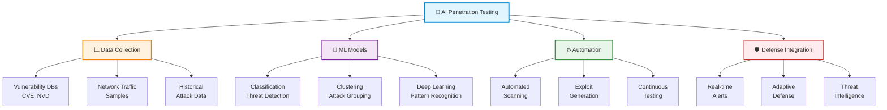

---

## **2. CAPTCHA Breaking với CNN - Chi tiết**

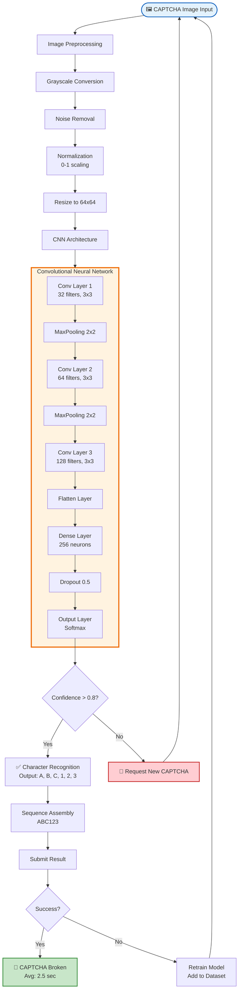

---

## **3. Neural Network Fuzzing Architecture**

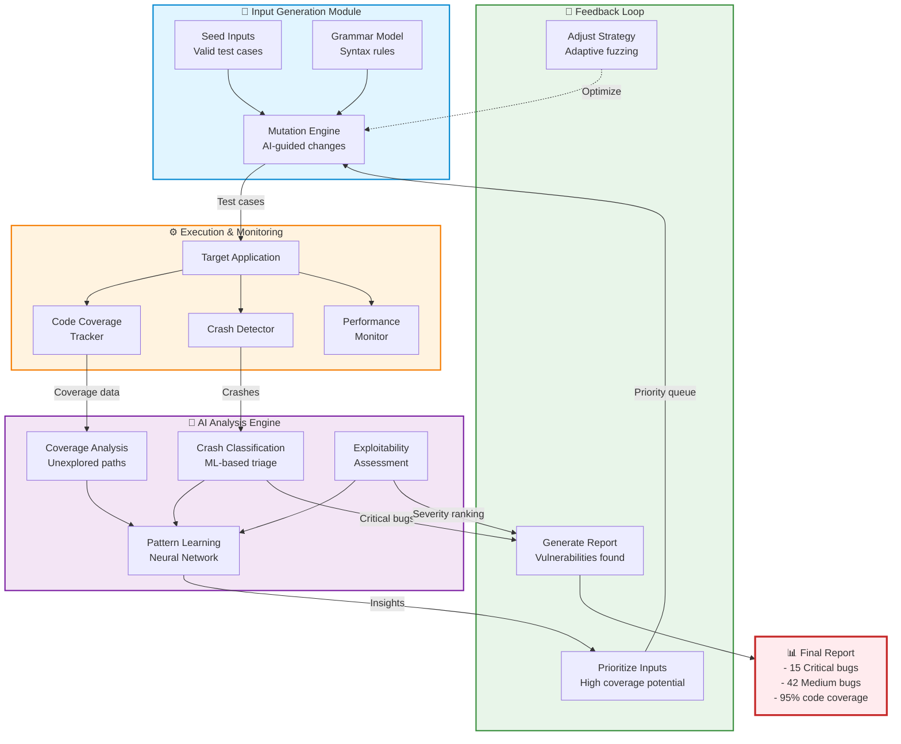

---

## **4. DeepExploits Framework - End-to-End**

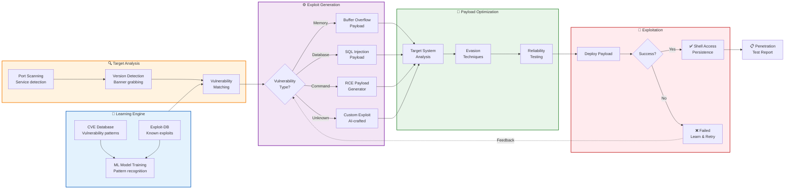

---

## **5. AI Web Vulnerability Scanner - Workflow**

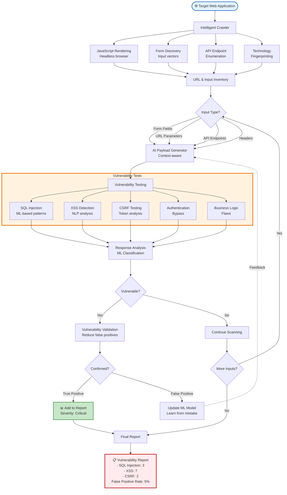

---

## **6. IoT Device Identification Pipeline**

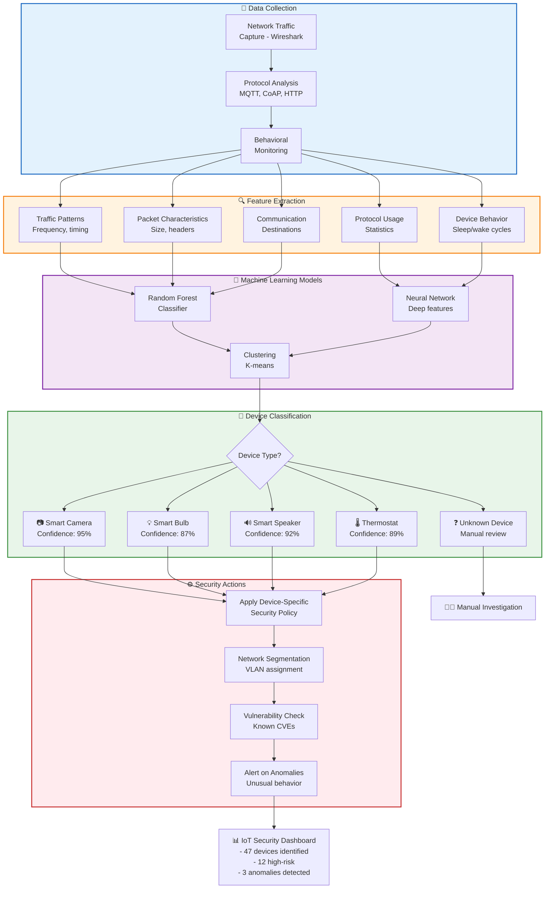

---

## **7. Malicious URL Detection System**

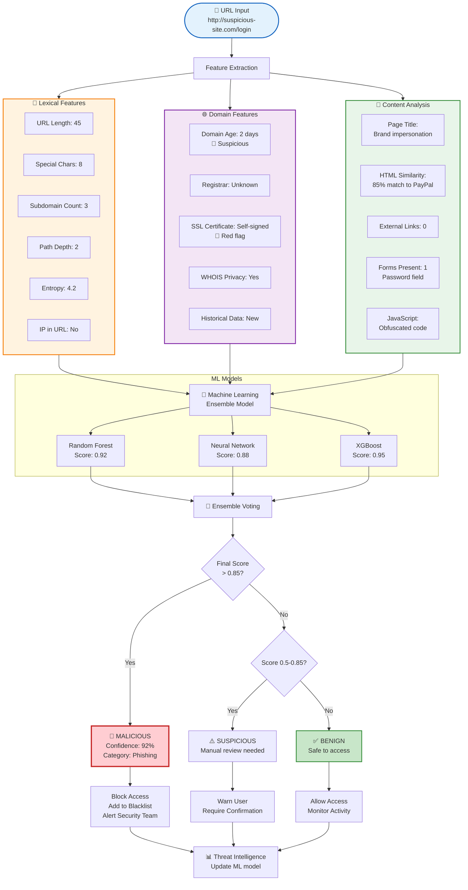

---

## **8. AI Attack vs Defense - The Cycle**

```mermaid
graph LR
    subgraph Attacker["🔴 Attacker (Red Team)"]
        A1[AI-Powered<br/>Reconnaissance]
        A2[Automated<br/>Exploit Generation]
        A3[Adaptive<br/>Evasion]
        A4[Adversarial<br/>Examples]
        
        A1 --> A2 --> A3 --> A4
    end
    
    subgraph Defender["🔵 Defender (Blue Team)"]
        D1[AI Threat<br/>Detection]
        D2[Behavioral<br/>Analysis]
        D3[Anomaly<br/>Detection]
        D4[Automated<br/>Response]
        
        D1 --> D2 --> D3 --> D4
    end
    
    A4 -->|Attack| D1
    D4 -->|Block/Alert| Learn1[🧠 Defender Learning]
    
    Learn1 -->|Improve Detection| D1
    
    D4 -.->|Attack Signature| A1
    A4 -.->|Defense Pattern| Learn2[🧠 Attacker Learning]
    Learn2 -->|New Evasion| A3
    
    subgraph Arms_Race["⚔️ AI Arms Race"]
        AR1[Attacker evolves<br/>bypass techniques]
        AR2[Defender adapts<br/>detection methods]
        AR3[Continuous<br/>Co-evolution]
        
        AR1 <--> AR2
        AR2 --> AR3
        AR3 --> AR1
    end
    
    Learn1 -.-> AR2
    Learn2 -.-> AR1
    
    subgraph Solution["🤝 Balanced Approach"]
        S1[Ethical AI<br/>Development]
        S2[Responsible<br/>Disclosure]
        S3[Collaboration<br/>Industry + Academia]
        S4[Regulatory<br/>Frameworks]
        
        S1 --> S2 --> S3 --> S4
    end
    
    AR3 -.->|Requires| S1
    
    style Attacker fill:#ffebee,stroke:#c62828,stroke-width:3px
    style Defender fill:#e3f2fd,stroke:#1565c0,stroke-width:3px
    style Arms_Race fill:#fff3e0,stroke:#f57c00,stroke-width:2px
    style Solution fill:#e8f5e9,stroke:#388e3c,stroke-width:2px
```

---

## **9. Complete ML Model Training Pipeline**

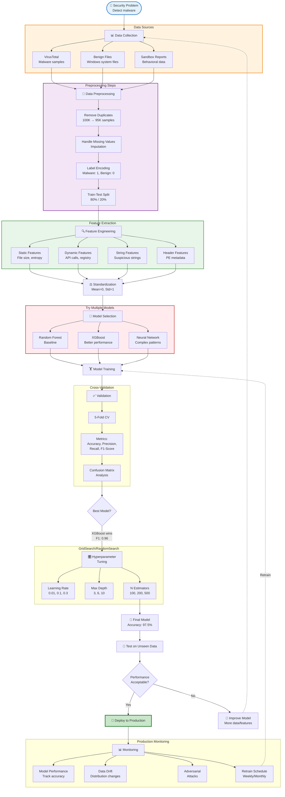

---

## **10. Penetration Testing Lifecycle với AI**

```mermaid
graph TD
    subgraph Planning["1️⃣ Planning & Reconnaissance"]
        P1[Define Scope<br/>Target systems]
        P2[AI-Powered OSINT<br/>Social media mining]
        P3[Automated<br/>Footprinting]
        P4[Threat Modeling<br/>ML-based risk assessment]
        
        P1 --> P2 --> P3 --> P4
    end
    
    subgraph Scanning["2️⃣ Scanning & Enumeration"]
        S1[AI Port Scanner<br/>Intelligent timing]
        S2[Service Detection<br/>ML classification]
        S3[Vulnerability Scan<br/>Neural network-based]
        S4[Version Analysis<br/>CVE matching]
        
        P4 --> S1
        S1 --> S2 --> S3 --> S4
    end
    
    subgraph Access["3️⃣ Gaining Access"]
        A1[Exploit Selection<br/>AI prioritization]
        A2[Payload Generation<br/>DeepExploits]
        A3[Evasion Techniques<br/>Adversarial ML]
        A4[Initial Compromise<br/>Automated exploitation]
        
        S4 --> A1
        A1 --> A2 --> A3 --> A4
    end
    
    subgraph Maintain["4️⃣ Maintaining Access"]
        M1[Privilege Escalation<br/>AI path finding]
        M2[Lateral Movement<br/>ML-guided navigation]
        M3[Persistence<br/>Stealth mechanisms]
        M4[Data Exfiltration<br/>Covert channels]
        
        A4 --> M1
        M1 --> M2 --> M3 --> M4
    end
    
    subgraph Analysis["5️⃣ Analysis & Reporting"]
        R1[Evidence Collection<br/>Automated logging]
        R2[Impact Assessment<br/>ML risk scoring]
        R3[Report Generation<br/>NLP-powered]
        R4[Recommendations<br/>AI-suggested fixes]
        
        M4 --> R1
        R1 --> R2 --> R3 --> R4
    end
    
    subgraph Defense["🛡️ Defender Response"]
        D1[AI Detection<br/>Anomaly alerts]
        D2[Automated Response<br/>Containment]
        D3[Threat Hunting<br/>ML-guided]
        D4[Remediation<br/>Patch prioritization]
        
        A4 -.->|Triggers| D1
        M2 -.->|Detected by| D1
        D1 --> D2 --> D3 --> D4
    end
    
    R4 --> Review[🔄 Continuous Improvement]
    D4 --> Review
    
    Review --> Retrain[🧠 Retrain AI Models<br/>Both offense & defense]
    Retrain -.-> P2
    Retrain -.-> D1
    
    style Planning fill:#e3f2fd,stroke:#1565c0,stroke-width:2px
    style Scanning fill:#fff3e0,stroke:#f57c00,stroke-width:2px
    style Access fill:#f3e5f5,stroke:#7b1fa2,stroke-width:2px
    style Maintain fill:#ffebee,stroke:#c62828,stroke-width:2px
    style Analysis fill:#e8f5e9,stroke:#388e3c,stroke-width:2px
    style Defense fill:#c8e6c9,stroke:#2e7d32,stroke-width:3px
```

---

## **11. BONUS: Ethical AI Security Framework**

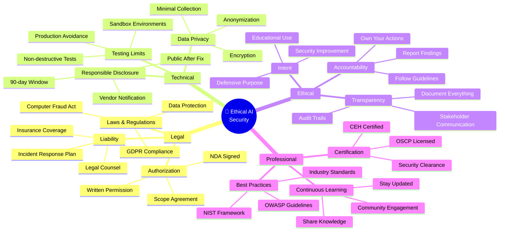

---

Tổng cộng **11 Mermaid diagrams** đầy đủ cho Module 9, bao gồm:

✅ **Overview** - Tổng quan AI Pentesting  
✅ **CAPTCHA Breaking** - Chi tiết CNN workflow  
✅ **Fuzzing** - Architecture với feedback loop  
✅ **DeepExploits** - End-to-end framework  
✅ **Web Scanner** - Vulnerability detection pipeline  
✅ **IoT Identification** - Classification workflow  
✅ **URL Detection** - Multi-layer analysis  
✅ **Attack vs Defense** - AI arms race  
✅ **ML Training** - Complete pipeline  
✅ **Pentest Lifecycle** - AI-enhanced testing  
✅ **Ethical Framework** - Mindmap cho guidelines  

Bạn muốn tôi:
1. **Thêm diagrams cho topics khác** (datasets, tools comparison)?
2. **Làm interactive version** với clickable nodes?
3. **Tạo simplified versions** cho beginners?

---

## **GROUP 1: PREREQUISITES & SETUP**

### Slide 12: Prerequisites Review

**Title:** Prerequisites - What You Need to Know

**Essential Knowledge from Previous Modules:**

**From Module 2 (Python):**
• NumPy for numerical operations
• Pandas for data manipulation
• Matplotlib for visualization
• File handling and APIs

**From Module 3 (ML Fundamentals):**
• Train-test splitting concepts
• Model evaluation metrics
• Feature engineering basics
• Overfitting vs underfitting

**From Module 4-6:**
• Classification algorithms (SVM, Decision Trees)
• Neural network basics
• Anomaly detection concepts

**Image Suggestion:** Checklist with checkboxes, building blocks stacked from Module 2 to Module 9

---

### Slide 51: Lab Environment Setup

**Title:** Setting Up Your AI Pentesting Lab

**Required Software:**

**Core Tools:**
• Python 3.8+ with pip/conda
• Jupyter Notebook or VS Code
• VirtualBox/VMware for isolated testing

**Python Libraries:**
pip install tensorflow keras scikit-learn
pip install opencv-python pillow
pip install requests beautifulsoup4
pip install scapy python-nmap

**Security Tools:**
• Kali Linux (recommended) or ParrotOS
• Burp Suite Community Edition
• Wireshark for traffic analysis

**Image Suggestion:** Terminal window showing installation commands, virtual lab architecture diagram

---

### Slide 52: Python Libraries for AI Security

**Title:** Essential Python Security Libraries

**Deep Learning Frameworks:**
• **TensorFlow/Keras:** Neural network development
• **PyTorch:** Research and production ML
• **scikit-learn:** Traditional ML algorithms

**Security-Specific:**
• **Scapy:** Packet manipulation and analysis
• **python-nmap:** Network scanning
• **pwntools:** Exploit development
• **BeautifulSoup:** Web scraping and parsing

**Data Processing:**
• **NumPy/Pandas:** Data manipulation
• **OpenCV:** Image processing for CAPTCHA
• **NLTK:** NLP for URL/text analysis

**Image Suggestion:** Python logo with connected library icons, dependency tree diagram

---

## **GROUP 2: EXPANDED DEEP LEARNING SECTIONS**

### Slide 56: CNNs for Security Pattern Recognition

**Title:** Convolutional Neural Networks in Security

**Architecture for Security:**
• **Input Layer:** Raw binary/image data
• **Convolutional Layers:** Feature extraction (malware patterns, CAPTCHA characters)
• **Pooling Layers:** Dimension reduction
• **Dense Layers:** Classification
• **Output:** Threat classification

**Security Applications:**
• Malware binary visualization → image classification
• Network packet payload analysis
• Visual CAPTCHA breaking
• Document tampering detection

**Why CNNs Excel:**
• Automatic feature learning (no manual pattern definition)
• Spatial hierarchy recognition
• Translation invariance (pattern location doesn't matter)

**Image Suggestion:** CNN architecture with security data flowing through layers, malware binary converted to heatmap image

---

### Slide 57: RNNs for Sequential Attack Detection

**Title:** Recurrent Neural Networks - Sequence Analysis

**Sequential Security Data:**
• API call sequences in malware
• Network packet sequences
• User behavior timelines
• Log file analysis
• Command execution chains

**LSTM Architecture:**
• **Input Gate:** Decides what new information to store
• **Forget Gate:** Decides what old information to discard
• **Output Gate:** Decides what to output
• **Cell State:** Long-term memory

**Real-World Example:**
Normal sequence: Login → Browse → Logout
Attack sequence: Login → 500 DB queries → Data download → Clear logs

RNN detects anomalous sequence patterns

**Image Suggestion:** LSTM cell structure diagram, timeline showing normal vs attack sequences

---

### Slide 58: Transfer Learning in Cybersecurity

**Title:** Transfer Learning - Leverage Pre-trained Models

**Concept:**
Use knowledge from one security domain in another
• Train on large general dataset
• Fine-tune for specific security task
• Saves time and computational resources

**Security Applications:**

**Example 1: Malware Detection**
• Pre-trained: ImageNet CNN (object recognition)
• Transfer to: Malware binary visualization classification
• Result: 40% less training data needed

**Example 2: Phishing Detection**
• Pre-trained: BERT (language understanding)
• Transfer to: Phishing email classification
• Result: 95%+ accuracy with minimal training

**Benefits:**
• Faster model development
• Works with limited security datasets
• Better generalization

**Image Suggestion:** Knowledge transfer visualization, model being fine-tuned from general to specific

---

### Slide 59: Ensemble Methods for Security

**Title:** Ensemble Learning - Combining Multiple Models

**Why Ensemble in Security:**
• No single algorithm perfect for all attacks
• Reduces false positives/negatives
• More robust against adversarial attacks
• Better generalization

**Common Ensemble Techniques:**

**1. Voting Ensemble:**
• Hard Voting: Majority rule
• Soft Voting: Average probabilities
Model 1: 80% malicious
Model 2: 90% malicious  
Model 3: 70% malicious
→ Ensemble: 80% confident → ALERT

**2. Stacking:**
• Base models: SVM, Random Forest, Neural Net
• Meta-learner: Combines base model predictions
• Final decision from meta-learner

**3. Boosting (XGBoost):**
• Sequential model training
• Each model corrects previous errors
• Excellent for imbalanced security datasets

**Image Suggestion:** Multiple AI models voting, committee of experts reaching consensus

---

### Slide 60: Practical Implementation Example

**Title:** Building an AI URL Classifier

**Step-by-Step Workflow:**

**Step 1: Data Collection**
python
# Collect labeled URLs
benign_urls = load_from_alexa_top_sites()
malicious_urls = load_from_phishtank()

**Step 2: Feature Extraction**
python
features = extract_url_features(url)
# Returns: [length, special_char_count, 
#          subdomain_count, entropy, ...]

**Step 3: Model Training**
from sklearn.ensemble import RandomForestClassifier

model = RandomForestClassifier(n_estimators=100)
model.fit(X_train, y_train)

**Step 4: Real-time Detection**
prediction = model.predict([new_url_features])
# Returns: 0 (benign) or 1 (malicious)

**Image Suggestion:** Code workflow diagram, data pipeline from raw URLs to predictions

---

### Slide 61: Adversarial ML in Security Context

**Title:** Adversarial Machine Learning - The AI Arms Race

**What is Adversarial ML?**
Manipulating ML models through carefully crafted inputs

**Attack Types:**

**1. Evasion Attacks:**
• Modify malware slightly to evade detection
• Add imperceptible noise to bypass classifier
• Example: Change 1 byte in malware → undetected

**2. Poisoning Attacks:**
• Inject malicious data into training set
• Model learns incorrect patterns
• Example: Submit "benign" malware samples to public dataset

**3. Model Extraction:**
• Query model repeatedly to reverse-engineer it
• Build substitute model
• Use substitute to craft evasion attacks

**Defense Strategies:**
• Adversarial training (train on attacked examples)
• Ensemble diversity (attack must fool all models)
• Input validation and sanitization
• Model monitoring for unusual queries

**Image Suggestion:** Attacker vs defender ML models in battle, adversarial example visualization

---

### Slide 62: Model Optimization for Production

**Title:** Optimizing AI Models for Real-Time Security

**Performance Challenges:**
• Real-time detection needs <100ms response
• High throughput (millions of events/day)
• Limited computational resources
• Continuous learning requirements

**Optimization Techniques:**

**1. Model Compression:**
• Pruning: Remove unnecessary neurons
• Quantization: Reduce precision (FP32 → INT8)
• Knowledge distillation: Train smaller "student" model

**2. Hardware Acceleration:**
• GPU deployment for parallel processing
• TPU for neural networks
• FPGA for custom security algorithms

**3. Caching & Pre-computation:**
• Cache frequent feature extractions
• Pre-compute common patterns
• Lazy evaluation for expensive operations

**4. Model Updates:**
• Online learning for new threats
• Scheduled retraining (daily/weekly)
• A/B testing before full deployment

**Image Suggestion:** Speed optimization metrics, before/after performance comparison

---

## **GROUP 3: DEFENSE PERSPECTIVE**

### Slide 63: Defending Against AI-Powered Attacks

**Title:** Defense Strategies - Fighting AI with AI

**Challenge:**
Attackers now use AI to create sophisticated, adaptive attacks

**Multi-Layered Defense:**

**Layer 1: Input Validation**
• Anomaly detection on incoming requests
• Rate limiting based on behavioral patterns
• Input sanitization and validation

**Layer 2: Model Hardening**
• Adversarial training with attack examples
• Ensemble models (harder to fool all)
• Defensive distillation (smoother decision boundaries)

**Layer 3: Monitoring & Detection**
• Detect unusual query patterns (model extraction attempts)
• Monitor for adversarial examples
• Log all AI decisions for audit

**Layer 4: Human-in-the-Loop**
• High-risk decisions require human approval
• Analyst reviews flagged cases
• Continuous feedback loop

**Image Suggestion:** Multi-layered security shield, defense-in-depth architecture

---

### Slide 64: Detecting AI-Generated Attacks

**Title:** Spotting AI-Generated Malicious Content

**AI Attack Indicators:**

**Automated Phishing:**
• Perfect grammar but generic content
• High-volume campaigns with variations
• Rapid adaptation to defenses
• Personalization at scale

**AI-Generated Malware:**
• Polymorphic code with unusual patterns
• Optimal evasion techniques
• Code that seems "too perfect"
• Rapid mutation rates

**Detection Techniques:**

**1. Statistical Analysis:**
• Entropy measurement
• Pattern deviation from human-generated
• Frequency analysis

**2. Behavioral Fingerprinting:**
• AI tends to optimize differently than humans
• Look for "unnatural" optimizations
• Timing and interaction patterns

**3. Honeypots & Deception:**
• Trap AI with fake vulnerabilities
• Detect automated reconnaissance
• Identify bot-like behavior

**Image Suggestion:** AI-generated content under magnifying glass, detection algorithm flowchart

---

### Slide 65: Secure AI Model Deployment

**Title:** Securing Your AI Security Models

**Deployment Risks:**

**Model Theft:**
• Attackers extract your trained model
• Reverse-engineer detection logic
• Build evasion techniques

**Model Manipulation:**
• Poison training data
• Corrupt model parameters
• Backdoor injection

**Best Practices:**

**1. Access Control:**
• API authentication and authorization
• Rate limiting on model queries
• Logging all model access

**2. Model Protection:**
• Encrypt model weights
• Use model serving platforms (TensorFlow Serving)
• Obfuscate model architecture

**3. Monitoring:**
• Track model performance degradation
• Detect data drift
• Alert on unusual prediction patterns

**4. Secure Training Pipeline:**
• Validate training data sources
• Use secure compute environments
• Version control for models

**Image Suggestion:** Secure deployment architecture, model protection layers

---

## **GROUP 4: TOOLS & COMPARISONS**

### Slide 66: CAPTCHA Breaking Tools Comparison

**Title:** CAPTCHA Breaking - Tools & Frameworks

| Tool | Type | Accuracy | Speed | Difficulty |
|------|------|----------|-------|------------|
| **Tesseract OCR** | Traditional | 60-70% | Fast | Easy |
| **Custom CNN** | Deep Learning | 85-95% | Medium | Hard |
| **2Captcha API** | Service | 90%+ | Slow | Easy |
| **Selenium + ML** | Automation | 80-90% | Medium | Medium |

**Open-Source Frameworks:**
• **TensorFlow Object Detection API** - Pre-trained models
• **PyTorch Vision** - Custom CNN training
• **OpenCV** - Image preprocessing

**Ethical Use:**
• Test your own CAPTCHAs only
• Improve CAPTCHA security
• Research purposes with permission

**Lab Exercise:**
Train a simple CNN on text CAPTCHA dataset

**Image Suggestion:** Tool comparison matrix, CAPTCHA examples with detection overlays

---

### Slide 67: Fuzzing Tools Comparison

**Title:** AI-Enhanced Fuzzing Frameworks

**Traditional Fuzzers:**

**AFL (American Fuzzy Lop):**
• Coverage-guided fuzzing
• Genetic algorithm for input mutation
• No AI, but very effective baseline

**LibFuzzer:**
• In-process fuzzing
• Fast feedback loop
• Integrates with sanitizers

**AI-Enhanced Fuzzers:**

**Neuzz:**
• Neural network-guided fuzzing
• Learns program behavior patterns
• 2-3x faster than AFL

**Enfuzz:**
• Ensemble learning approach
• Combines multiple fuzzing strategies
• Adaptive input generation

**DeepFuzz:**
• Deep learning for test case generation
• Learns from crash samples
• Targeted vulnerability discovery

**Comparison:**
• Traditional: Faster, simpler, proven
• AI-Enhanced: Better coverage, smarter mutations, resource-intensive

**Image Suggestion:** Fuzzer comparison chart, vulnerability discovery rates over time

---

### Slide 68: Web Scanner Tools Comparison

**Title:** AI-Powered Web Vulnerability Scanners

**Commercial Tools:**

**Burp Suite Pro + Extensions:**
• Baseline: Traditional scanner
• **Backslash Powered Scanner:** ML-based detection
• **Turbo Intruder:** Smart brute-forcing
• Cost: $399/year

**Acunetix:**
• DeepScan technology (ML-based)
• Low false positive rate
• Excellent JavaScript scanning
• Cost: $4,500+/year

**Open-Source Options:**

**ZAP (OWASP):**
• Free, extensible
• Community ML plugins
• Good for learning

**Nuclei:**
• Template-based scanning
• Fast, lightweight
• Can integrate ML for template selection

**Custom AI Scanner:**
• Build with scikit-learn + Selenium
• Full control and customization
• Requires ML expertise

**Image Suggestion:** Scanner comparison table with features/pricing, scanning workflow

---

### Slide 69: Dataset Resources

**Title:** Security Datasets for AI Training

**CAPTCHA Datasets:**
• **reCAPTCHA Dataset:** Google's v2 samples
• **SimpleCaptcha:** Basic text CAPTCHAs (GitHub)
• **Custom Generation:** Create synthetic data

**Malware & Benign Files:**
• **VirusTotal:** API access to samples
• **EMBER Dataset:** 1M+ Windows executables
• **SOREL-20M:** Large-scale malware dataset

**Web Vulnerability Data:**
• **OWASP WebGoat:** Intentionally vulnerable apps
• **Common Crawl:** Web data for training
• **HackerOne/Bugcrowd:** Disclosed vulnerabilities

**Network Traffic:**
• **UNSW-NB15:** Network intrusion dataset
• **CTU-13:** Botnet traffic captures
• **CICIDS2017:** Intrusion detection dataset

**URL/Phishing:**
• **PhishTank:** Verified phishing URLs
• **URLhaus:** Malware distribution URLs
• **Alexa Top 1M:** Legitimate websites

**Image Suggestion:** Dataset sources mind map, data collection pipeline

---

## **GROUP 5: PERFORMANCE METRICS**

### Slide 70: Performance Metrics Deep Dive

**Title:** Evaluating AI Security Models - Metrics That Matter

**Confusion Matrix for Security:**

                Predicted
              Benign  Malicious
Actual Benign   TN      FP
     Malicious  FN      TP

**Key Metrics:**

**1. Precision = TP / (TP + FP)**
• "Of all items flagged as malicious, how many actually were?"
• High precision = Few false alarms
• Critical for avoiding alert fatigue

**2. Recall = TP / (TP + FN)**
• "Of all actual threats, how many did we catch?"
• High recall = Few missed attacks
• Critical for security coverage

**3. F1-Score = 2 × (Precision × Recall) / (Precision + Recall)**
• Harmonic mean balances both
• Good for imbalanced datasets (most security data is benign)

**Security Context:**
• False Positive (FP): Block legitimate user → Business impact
• False Negative (FN): Miss real attack → Security breach

**Image Suggestion:** Confusion matrix with security examples, precision-recall tradeoff curve

---

### Slide 71: Cost-Sensitive Learning

**Title:** Balancing Security Costs and Benefits

**Not All Errors Are Equal:**

**False Positive Costs:**
• Legitimate user blocked: $10-100 lost revenue
• Employee productivity loss: $50-200/incident
• Support tickets: $25-50/ticket
• Reputation damage: Immeasurable

**False Negative Costs:**
• Data breach: $4.35M average (IBM 2022)
• Ransomware: $100K-$50M
• Compliance fines: $100K-$50M
• Customer trust loss: 60% churn rate

**Cost-Sensitive Model Training:**
from sklearn.ensemble import RandomForestClassifier

# Assign higher penalty to false negatives
class_weight = {0: 1, 1: 100}  # Benign:Malicious

model = RandomForestClassifier(class_weight=class_weight)

**Threshold Optimization:**
• Default: 0.5 probability threshold
• High security: 0.3 threshold (flag more)
• High precision need: 0.7 threshold (flag less)

**Image Suggestion:** Cost matrix visualization, ROC curve with business impact annotations

---

### Slide 72: ROC Curves and AUC

**Title:** ROC-AUC - Comprehensive Performance Visualization

**ROC Curve (Receiver Operating Characteristic):**
• X-axis: False Positive Rate (FPR)
• Y-axis: True Positive Rate (TPR/Recall)
• Shows tradeoff across all thresholds

**Interpreting ROC:**
• **Perfect Classifier:** Curve to top-left corner (AUC = 1.0)
• **Random Classifier:** Diagonal line (AUC = 0.5)
• **Good Security Model:** AUC > 0.9

**AUC (Area Under Curve):**
• Single number to compare models
• Higher = Better overall performance
• Threshold-independent metric

**Security Application Example:**
Model A: AUC = 0.92 (Malware detector)
Model B: AUC = 0.95 (Improved version)
→ Model B correctly ranks malware higher 95% of time

**Choosing Operating Point:**
• High TPR, accept some FPR: Maximum security
• Low FPR, accept some FN: Minimize disruption
• Balance: Use F1-optimal threshold

**Image Suggestion:** ROC curves comparing multiple models, AUC interpretation diagram

---

## **GROUP 6: MODULE CONNECTIONS**

### Slide 73: Connection to Module 7 - Authentication Security

**Title:** Linking Penetration Testing with User Authentication

**How Module 9 Techniques Apply to Module 7:**

**1. Brute-Force Attack Testing:**
• Use AI to generate likely passwords
• Test authentication rate limiting
• Identify weak lockout policies

**2. Bot Detection in Auth Systems:**
• AI can mimic human behavior patterns
• Test if your auth system detects automated attacks
• Module 7 Slack integration: Can bots bypass it?

**3. Credential Stuffing:**
• AI-powered credential testing at scale
• Test against Module 7's account reputation scoring
• Measure effectiveness of behavioral analysis

**4. Session Hijacking:**
• AI predicts session tokens
• Test authentication persistence mechanisms
• Validate continuous authentication from Module 7

**Real Scenario:**
Attacker uses AI fuzzing → Discovers auth bypass
Defender uses Module 7 techniques → Detects anomaly
Slack bot (Module 7) → Alerts security team
Penetration test validates both offense and defense

**Image Suggestion:** Venn diagram showing Module 7 and 9 overlap, authentication attack/defense cycle

---

### Slide 74: Integrating Slack Monitoring (Module 7 Extension)

**Title:** AI-Powered Monitoring via Slack Integration

**Penetration Testing Alerts in Slack:**

**What to Monitor:**
• Successful vulnerability discoveries
• Failed authentication attempts
• Unusual network scanning activity
• Compromised IoT devices
• Malicious URLs clicked by employees

**AI Enhancement:**

**1. Intelligent Alerting:**
# Only alert on high-confidence threats
if prediction_confidence > 0.85 and severity == "CRITICAL":
    send_slack_alert(channel="#security-ops")

**2. Context-Aware Notifications:**
• Group related alerts (same attack campaign)
• Prioritize based on asset criticality
• Suppress duplicate/low-priority alerts

**3. Interactive Response:**
Slack Bot: "🚨 AI detected potential SQL injection on /api/users"
[Block IP] [Investigate] [False Positive]

**4. Automated Playbooks:**
• Trigger incident response workflow
• Gather forensic data automatically
• Notify relevant stakeholders

**Image Suggestion:** Slack interface with AI security alerts, interactive bot responses

---

## **GROUP 7: ASSESSMENT & WRAP-UP**

### Slide 75: Hands-On Lab Challenges

**Title:** Module 9 - Practical Lab Exercises

**Lab 1: CAPTCHA Breaker (2 hours)**
**Objective:** Train CNN to break text CAPTCHAs
**Tasks:**
1. Collect/generate 1,000 CAPTCHA images
2. Preprocess images (grayscale, normalize)
3. Build CNN with TensorFlow/Keras
4. Train and evaluate (target: >80% accuracy)
5. Test on unseen CAPTCHAs

**Lab 2: Fuzzing Web Application (3 hours)**
**Objective:** Use AI-guided fuzzing to find vulnerabilities
**Tasks:**
1. Deploy vulnerable web app (OWASP WebGoat)
2. Implement smart input generator with ML
3. Monitor code coverage
4. Identify 3+ vulnerabilities
5. Generate exploitation report

**Lab 3: Malicious URL Detector (2 hours)**
**Objective:** Build classifier for phishing URLs
**Tasks:**
1. Load dataset (PhishTank + Alexa)
2. Extract 10+ features per URL
3. Train Random Forest classifier
4. Achieve F1-score > 0.90
5. Deploy as simple API

**Lab 4: IoT Device Identification (Advanced - 4 hours)**
**Objective:** Classify IoT devices from network traffic
**Tasks:**
1. Capture traffic with Wireshark/tcpdump
2. Extract traffic features
3. Train multi-class classifier
4. Identify 5+ device types
5. Build real-time monitoring dashboard

**Image Suggestion:** Lab challenge cards, progress tracking checklist

---

### Slide 76: Assessment Criteria

**Title:** Module 9 - Evaluation Standards

**Written Exam (30%):**
• AI/ML fundamentals in security context
• Tool selection and justification
• Ethical considerations
• Defense strategies

**Lab Performance (40%):**
• Code quality and organization
• Model accuracy metrics
• Documentation completeness
• Problem-solving approach

**Final Project (30%):**
**Choose One:**

**Option A: AI Pentesting Tool**
• Build custom tool using Module 9 techniques
• Must include: Data collection, model training, real-time detection
• Present to class (15 min)

**Option B: Security Research Paper**
• Analyze emerging AI security threats
• Propose defense strategies
• 10-15 pages with experiments

**Option C: Red Team vs Blue Team Simulation**
• Form teams (3-4 students)
• Red: Use AI to attack
• Blue: Use AI to defend
• Document attack vectors and defenses

**Grading Rubric:**
• Technical accuracy: 40%
• Creativity/Innovation: 20%
• Documentation: 20%
• Presentation: 20%

**Image Suggestion:** Assessment breakdown pie chart, project showcase examples

---

### Slide 77: Key Takeaways - Module 9

**Title:** Module 9 Summary - What You've Mastered

**Core Competencies:**

**✓ AI Attack Techniques:**
• CAPTCHA breaking with CNNs
• Neural network-assisted fuzzing
• Automated exploit generation (DeepExploits)
• Web vulnerability discovery at scale
• IoT device fingerprinting
• Malicious URL detection

**✓ AI Defense Strategies:**
• Adversarial ML awareness
• Secure model deployment
• Detecting AI-generated attacks
• Human-AI collaboration

**✓ Practical Skills:**
• Model training and evaluation
• Tool selection and usage
• Performance optimization
• Ethical pentesting framework

**Critical Understanding:**
• AI is a tool, not magic
• Defense must evolve with attacks
• Ethical responsibility is paramount
• Continuous learning is essential

**Image Suggestion:** Skill tree showing mastered abilities, certificate of completion badge

---

### Slide 78: Common Pitfalls to Avoid

**Title:** Lessons Learned - Don't Make These Mistakes

**Technical Pitfalls:**

**1. Overfitting to Training Data**
• Your model works perfectly on test set
• Fails completely on real-world data
• **Solution:** Cross-validation, diverse datasets

**2. Ignoring Class Imbalance**
• 99% benign, 1% malicious data
• Model predicts "benign" for everything → 99% accuracy!
• **Solution:** SMOTE, class weighting, stratified sampling

**3. Feature Leakage**
• Including future information in training
• Example: Including "alert_triggered" as feature
• **Solution:** Careful feature selection, temporal validation

**4. Adversarial Blindness**
• Train only on "natural" attacks
• Real attackers will evade easily
• **Solution:** Adversarial training, red team testing

**Ethical Pitfalls:**

**5. Unauthorized Testing**
• "Just testing" on production systems
• Legal consequences
• **Solution:** Always get written permission

**6. Public Disclosure**
• Finding vulnerability and tweeting immediately
• Puts organizations at risk
• **Solution:** Responsible disclosure (90 days)

**Image Suggestion:** Warning signs, common mistakes with red X marks

---

### Slide 79: Career Paths in AI Security

**Title:** Your Future in AI-Powered Cybersecurity

**Job Roles:**

**1. AI Security Engineer**
• Salary: $120K-180K
• Build ML-powered security systems
• Require: ML + Security expertise

**2. Red Team AI Specialist**
• Salary: $130K-200K
• Use AI for offensive security
• Require: Pentesting + AI skills

**3. Security Data Scientist**
• Salary: $110K-170K
• Analyze security data with ML
• Require: Statistics + Security domain

**4. ML Security Researcher**
• Salary: $140K-220K
• Research novel AI attack/defense
• Require: PhD preferred, publication record

**5. Security Automation Engineer**
• Salary: $100K-150K
• Automate security operations with AI
• Require: DevOps + ML + Security

**Skills to Develop:**
• Deep learning frameworks (TensorFlow, PyTorch)
• Cloud platforms (AWS, GCP, Azure)
• Security certifications (OSCP, CEH)
• Python + security tools
• Research skills (read papers, experiment)

**Image Suggestion:** Career pathway diagram, salary ranges by role, skills matrix

---

### Slide 80: Resources for Continued Learning

**Title:** Keep Learning - Resources and Communities

**Online Courses:**
• **Coursera:** Deep Learning Specialization (Andrew Ng)
• **Udacity:** AI for Cybersecurity Nanodegree
• **Offensive Security:** OSCP + ML integration
• **SANS:** SEC595: Applied Data Science for Security

**Books:**
• "Deep Learning" - Ian Goodfellow
• "Hands-On Machine Learning" - Aurélien Géron
• "The Web Application Hacker's Handbook"
• "Adversarial Machine Learning" - Joseph, Nelson

**Research Venues:**
• **Conferences:** Black Hat, DEF CON, IEEE S&P, USENIX Security
• **Journals:** IEEE TDSC, ACM CCS
• **ArXiv:** cs.CR (Cryptography and Security)

**Open-Source Projects:**
• **CleverHans:** Adversarial ML library
• **ART (Adversarial Robustness Toolbox):** IBM Research
• **SecML:** Security-focused ML library
• **Foolbox:** Adversarial attacks framework

**Communities:**
• r/MachineLearning, r/netsec on Reddit
• Kaggle competitions (security datasets)
• HackerOne, Bugcrowd for pentesting
• OWASP local chapters

**Image Suggestion:** Resource hub with links, learning pathway roadmap

---

Tổng cộng tôi đã tạo **29 slides mới** (Slides 12, 51-52, 56-80) để bổ sung vào Module 9, bao gồm:

✅ **Prerequisites & Setup** (3 slides)
✅ **Expanded Deep Learning** (7 slides)  
✅ **Defense Perspective** (3 slides)
✅ **Tools Comparison** (4 slides)
✅ **Performance Metrics** (3 slides)
✅ **Module Connections** (2 slides)
✅ **Assessment & Wrap-up** (6 slides)

Bạn muốn tôi điều chỉnh hoặc mở rộng phần nào thêm không?

# Module 9: Penetration Testing With Artificial Intelligence

## 50 Slides with Image Suggestions

---

## Slide 1: Title Slide

**Title:** Module 9: Penetration Testing With Artificial Intelligence **Subtitle:** Advanced Cybersecurity Course **Instructor:** Professor [Your Name] **Date:** [Current Date]

**Image Suggestion:** Abstract digital brain connected to network nodes with cybersecurity shield icons

---

## Slide 2: Module Overview

**Content:** • AI-powered penetration testing fundamentals
• CAPTCHA breaking with neural networks  
• Neural network-assisted fuzzing techniques
• DeepExploits framework exploration
• AI-driven web vulnerability scanning
• IoT device identification using machine learning
• Malicious URL detection systems
• Deep learning for automated security testing

**Image Suggestion:** Flowchart showing AI tools connecting to various cybersecurity domains

---

## Slide 3: Learning Objectives

**By the end of this module, you will:** • Understand key requirements for AI-powered penetration testing
• Learn how neural networks break security mechanisms
• Master AI-assisted vulnerability discovery techniques
• Explore automated exploitation frameworks
• Analyze IoT security through AI lens
• Implement intelligent threat detection systems
• Evaluate ethical implications of AI in security

**Image Suggestion:** Target with arrows representing learning goals, surrounded by AI and security icons

---

## Slide 4: The Evolution of Penetration Testing

**Traditional Pen Testing:** • Manual vulnerability discovery
• Script-based automation
• Human expertise dependency
• Time-intensive processes

**AI-Enhanced Pen Testing:** • Automated pattern recognition
• Intelligent decision making
• Scalable testing capabilities
• Continuous learning systems

**Image Suggestion:** Side-by-side comparison showing manual hacker vs AI-powered cybersecurity tools

---

## Slide 5: Why AI in Penetration Testing?

**Key Drivers:** • Increasing attack surface complexity
• Speed of modern cyber threats
• Need for continuous security assessment
• Skills shortage in cybersecurity
• Cost reduction requirements
• 24/7 security monitoring needs

**Image Suggestion:** Speedometer showing increasing cyber threat velocity with AI gear overlay

---

## Slide 6: AI Technologies in Security

**Machine Learning Categories:** • Supervised Learning - Pattern recognition from labeled data
• Unsupervised Learning - Anomaly detection
• Reinforcement Learning - Adaptive attack strategies
• Deep Learning - Complex pattern analysis
• Natural Language Processing - Threat intelligence
• Computer Vision - Visual security analysis

**Image Suggestion:** Mind map with AI brain center connecting to different ML technique icons

---

## Slide 7: Key Requirements for AI Penetration Testing

**Essential Components:**

1. Data Infrastructure
2. Computing Resources
3. Machine Learning Models
4. Domain Knowledge Integration
5. Continuous Learning Systems
6. Ethical Framework

**Image Suggestion:** Pyramid structure showing layered requirements from infrastructure to ethics

---

## Slide 8: Data Requirements

**Critical Data Types:** • Vulnerability databases (CVE, NVD)
• Network traffic samples
• Malware signatures and behaviors
• System configuration baselines
• Attack pattern libraries
• Threat intelligence feeds
• Historical incident data

**Image Suggestion:** Database icons with flowing data streams connecting to AI processing unit

---

## Slide 9: Technical Infrastructure Needs

**Hardware Requirements:** • High-performance GPUs for deep learning
• Distributed computing clusters
• Real-time processing capabilities
• Secure development environments

**Software Stack:** • TensorFlow/PyTorch frameworks
• Security testing tools integration
• Data pipeline management
• Model deployment platforms

**Image Suggestion:** Modern data center with AI processing units and network connections

---

## Slide 10: Machine Learning Model Selection

**Model Types by Use Case:** • Classification - Malware detection
• Regression - Risk scoring
• Clustering - Attack grouping
• Neural Networks - Complex pattern recognition
• Ensemble Methods - Improved accuracy
• Time Series - Behavioral analysis

**Image Suggestion:** Decision tree flowchart showing different ML models for different security tasks

---

## Slide 11: Domain Knowledge Integration

**Security Expertise Areas:** • OWASP Top 10 vulnerabilities
• Attack frameworks (MITRE ATT&CK)
• Compliance requirements
• Industry-specific threats
• Emerging attack vectors
• Defense mechanisms

**Image Suggestion:** Knowledge base icon surrounded by security framework logos and threat indicators

---

## Slide 12: CAPTCHA Breaking - Introduction

**What is CAPTCHA?** • Completely Automated Public Turing test
• Designed to distinguish humans from bots
• Common types: text, image, audio, behavioral

**Why Break CAPTCHAs?** • Security testing of own systems
• Understanding AI capabilities
• Researching human-AI distinction

**Image Suggestion:** Various CAPTCHA examples (text, image puzzles, "I'm not a robot" checkbox)

---

## Slide 13: CAPTCHA Evolution Timeline

**1st Generation:** Simple text with distortion **2nd Generation:** Complex backgrounds and noise **3rd Generation:** Image recognition puzzles **4th Generation:** Behavioral analysis (reCAPTCHA v3) **Current:** Risk-based assessment

**AI Response:** Each generation defeated by advancing AI

**Image Suggestion:** Timeline showing CAPTCHA evolution with corresponding AI breakthrough points

---

## Slide 14: Neural Networks for CAPTCHA Breaking

**Architecture Components:** • Convolutional layers for feature extraction
• Pooling layers for dimensionality reduction
• Dense layers for classification
• Output layer for character prediction

**Process Flow:** Image → Preprocessing → Feature Extraction → Classification → Text Output

**Image Suggestion:** CNN architecture diagram showing image input flowing through network layers to text output

---

## Slide 15: CAPTCHA Breaking Process

**Step 1:** Image Acquisition and Preprocessing **Step 2:** Noise Removal and Normalization **Step 3:** Character Segmentation **Step 4:** Feature Extraction **Step 5:** Character Recognition **Step 6:** Sequence Assembly **Step 7:** Confidence Scoring

**Image Suggestion:** Flowchart showing CAPTCHA image processing through each step with visual examples

---

## Slide 16: Defender Perspective - CAPTCHA Testing

**Use Cases:** • Testing own CAPTCHA effectiveness
• Measuring AI resistance levels
• Identifying weak implementations
• Developing stronger alternatives
• Security assessment workflows

**Benefits:** • Proactive security improvement
• Cost-effective testing
• Continuous monitoring capabilities

**Image Suggestion:** Shield with checkmarks representing successful defense validation tests

---

## Slide 17: Attacker Perspective - CAPTCHA Bypass

**Malicious Applications:** • Automated account creation
• Spam distribution systems
• Credential stuffing attacks
• Web scraping at scale
• Rate limit circumvention

**Impact:** • Reduced security effectiveness
• Increased automated attacks
• Economic losses

**Image Suggestion:** Dark hooded figure with multiple computer screens showing automated attack dashboards

---

## Slide 18: Real-World CAPTCHA Bypass Example

**Case Study:** Google reCAPTCHA v2 Bypass
• Researchers achieved 70% success rate
• Used deep convolutional neural networks
• Training data: 500,000+ solved CAPTCHAs
• Processing time: <2 seconds per CAPTCHA

**Implications:** • Led to reCAPTCHA v3 development
• Shifted to behavioral analysis
• Reduced reliance on visual puzzles

**Image Suggestion:** Before/after comparison of reCAPTCHA v2 vs v3 interfaces

---

## Slide 19: Neural Network-Assisted Fuzzing - Introduction

**Traditional Fuzzing:** • Random or template-based input generation
• Limited intelligence in test case creation
• High false positive rates
• Inefficient coverage

**AI-Enhanced Fuzzing:** • Intelligent test case generation
• Coverage-guided input creation
• Crash prioritization and analysis
• Adaptive fuzzing strategies

**Image Suggestion:** Comparison showing random scatter plot vs organized AI-guided target pattern

---

## Slide 20: Fuzzing Architecture with AI

**Core Components:**

1. **Input Generator:** Neural network creates test cases
2. **Coverage Tracker:** Monitors code execution paths
3. **Crash Analyzer:** ML classifies and prioritizes findings
4. **Feedback Loop:** Continuous learning from results
5. **Strategy Adapter:** Adjusts approach based on target

**Image Suggestion:** Circular diagram showing fuzzing components with feedback arrows connecting each element

---

## Slide 21: AI Input Generation Strategies

**Mutation-Based Learning:** • Learn from successful crash-inducing inputs
• Evolve test cases through genetic algorithms
• Focus on high-impact areas

**Grammar-Based Generation:** • Understand input format structure
• Generate syntactically valid inputs
• Target specific parsing logic

**Adversarial Generation:** • Create inputs designed to fool systems
• Bypass input validation mechanisms

**Image Suggestion:** Three pathways showing different input generation approaches with example inputs

---

## Slide 22: Coverage-Guided Fuzzing with AI

**How It Works:** • Monitor code execution during fuzzing
• Identify unexplored code paths
• Generate inputs targeting uncovered areas
• Prioritize inputs that increase coverage

**AI Enhancement:** • Predict which inputs will increase coverage
• Learn relationships between inputs and paths
• Optimize fuzzing efficiency

**Image Suggestion:** Code coverage heatmap showing progression from sparse to full coverage

---

## Slide 23: Crash Analysis and Classification

**Traditional Approach:** • Manual crash investigation
• Time-intensive triage process
• Potential for missing critical issues

**AI-Powered Analysis:** • Automatic crash classification
• Exploitability assessment
• Root cause analysis
• Priority ranking
• Duplicate detection

**Image Suggestion:** Dashboard showing crash analysis results with severity ratings and classification categories

---

## Slide 24: Fuzzing Success Stories

**Microsoft Security Development Lifecycle:** • AI-guided fuzzing found 20% more bugs
• Reduced false positives by 60%
• Faster vulnerability discovery

**Google OSS-Fuzz Project:** • Continuous fuzzing of open-source software
• AI improvements increased efficiency
• Discovered thousands of vulnerabilities

**Image Suggestion:** Graph showing increased vulnerability discovery rates with AI-assisted fuzzing

---

## Slide 25: DeepExploits Framework Overview

**What is DeepExploits?** • AI-powered exploitation framework
• Combines machine learning with exploitation
• Automates exploit generation and deployment
• Learns from successful attack patterns

**Key Capabilities:** • Vulnerability assessment
• Exploit generation
• Payload optimization
• Evasion techniques

**Image Suggestion:** Framework architecture showing AI brain controlling multiple exploitation modules

---

## Slide 26: DeepExploits Architecture

**Learning Engine:** • Analyzes vulnerability databases
• Studies successful exploit patterns
• Builds predictive models
• Continuously updates knowledge

**Exploitation Engine:** • Generates custom exploits
• Tests exploit effectiveness
• Adapts to target environments
• Deploys successful attacks

**Image Suggestion:** Two-part system diagram showing learning and exploitation engines with data flows

---

## Slide 27: Exploit Generation Process

**Step 1:** Vulnerability Analysis

- Pattern recognition from CVE data
- Classification of vulnerability types
- Impact assessment

**Step 2:** Exploit Template Selection

- Choose appropriate exploit framework
- Select payload delivery method
- Identify target requirements

**Step 3:** Customization and Optimization

- Adapt exploit to specific target
- Optimize for reliability and stealth

**Image Suggestion:** Assembly line showing vulnerability input transforming into customized exploit output

---

## Slide 28: AI-Powered Payload Optimization

**Optimization Factors:** • Target system architecture
• Available attack surfaces
• Security control bypass
• Persistence mechanisms
• Detection avoidance

**AI Techniques:** • Reinforcement learning for adaptation
• Genetic algorithms for evolution
• Neural networks for pattern recognition

**Image Suggestion:** Multiple payload variants with AI selecting optimal combination

---

## Slide 29: Evasion Engine Capabilities

**Detection Avoidance:** • Signature-based detection bypass
• Behavioral analysis evasion
• Anti-virus circumvention
• Network monitoring avoidance

**AI Methods:** • Adversarial examples generation
• Polymorphic code creation
• Traffic pattern mimicry
• Timing optimization

**Image Suggestion:** Stealth aircraft avoiding radar detection as metaphor for evasion techniques

---

## Slide 30: DeepExploits Ethical Considerations

**Legitimate Uses:** • Red team exercises
• Security research
• Defense system testing
• Educational purposes

**Potential Misuse:** • Automated cyber attacks
• Criminal exploitation
• Nation-state warfare
• Terrorist activities

**Responsibility Framework:** • Ethical guidelines required
• Access controls necessary
• Audit trails essential

**Image Suggestion:** Balance scale showing legitimate research uses vs potential misuse risks

---

## Slide 31: Web Vulnerability Scanning with AI

**Traditional Web Scanners:** • Rule-based detection
• Signature matching
• High false positive rates
• Limited context understanding

**AI-Enhanced Scanners:** • Behavioral analysis
• Contextual understanding
• Adaptive scanning strategies
• Intelligent payload generation
• Automated validation

**Image Suggestion:** Spider web with AI bot intelligently navigating vs traditional bot getting caught

---

## Slide 32: AI Web Scanner Architecture

**Intelligent Crawler:** • Understands modern web frameworks
• Handles JavaScript-heavy applications
• Maps complex application logic
• Identifies all input vectors

**Vulnerability Detector:** • Machine learning-based analysis
• Pattern recognition in responses
• Contextual vulnerability assessment
• False positive reduction

**Image Suggestion:** Web application structure with AI scanner systematically analyzing each component

---

## Slide 33: Machine Learning for Web Security

**Supervised Learning Applications:** • XSS detection from training data
• SQL injection pattern recognition
• CSRF vulnerability identification
• Authentication bypass detection

**Unsupervised Learning Uses:** • Anomaly detection in responses
• Unusual application behavior
• New vulnerability pattern discovery

**Image Suggestion:** ML model training process with web vulnerability examples feeding into algorithm

---

## Slide 34: Natural Language Processing in Web Scanning

**Error Message Analysis:** • Database error interpretation
• Application stack identification
• Technology fingerprinting
• Vulnerability hints extraction

**Content Understanding:** • Form field purpose recognition
• Business logic comprehension
• User role identification
• Sensitive data detection

**Image Suggestion:** Text analysis visualization showing error messages being processed and categorized

---

## Slide 35: Adaptive Payload Generation

**Traditional Payloads:** • Static test strings
• Generic attack patterns
• One-size-fits-all approach

**AI-Generated Payloads:** • Context-aware test cases
• Framework-specific attacks
• Dynamically adapted inputs
• Learning from target responses

**Benefits:** • Higher success rates
• Reduced detection
• Better coverage

**Image Suggestion:** Payload factory with AI customizing attacks for different web technologies

---

## Slide 36: Web Scanner Case Study

**Major E-commerce Platform:** • Traditional scanner: 200 findings, 85% false positives
• AI-enhanced scanner: 150 findings, 20% false positives
• Time saved: 80% reduction in manual validation
• New vulnerabilities: 15% increase in real findings

**Key Improvements:** • Contextual understanding of shopping cart logic
• Personalized attack payloads
• Business logic vulnerability detection

**Image Suggestion:** Before/after dashboard comparison showing improved accuracy metrics

---

## Slide 37: IoT Device Identification - The Challenge

**IoT Explosion:** • 75+ billion devices by 2025
• Diverse manufacturers and protocols
• Limited security capabilities
• Unknown device inventory

**Security Implications:** • Unknown attack surfaces
• Unpatched vulnerabilities
• Weak authentication
• Data privacy risks

**Image Suggestion:** Network diagram showing countless IoT devices with question marks indicating unknown status

---

## Slide 38: AI-Powered Device Fingerprinting

**Identification Methods:** • Network traffic analysis
• Communication protocol patterns
• Device behavior profiling
• Firmware signature detection
• Power consumption patterns
• Radio frequency characteristics

**Machine Learning Approaches:** • Classification algorithms
• Clustering techniques
• Deep learning models
• Ensemble methods

**Image Suggestion:** Various IoT devices with AI analyzing their unique digital fingerprints

---

## Slide 39: Traffic Pattern Analysis

**Network Behavior Characteristics:** • Communication frequency
• Data packet sizes
• Protocol usage patterns
• Destination preferences
• Timing characteristics
• Bandwidth consumption

**AI Processing:** • Feature extraction from network flows
• Pattern classification
• Anomaly detection
• Device clustering

**Image Suggestion:** Network traffic visualization showing different colored flows for different device types

---

## Slide 40: Protocol Fingerprinting

**Common IoT Protocols:** • MQTT - Message queuing
• CoAP - Constrained application protocol
• Zigbee - Mesh networking
• Bluetooth LE - Low energy communication
• LoRaWAN - Long range networking
• HTTP/HTTPS - Web communication

**AI Analysis:** • Protocol usage patterns
• Implementation quirks
• Version identification
• Security feature detection

**Image Suggestion:** Protocol stack diagram with AI analyzing each layer for device identification

---

## Slide 41: Device Behavior Profiling

**Behavioral Characteristics:** • Update patterns
• Sleep/wake cycles
• Data transmission schedules
• Response to commands
• Interaction with other devices
• Resource usage patterns

**ML Techniques:** • Time series analysis
• Sequential pattern mining
• Behavioral clustering
• Anomaly detection

**Image Suggestion:** Timeline showing various IoT device activity patterns with AI recognizing signatures

---

## Slide 42: IoT Security Applications

**Asset Management:** • Automated device discovery
• Inventory maintenance
• Shadow IT detection
• Compliance monitoring

**Security Policy Enforcement:** • Device-specific rules
• Network segmentation
• Access control
• Vulnerability management

**Threat Detection:** • Compromised device identification
• Botnet detection
• Unusual behavior alerts

**Image Suggestion:** Security operations center dashboard showing IoT device management and monitoring

---

## Slide 43: Smart City Case Study

**Challenge:** • 50,000+ unknown IoT devices
• Multiple vendors and protocols
• Security policy gaps
• Compliance requirements

**AI Solution Implementation:** • Traffic analysis system deployment
• Device classification model training
• Automated inventory updates
• Risk assessment integration

**Results:** • 98% device identification accuracy
• Discovery of 500+ shadow devices
• 60% reduction in security incidents

**Image Suggestion:** Smart city infrastructure with AI overlay showing identified and classified devices

---

## Slide 44: Malicious URL Detection - The Threat

**URL-Based Attacks:** • Phishing campaigns
• Malware distribution
• Social engineering
• Drive-by downloads
• Command and control
• Data exfiltration

**Scale of Problem:** • Millions of new URLs daily
• Sophisticated evasion techniques
• Short-lived malicious domains
• Legitimate service abuse

**Image Suggestion:** Fishing hook with URL bait and various devices being targeted

---

## Slide 45: AI URL Analysis Framework

**Multi-Layered Analysis:**

1. **Lexical Analysis** - URL structure and patterns
2. **Domain Intelligence** - Registration and reputation data
3. **Content Analysis** - Webpage content and behavior
4. **Contextual Analysis** - User and environment factors
5. **Temporal Analysis** - Time-based patterns

**Image Suggestion:** Magnifying glass examining URL with multiple analysis layers visible

---

## Slide 46: Feature Engineering for URLs

**Lexical Features:** • URL length and complexity
• Character distribution
• Subdomain count
• Special character usage
• Encoded content
• Path depth

**Domain Features:** • Registration age
• Registrar reputation
• DNS characteristics
• SSL certificate details
• Historical data

**Image Suggestion:** URL being deconstructed into component features for analysis

---

## Slide 47: Machine Learning Models for URL Classification

**Algorithm Comparison:** • **Random Forest:** 94% accuracy, interpretable
• **SVM:** 92% accuracy, good with high dimensions  
• **Neural Networks:** 96% accuracy, complex patterns
• **Ensemble Methods:** 97% accuracy, best performance
• **Deep Learning:** 98% accuracy, automatic feature learning

**Performance Metrics:** • Precision, Recall, F1-Score
• False Positive Rate
• Processing Speed
• Model Interpretability

**Image Suggestion:** Performance comparison chart showing different ML algorithms and their accuracy rates

---

## Slide 48: Real-Time URL Protection

**Implementation Challenges:** • Millisecond response requirements
• High volume processing
• Streaming data analysis
• Model update frequency
• Edge computing deployment

**AI Solutions:** • Lightweight model optimization
• Federated learning approaches
• Caching strategies
• Progressive analysis

**Image Suggestion:** Real-time dashboard showing URL analysis pipeline with performance metrics

---

## Slide 49: Deep Learning for Automatic Detection

**Advanced AI Architectures:** • **Transformers:** Natural language understanding
• **GANs:** Adversarial attack simulation
• **Autoencoders:** Anomaly detection
• **Reinforcement Learning:** Adaptive strategies
• **Graph Neural Networks:** Relationship analysis

**Automatic Feature Discovery:** • No manual feature engineering
• Hidden pattern recognition
• Multi-modal data fusion
• Transfer learning capabilities

**Image Suggestion:** Complex neural network architecture with multiple interconnected layers and pathways

---

## Slide 50: Future of AI in Penetration Testing

**Emerging Trends:** • Automated red team operations
• AI vs AI security battles
• Quantum-resistant AI models
• Federated security intelligence
• Explainable AI for security
• Edge AI for real-time protection

**Challenges Ahead:** • Ethical AI development
• Regulatory compliance
• Skills gap in AI security
• Adversarial AI attacks
• Privacy preservation

**Call to Action:** • Stay current with AI developments
• Practice ethical AI principles
• Develop interdisciplinary skills
• Contribute to responsible AI research

**Image Suggestion:** Futuristic cybersecurity landscape with AI guardians protecting digital infrastructure

---

## Additional Slide Ideas for Expansion:

**Slide 51:** Hands-on Lab Setup Instructions **Slide 52:** Python Libraries for AI Security **Slide 53:** Data Preprocessing Techniques **Slide 54:** Model Evaluation Metrics **Slide 55:** Deployment Strategies **Slide 56:** Monitoring and Maintenance **Slide 57:** Legal and Compliance Framework **Slide 58:** Industry Best Practices **Slide 59:** Career Paths in AI Security **Slide 60:** Resources for Continued Learning

Each slide should include practical examples, code snippets where appropriate, and discussion questions to engage students in active learning about AI-powered penetration testing concepts.

