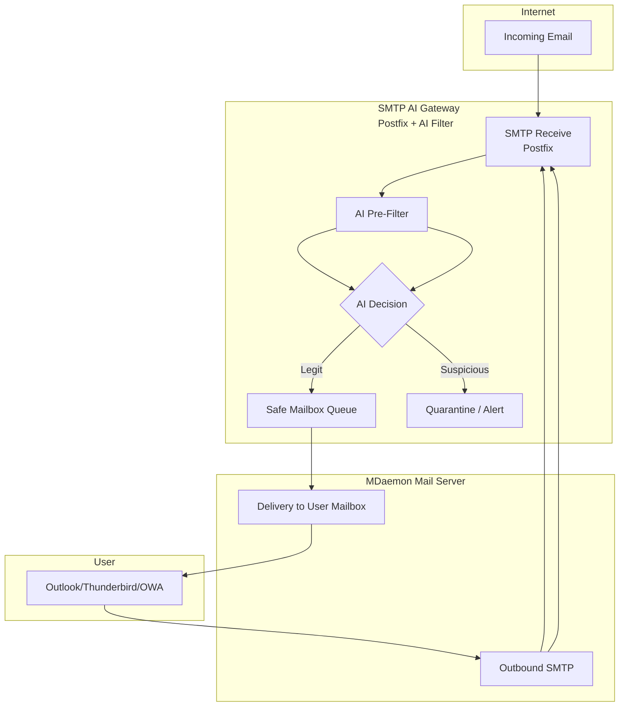
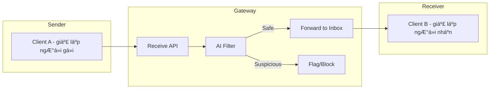
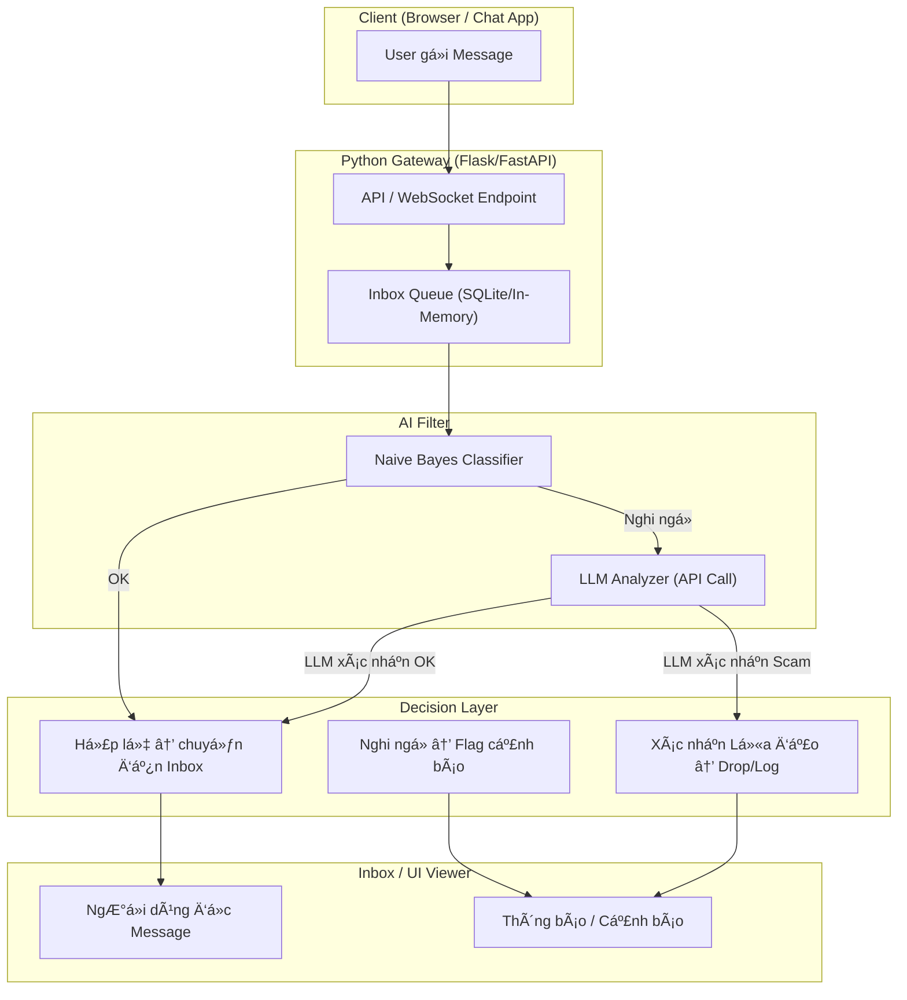

Rất hay, để mình đóng vai chuyên gia tư vấn bảo mật và phân tích cho bạn theo hướng thực tiễn cho doanh nghiệp nhỠ(SMB).

---

## 1. Hệ thống email mà doanh nghiệp nhá» thÆ°á»ng dùng

Doanh nghiệp nhỠhiếm khi tự dựng **mail server on-premises** (Exchange Server, Postfix, Zimbra...) vì:

* Tốn chi phí quản trị (máy chủ, bảo mật, backup, chống spam, chứng chỉ SSL...).
* Cần đội ngũ IT chuyên trách.

👉 Thay vào đó, há» thÆ°á»ng chá»n **dịch vụ email “cloud-basedâ€**:

* **Microsoft 365 (Exchange Online)**: phổ biến cho doanh nghiệp cần tích hợp với Word, Excel, Teams.
* **Google Workspace (Gmail for Business)**: dễ quản trị, giao diện quen thuộc.
* **Zoho Mail, Proton Mail for Business, Fastmail**: giải pháp chi phí thấp hoặc chú trá»ng bảo mật.
* Má»™t số doanh nghiệp nhỠở Việt Nam vẫn dùng **dịch vụ hosting email tích hợp từ nhà cung cấp domain/web hosting (PA Vietnam, Mắt Bão, Nhân Hòa...)** – nhÆ°ng mức Ä‘á»™ bảo mật thÆ°á»ng không cao bằng Microsoft/Google.

---

## 2. Tiêu chuẩn và yêu cầu bảo mật email doanh nghiệp

Khi nâng cấp hệ thống email, công ty cần lưu ý tuân thủ các tiêu chuẩn và best practices sau:

### a) **Authentication & Anti-Spoofing**

* **SPF (Sender Policy Framework)**: quy định máy chủ nào được phép gửi mail thay mặt domain.
* **DKIM (DomainKeys Identified Mail)**: ký số nội dung để chống giả mạo và thay đổi.
* **DMARC (Domain-based Message Authentication, Reporting & Conformance)**: chính sách cho mail server nhận, giúp giảm spoofing/phishing.
* **BIMI** (Brand Indicators for Message Identification): hiển thị logo chính chủ trong email (khi đã có DMARC ở mức enforced).

### b) **Encryption**

* **TLS (STARTTLS, SMTPS)** để mã hóa kênh truyá»n khi gá»­i/nhận email.
* Với dữ liệu nhạy cảm: cân nhắc **end-to-end encryption** (ProtonMail, S/MIME, PGP).

### c) **Access & Identity**

* **MFA (Multi-Factor Authentication)** cho tất cả tài khoản email admin và user quan trá»ng.
* **SSO (Single Sign-On)** nếu công ty đã có ná»n tảng IAM.

### d) **Data Protection & Compliance**

* **Backup & Archiving**: nhiá»u giải pháp cloud có built-in archive, nhÆ°ng bạn nên bổ sung backup ngoài (VD: Veeam, Barracuda).
* **DLP (Data Loss Prevention)** nếu công ty có yêu cầu tuân thủ (VD: PCI-DSS, GDPR).
* **Retention Policy**: quy định thá»i gian lÆ°u trữ email.

### e) **Monitoring & Threat Detection**

* Anti-Spam & Anti-Malware gateway (mặc định có trong Microsoft 365, Gmail).
* **Security logs + SIEM integration**: để giám sát đăng nhập bất thÆ°á»ng, phishing, brute-force.

---

## 3. Các tiêu chuẩn/quy định liên quan

* **ISO/IEC 27001**: Hệ thống quản lý an toàn thông tin (ISMS).
* **NIST SP 800-177**: Email Security Guidelines.
* **GDPR (EU)** hoặc **Decree 13/2023/NÄ-CP (VN)** nếu liên quan dữ liệu cá nhân.
* Nếu làm việc với đối tác quốc tế: **HIPAA (y tế), PCI-DSS (thẻ thanh toán)** cũng có thể yêu cầu email an toàn.

---

## 4. Gợi ý cho doanh nghiệp nhá»

* Nếu công ty chưa có hệ thống phức tạp:
  → **Google Workspace Business Standard** hoặc **Microsoft 365 Business Premium** là đủ (có MFA, chống spam, backup cơ bản).
* Nếu công ty ưu tiên chi phí thấp:
  → **Zoho Mail** (nhưng nên triển khai SPF/DKIM/DMARC đầy đủ).
* Nếu công ty ưu tiên bảo mật cao:
  → **ProtonMail for Business** (end-to-end encryption).

---

👉 Câu há»i cho bạn: công ty của bạn định **chuyển đổi từ hệ thống cÅ© (on-premise/hosting)** sang **cloud email**, hay muốn **nâng cấp bảo mật cho hệ thống hiện tại** (vẫn tá»± vận hành)?

Vì hÆ°á»›ng triển khai sẽ khác nhau khá nhiá»u. Bạn muốn mình phân tích chi tiết từng kịch bản không?

Chuẩn rồi ğŸ‘.

Cái dòng bạn thấy:

```
MDaemon Webmail 25.0.3 © 2025 MDaemon Technologies, Ltd.
```

👉 NghÄ©a là công ty bạn **Ä‘ang dùng MDaemon Mail Server** – đây là má»™t phần má»m mail server on-premises (cài đặt trá»±c tiếp trên máy chủ công ty, thÆ°á»ng chạy Windows Server). Nó không phải nhà cung cấp dịch vụ cloud nhÆ° Gmail hay Microsoft 365, mà là **giải pháp mail server thÆ°Æ¡ng mại** do hãng MDaemon Technologies (trÆ°á»›c đây là Alt-N Technologies) phát triển.

---

## 1. Vậy quản trị mail server (MDaemon) thì bạn có thể làm gì để tăng tính bảo mật?

Khi vận hành **mail server on-premises**, bạn phải tá»± chịu trách nhiệm vá» bảo mật, chống spam, backup... Äây là những Ä‘iểm cần tập trung:

### a) **Cấu hình xác thực chống giả mạo (anti-spoofing)**

* **SPF**: cấu hình record trong DNS, chỉ định IP/mail server nào được phép gửi mail thay mặt domain.
* **DKIM**: bật DKIM signing trong MDaemon để tất cả mail Ä‘i ra Ä‘á»u được ký số.
* **DMARC**: thêm policy vào DNS (`p=quarantine` hoặc `p=reject`), giúp ngăn chặn giả mạo domain.
* (Nếu được) hỗ trợ **BIMI** để hiển thị logo chính chủ trong email.

### b) **Mã hóa & truyá»n thông an toàn**

* Bật **TLS/SSL** cho SMTP, POP3, IMAP, Webmail.
* Hạn chế cho phép kết nối không mã hóa (disable “allow plaintext authenticationâ€).
* Nếu gá»­i email ra ngoài, bật **Mandatory TLS** cho các domain quan trá»ng (VD: ngân hàng, đối tác).

### c) **Xác thá»±c ngÆ°á»i dùng**

* Bắt buá»™c **MFA (Multi-Factor Authentication)** cho admin và user quan trá»ng.
* Yêu cầu password mạnh, thay đổi định kỳ.
* Giới hạn số lần login fail, bật cơ chế **account lockout**.

### d) **Chống spam & malware**

* Sử dụng **SpamAssassin, Bayesian Filter, DNSBL, URIBL** có sẵn trong MDaemon.
* Tích hợp thêm **antivirus/antimalware engine** (MDaemon hỗ trợ tích hợp Kaspersky, ClamAV).
* Bật **Attachment Filtering** để chặn file nguy hiểm (.exe, .js, .vbs...).

### e) **Cập nhật & vá lỗi**

* Luôn nâng cấp MDaemon lên bản mới nhất (bạn đang ở 25.0.3 là khá mới).
* Update Windows Server và các thành phần liên quan (IIS, .NET, OpenSSL).

### f) **Giới hạn truy cập**

* Chỉ mở port mail cần thiết (25, 465/587, 993/995).
* Sử dụng **firewall** và **GeoIP blocking** (nếu chỉ gửi nhận trong VN, chặn toàn bộ login từ IP nước ngoài).
* Tách biệt mail server khá»i hệ thống mạng ná»™i bá»™ (DMZ).

### g) **Monitoring & logging**

* Theo dõi log đăng nhập, cảnh báo brute-force.
* Bật tính năng **account hijack detection** trong MDaemon.
* Triển khai SIEM/SOC nếu có hệ thống lớn.

### h) **Backup & khôi phục**

* Thiết lập backup hàng ngày (toàn bộ dữ liệu email + cấu hình MDaemon).
* Kiểm tra khả năng restore định kỳ.
* Cân nhắc snapshot VM (nếu chạy trong môi trÆ°á»ng ảo hóa).

---

## 2. Tiêu chuẩn cần hướng tới khi vận hành mail server

* **NIST Email Security Guidelines (SP 800-177)**.
* **ISO/IEC 27001** (vỠquản lý an toàn thông tin).
* **RFC 6376, RFC 7208, RFC 7489** (chuẩn DKIM, SPF, DMARC).

---

## 3. Lá»i khuyên thá»±c tế

* Nếu công ty bạn **không có đội IT mạnh** và email chỉ dùng ở mức cơ bản: nên cân nhắc **di chuyển sang dịch vụ cloud (Google Workspace hoặc Microsoft 365)** để giảm gánh nặng quản trị.
* Nếu bắt buộc phải giữ on-prem (yêu cầu riêng, dữ liệu nhạy cảm): cần triển khai **một kế hoạch bảo mật đầy đủ** như trên, kèm theo kiểm thử xâm nhập định kỳ.

---

👉 Bạn có muốn mình viết **checklist bảo mật chi tiết dành riêng cho MDaemon** (từng bước bật/tắt tính năng nào, chỉnh ở đâu trong giao diện quản trị) để bạn áp dụng ngay không?


Hiểu rồi ğŸ‘, để mình giúp bạn đánh giá sÆ¡ bá»™ MDaemon dÆ°á»›i góc nhìn bảo mật & chiến lược so sánh vá»›i các giải pháp email khác.

---

## 1. MDaemon là ai?

* **MDaemon Technologies, Ltd.** (trÆ°á»›c đây là Alt-N Technologies, Mỹ) phát triển phần má»m **MDaemon Email Server** từ những năm 1990.
* Äiểm mạnh: giải pháp **mail server all-in-one** chạy trên Windows, dá»… cài đặt, không cần nhiá»u kỹ năng Linux/Unix nhÆ° Postfix, Sendmail.
* Äối tượng khách hàng: **doanh nghiệp nhá» và vừa (SMB)**, tổ chức không muốn phụ thuá»™c cloud, hoặc ở khu vá»±c hạ tầng internet hạn chế.

Nói cách khác: MDaemon không phải “ông lá»›n†nhÆ° Microsoft hay Google, mà giống nhÆ° **nhà cung cấp niá»m tin cậy cho SMB cần server email on-premises giá hợp lý**.

---

## 2. Công nghệ mà MDaemon sử dụng

* **Ná»n tảng**: chạy trên **Windows Server**, không cần SQL Server, chỉ dùng cÆ¡ sở dữ liệu riêng (flat-file).
* **Giao thức chuẩn**: SMTP, POP3, IMAP, ActiveSync (đồng bộ với Outlook, mobile).
* **Bảo mật tích hợp**:

  * TLS/SSL cho SMTP, POP, IMAP.
  * SPF, DKIM, DMARC.
  * AntiSpam (SpamAssassin, Bayesian Filter, DNSBL, URIBL).
  * Antivirus tích hợp (ClamAV, tùy chá»n Kaspersky).
  * Account hijack detection, IP Shielding.
* **Quản trị**: giao diện quản lý web-based, dễ dùng hơn Postfix/Zimbra.
* **Linh hoạt triển khai**: hỗ trợ hybrid (MDaemon on-prem + relay lên cloud như Office 365).

---

## 3. So sánh với các hãng email khác

| Tiêu chí                        | **MDaemon**                                                | **Microsoft Exchange / 365**                | **Google Workspace (Gmail)**              | **Zimbra / Postfix / Open-source**             |
| ------------------------------- | ---------------------------------------------------------- | ------------------------------------------- | ----------------------------------------- | ---------------------------------------------- |
| **Mức độ phổ biến**             | Trung bình, chủ yếu SMB                                    | Rất cao, chuẩn doanh nghiệp                 | Rất cao, từ SMB đến Enterprise            | Trung bình, phổ biến ở IT có kinh nghiệm Linux |
| **Triển khai**                  | On-prem Windows, dễ cài                                    | On-prem (Exchange Server) hoặc cloud (365)  | Cloud SaaS                                | On-prem Linux                                  |
| **Chi phí**                     | License 1 lần (CAPEX), rẻ hơn Exchange                     | Thuê bao theo user/tháng, cao               | Thuê bao theo user/tháng, trung bình-cao  | Miễn phí (OSS), phí support riêng              |
| **Bảo mật tích hợp**            | Tương đối tốt (TLS, SPF/DKIM/DMARC, SpamAssassin)          | Rất mạnh, có ATP, DLP, Defender             | Rất mạnh, có AI chống phishing            | Tuỳ config, mạnh nhưng khó quản trị            |
| **Yêu cầu quản trị**            | Thấp – vừa, quản lý qua GUI                                | Cao (Exchange phức tạp), cloud dễ hơn       | Thấp, Google quản lý gần hết              | Cao, cần sysadmin Linux                        |
| **Khả năng mở rộng**            | Vừa, phù hợp 50–500 user                                   | Rất cao, phù hợp Enterprise                 | Rất cao, phù hợp Enterprise               | Cao nhưng cần kỹ thuật                         |
| **Tuân thủ tiêu chuẩn quốc tế** | Có (TLS, SPF, DKIM, DMARC) nhÆ°ng không có DLP/ATP nâng cao | Äầy đủ (ISO 27001, HIPAA, GDPR, FedRAMP...) | Äầy đủ (ISO 27001, HIPAA, GDPR, SOC 2...) | Phụ thuá»™c triển khai                           |

---

## 4. Nhận xét tổng quan

* **MDaemon mạnh ở đâu?**

  * **Dễ triển khai, dễ quản lý** với doanh nghiệp nhỠkhông có đội IT mạnh.
  * Äủ tính năng “chuẩn má»±c†(SPF, DKIM, DMARC, TLS, AntiSpam).
  * Chi phí **má»™t lần mua bản quyá»n** (CAPEX) thay vì trả thuê bao hàng tháng.

* **MDaemon hạn chế gì?**

  * Không có nhiá»u tính năng nâng cao vá» **AI chống phishing, DLP, ATP (Advanced Threat Protection)** nhÆ° Microsoft/Google.
  * Ãt chứng nhận quốc tế vá» bảo mật, tuân thủ (GDPR/HIPAA chỉ có thể cấu hình chứ không có chứng nhận built-in).
  * Phụ thuộc vào việc quản trị viên **biết cấu hình đúng**, nếu không sẽ dễ bị spam relay, hijack tài khoản.

* **So vá»›i Microsoft/Google**:

  * Thua vỠ**bảo mật nâng cao** và **compliance quốc tế**.
  * NhÆ°ng dá»… vận hành, **ít đòi há»i IT** hÆ¡n Exchange Server hoặc Linux-based mail server.

---

## 5. Kết luận cho bạn

* Nếu công ty bạn **chỉ có vài chục đến vài trăm nhân viên, không có Ä‘á»™i IT mạnh, muốn giữ dữ liệu trong công ty**, MDaemon vẫn là lá»±a chá»n ổn.
* Nhưng nếu công ty cần **đối tác quốc tế, compliance (ISO, GDPR, HIPAA)** hoặc **yêu cầu bảo mật cực cao (AI chống phishing, ATP)** → nên cân nhắc chuyển sang **Microsoft 365 hoặc Google Workspace**.

---

👉 Bạn có muốn mình làm một **bản khuyến nghị bảo mật riêng cho MDaemon** (cụ thể: bật DKIM ở đâu, chỉnh TLS thế nào, anti-spam tối ưu ra sao) để bạn triển khai trực tiếp cho công ty không?

Câu há»i rất hay 👠– đây là “cốt lõi†để hiểu tại sao MDaemon, Microsoft, Google, Zimbra… lại khác nhau vá» bảo mật, chi phí và Ä‘á»™ phức tạp.

---

## 1. Äiểm chung vá» công nghệ lõi (chuẩn quốc tế)

Dù là MDaemon, Exchange, Gmail hay Postfix/Zimbra… **tất cả Ä‘á»u phải tuân thủ các chuẩn email quốc tế** (RFC), ví dụ:

* **SMTP (RFC 5321)** – giao thức gửi mail.
* **POP3 (RFC 1939), IMAP (RFC 3501)** – giao thức nhận mail.
* **TLS (STARTTLS, SMTPS, IMAPS, POP3S)** – mã hóa Ä‘Æ°á»ng truyá»n.
* **SPF (RFC 7208), DKIM (RFC 6376), DMARC (RFC 7489)** – chống giả mạo domain.
* **MIME (RFC 2045+)** – chuẩn đính kèm, định dạng mail.

👉 Nói cách khác: **vỠ“công nghệ lõiâ€, các hãng Ä‘á»u phải chÆ¡i trên cùng má»™t sân** để email có thể liên lạc toàn cầu.

---

## 2. Äiểm khác biệt – “công nghệ riêng†của từng hãng

Khác biệt lớn nằm ở **cách hỠtriển khai, mở rộng và thêm tính năng bảo mật/tiện ích xung quanh lõi SMTP/IMAP/POP**.

### 🔹 **MDaemon**

* Ná»n tảng: **Windows**, file-based (không cần SQL Server).
* Anti-Spam: SpamAssassin, Bayesian Filter (công nghệ open-source tích hợp).
* Anti-Malware: ClamAV (miễn phí) hoặc Kaspersky (thương mại).
* Bảo mật: SPF/DKIM/DMARC, TLS, Account Hijack Detection.
* Äiểm mạnh: **Ä‘Æ¡n giản hóa** để SMB dá»… triển khai.
* Äiểm yếu: không có AI, DLP, ATP nâng cao.

---

### 🔹 **Microsoft Exchange / Office 365**

* Ná»n tảng: Windows Server (on-prem) hoặc Azure Cloud (Exchange Online).
* Core: SMTP/IMAP/POP, nhưng tích hợp sâu với **Active Directory (AD)** và **Outlook**.
* Bảo mật nâng cao:

  * **Microsoft Defender for Office 365** (chống phishing, sandbox malware).
  * **DLP (Data Loss Prevention)** theo chính sách GDPR/HIPAA.
  * **ATP (Advanced Threat Protection)**, phát hiện URL độc hại.
  * **SSO + MFA + Conditional Access** (Azure AD).
* Äiểm mạnh: **ecosystem cá»±c mạnh** (AD, Teams, OneDrive, SharePoint).
* Äiểm yếu: phức tạp, tốn chi phí, cần IT mạnh.

---

### 🔹 **Google Workspace (Gmail for Business)**

* Ná»n tảng: **Google Cloud**.
* Core: SMTP/IMAP/POP nhưng mở rộng thêm **API mạnh** (Gmail API, Workspace API).
* Bảo mật nâng cao:

  * **AI chống phishing/spam** (Google Safe Browsing, ML engine).
  * **TLS Enforced**, **MTA-STS**, **DANE** (chuẩn mới để buộc mã hóa).
  * **Confidential Mode** (mail tự hủy, hạn chế forward).
  * **DLP** theo chính sách.
* Äiểm mạnh: **AI + ML**, hệ sinh thái cloud-first.
* Äiểm yếu: ít kiểm soát on-prem, phụ thuá»™c Google.

---

### 🔹 **Zimbra / Postfix / Open-source**

* Ná»n tảng: **Linux**, open-source.
* Core: Postfix (SMTP), Dovecot (IMAP/POP), Amavis + SpamAssassin + ClamAV.
* Tùy chỉnh cao: có thể bật TLS, SPF/DKIM/DMARC, DMZ, relay…
* Äiểm mạnh: **linh hoạt, chi phí thấp** (miá»…n phí nếu tá»± quản).
* Äiểm yếu: **cần sysadmin Linux giá»i**, dá»… sai cấu hình → bị spam relay.

---

## 3. So sánh mô hình công nghệ lõi

| Tầng công nghệ               | **MDaemon**                   | **Exchange / 365**               | **Google Workspace**       | **Zimbra / Postfix**  |
| ---------------------------- | ----------------------------- | -------------------------------- | -------------------------- | --------------------- |
| **Protocol (SMTP/IMAP/POP)** | Chuẩn quốc tế                 | Chuẩn quốc tế                    | Chuẩn quốc tế              | Chuẩn quốc tế         |
| **Authentication**           | SPF, DKIM, DMARC              | SPF, DKIM, DMARC, AD integration | SPF, DKIM, DMARC, OAuth2   | SPF, DKIM, DMARC      |
| **Encryption**               | TLS/SSL                       | TLS, MTA-STS, DANE (cloud)       | TLS, MTA-STS, DANE         | TLS                   |
| **Anti-Spam**                | SpamAssassin, DNSBL           | Defender (AI-based)              | AI/ML Spam Filter          | SpamAssassin          |
| **Anti-Malware**             | ClamAV/Kaspersky              | ATP, Defender                    | Google Safe Browsing, ML   | ClamAV                |
| **Advanced Security**        | Basic (Account hijack detect) | DLP, ATP, SIEM, SSO              | DLP, AI, Confidential Mode | Tùy admin cài         |
| **Quản trị**                 | GUI đơn giản                  | AD/Exchange Admin Center         | Google Admin Console       | CLI/web (Zimbra)      |
| **Äối tượng phù hợp**        | SMB không có IT mạnh          | Enterprise, tổ chức compliance   | SMB đến Enterprise         | SMB có sysadmin Linux |

---

## 4. Kết luận

* **Lõi công nghệ (SMTP/IMAP/POP/TLS)** → **giống nhau**, vì Ä‘á»u phải tuân theo chuẩn quốc tế.
* **Khác biệt nằm ở “lá»›p giá trị gia tăngâ€**:

  * **MDaemon**: đơn giản, vừa đủ, hướng SMB.
  * **Microsoft**: Enterprise, bảo mật nhiá»u lá»›p, compliance mạnh.
  * **Google**: Cloud-first, AI/ML chống phishing tốt nhất.
  * **Open-source**: linh hoạt, rẻ, nhÆ°ng cần IT giá»i.

---

👉 Bạn có muốn mình vẽ cho bạn một **sơ đồ kiến trúc lớp (protocol core → security → management → compliance)** để trực quan thấy các hãng giống và khác nhau thế nào không?

À, chá»— này quan trá»ng nè 👌. Bạn Ä‘ang so sánh giữa:

* **Công ty bạn** → dùng **MDaemon Mail Server on-premises** (máy chủ chạy trong nội bộ, do công ty bạn tự quản lý).
* **Công ty bên cạnh** → dùng **Microsoft Exchange Server + Outlook Web Access (OWA)**.

Nhìn giống nhau ở chá»— Ä‘á»u có “webmail†để truy cập, nhÆ°ng bản chất **vấn Ä‘á» bảo mật phụ thuá»™c vào ai chịu trách nhiệm quản trị** thì khác nhau.

---

## 1. MDaemon on-premises (bên bạn)

* Mail server chạy trên **máy chủ vật lý/VM của công ty**.
* **Bảo mật, chống spam, backup, update, chứng chỉ SSL… → do chính công ty bạn lo**.
* MDaemon có sẵn tính năng bảo mật (TLS, SPF/DKIM/DMARC, anti-spam), nhưng:

  * Nếu bạn không bật hoặc cấu hình sai → hệ thống dễ bị **spam relay, brute-force, spoofing**.
  * Nếu không update thÆ°á»ng xuyên → có thể dính **lá»— hổng zero-day**.
* Nói cách khác: **MDaemon chỉ cung cấp “công cụâ€, còn bảo mật thá»±c tế do bạn quản trị.**

---

## 2. Microsoft Exchange Server + OWA (on-premises)

* CÅ©ng là **tá»± dá»±ng server tại công ty**, thÆ°á»ng chạy trên **Windows Server**.
* OWA chỉ là **giao diện web** để truy cập mailbox, chứ không phải “dịch vụ cloudâ€.
* Do đó, **công ty bên cạnh cũng phải tự lo bảo mật**:

  * Cấu hình Exchange đúng (TLS, SPF/DKIM/DMARC, relaying, transport rules).
  * Triển khai **firewall, reverse proxy (VD: Microsoft TMG, WAF)** để bảo vệ OWA.
  * Update bản vá bảo mật Exchange (Microsoft Exchange từng dính nhiá»u CVE nghiêm trá»ng, VD: ProxyLogon 2021).
* Nghĩa là **bản chất giống bạn** → server ở đâu thì chủ hệ thống chịu trách nhiệm ở đó.

---

## 3. Khi nào “nhà cung cấp†mới lo bảo mật thay bạn?

* Nếu dùng **dịch vụ cloud (SaaS)** như:

  * **Microsoft 365 Exchange Online (cloud)**
  * **Google Workspace (Gmail for Business)**
  * ProtonMail, Zoho Mail...
* Lúc này:

  * Nhà cung cấp **lo hạ tầng, vá lỗi, chống spam, AI filter, compliance**.
  * Bạn chỉ cần quản lý **tài khoản ngÆ°á»i dùng, mật khẩu, MFA, chính sách ná»™i bá»™**.
* Äây gá»i là mô hình **Shared Responsibility**:

  * Cloud provider lo phần **infrastructure security**.
  * Doanh nghiệp lo phần **identity & access management (IAM)**.

---

## 4. Kết luận

* **MDaemon (bạn)** và **Exchange Server (công ty bên cạnh)**:
  → Äá»u là **on-premises mail server**, nên **bảo mật phụ thuá»™c vào Ä‘á»™i ngÅ© quản trị ná»™i bá»™**. Nhà cung cấp (MDaemon hoặc Microsoft) **chỉ phát hành phần má»m & bản vá**, còn việc áp dụng hay không là do bạn.

* **Microsoft 365 / Google Workspace**:
  → Khi lên cloud, nhà cung cấp sẽ **gánh phần bảo mật hạ tầng**, bạn chỉ còn lo vá» ngÆ°á»i dùng và chính sách.

---

👉 NhÆ° vậy, nếu công ty bạn **không có Ä‘á»™i IT mạnh** thì việc vận hành MDaemon sẽ có rủi ro, còn nếu chuyển sang cloud (365/Gmail) thì gánh nặng bảo mật giảm rất nhiá»u.

Bạn có muốn mình lập cho bạn má»™t **bảng “shared responsibility modelâ€** (so sánh rõ ràng: ai chịu trách nhiệm cái gì trong on-prem vs cloud) để bạn trình sếp dá»… hiểu không?

Bạn chạm đúng **vấn Ä‘á» lá»›n nhất hiện nay trong bảo mật email** rồi ğŸ‘.
Äây chính là dạng **Business Email Compromise (BEC)**, kẻ tấn công giả mạo email đối tác để thay đổi thông tin thanh toán.

---

## 1. Các rủi ro bảo mật phổ biến với mail server on-prem (MDaemon, Exchange) và cả cloud

* **Phishing / BEC (Business Email Compromise):** giả mạo email đối tác, đổi số tài khoản.
* **Spoofing domain:** kẻ tấn công gửi email “y chang†domain công ty đối tác nhưng thay đổi một ký tự (VD: `partner.com` → `partnerr.com`).
* **Account takeover:** hacker chiếm tài khoản thật (qua password yếu, không có MFA), sau đó gửi mail trực tiếp từ tài khoản đó → **khó phát hiện hơn spoofing**.
* **Relay / open relay misconfig:** mail server cấu hình sai → hacker lợi dụng để gửi spam/phishing.
* **Man-in-the-middle (MITM):** nếu không bắt buá»™c TLS, mail có thể bị Ä‘á»c trá»™m trên Ä‘Æ°á»ng Ä‘i.
* **Malware / ransomware qua email:** file đính kèm độc hại.

---

## 2. Trả lá»i câu há»i của bạn:

### “Làm sao kẻ lừa đảo có thể chèn được email giả mạo vào luồng trao đổi thật?â€

Có 2 tình huống chính:

### **(A) Giả mạo (spoofing / lookalike domain)**

* Hacker **không xâm nhập hệ thống**.
* HỠđăng ký domain gần giống (`abc-corp.com` → `abccorp.com`), sau đó gá»­i email “giả danh đối tácâ€.
* Nếu **bạn chÆ°a bật SPF/DKIM/DMARC nghiêm ngặt**, email này sẽ **lá»t vào inbox** nhÆ° email thật.
* NgÆ°á»i dùng chỉ thấy khác 1 ký tá»± nhỠ→ dá»… bị lừa.

👉 Äây là kiểu bạn mô tả: “email y chang đối tác nhÆ°ng đổi 1 chữ rất béâ€.

---

### **(B) Chiếm quyá»n (account takeover / mailbox compromise)**

* Hacker **hack tài khoản email của đối tác hoặc của chính công ty bạn** (password yếu, không có MFA).
* Khi đã vào được mailbox thật, hacker có thể:

  * Theo dõi luồng trao đổi email.
  * Xen ngang bằng email thật từ chính tài khoản đó.
  * Hoặc tạo rule ẩn email gốc, chỉ để lá»™ email “đã chỉnh sá»­aâ€.
* Äây là mức nguy hiểm nhất, vì email đến từ tài khoản thật, **SPF/DKIM/DMARC Ä‘á»u pass**.

---

## 3. Vì sao anti-spam không chặn được hết?

* Anti-spam chủ yếu chặn **spam số lượng lớn, malware, URL độc hại**.
* NhÆ°ng **BEC/email giả mạo tài chính** thÆ°á»ng được viết thủ công, không chứa link hay malware, nên rất khó phát hiện tá»± Ä‘á»™ng.
* TrÆ°á»ng hợp domain giống nhau (`partner.com` vs `partnerr.com`) → nếu không bật **DMARC enforcement + anti-lookalike detection** thì hệ thống vẫn coi là hợp lệ.

---

## 4. Cách phòng tránh

### **Kỹ thuật (trên mail server)**

* Bắt buộc triển khai:

  * **SPF + DKIM + DMARC (p=reject)** cho domain công ty.
  * **Check strict SPF/DKIM/DMARC** cho mail nhận vào.
* Bật **TLS (MTA-STS, DANE)** để chống MITM.
* Bật **anti-spoofing & anti-impersonation** (Microsoft 365, Google Workspace có sẵn; MDaemon/Exchange cần plugin/add-on).
* Bật **MFA** cho tất cả tài khoản email.
* Chặn **domain lookalike** bằng DNSBL hoặc gateway filter (VD: chặn email từ domain mới đăng ký <30 ngày).

### **Quy trình & con ngÆ°á»i**

* Quy định ná»™i bá»™: **má»i thay đổi thông tin tài chính phải xác nhận qua kênh thứ hai** (Ä‘iện thoại, chữ ký số).
* Huấn luyện nhân viên: kiểm tra kỹ domain ngÆ°á»i gá»­i, đặc biệt trong email yêu cầu thanh toán/gấp.
* Sử dụng **Email Banner Warning** (hiển thị cảnh báo đỠnếu email đến từ outside domain).

---

## 5. Kết luận

* Trong cả MDaemon (bạn) và Exchange Server (công ty bên cạnh), **bảo mật phụ thuộc cấu hình**.
* Nếu chỉ cài mặc định, khả năng cao sẽ lá»t **email spoofing/BEC**.
* Hacker **không cần chèn vào hệ thống email**; chỉ cần đăng ký domain gần giống, hoặc hack tài khoản của đối tác → thế là “lá»t vào luồng email†nhÆ° bạn thấy.

---

👉 Mình có thể viết cho bạn má»™t **playbook chống BEC** (từng bÆ°á»›c: bật SPF/DKIM/DMARC → lá»c domain lookalike → huấn luyện user → quy trình xác minh thanh toán) để bạn áp dụng ngay trong công ty. Bạn có muốn không?
Rất chuẩn! Anh Ä‘ang chạm đúng trá»ng tâm của **BEC (Business Email Compromise)** rồi. Em sẽ làm má»™t **Playbook chống BEC** từng bÆ°á»›c, dá»… triển khai trong doanh nghiệp nhá» (dùng MDaemon hoặc Exchange Ä‘á»u áp dụng được):

---

# 🛡 Playbook Chống BEC (Business Email Compromise)

## 1. **Củng cố xác thực email (Email Authentication)**

* **SPF**: (Sender Policy Framework)

  * Khai báo trong DNS các server được phép gửi email cho domain của công ty.
  * Ví dụ bản ghi:

    ```
    v=spf1 include:_spf.mdaemon.com -all
    ```
* **DKIM**: (DomainKeys Identified Mail)

  * MDaemon & Exchange Ä‘á»u há»— trợ.
  * Dùng chữ ký số gắn vào header email để ngÆ°á»i nhận xác minh tính toàn vẹn.
* **DMARC**: (Domain-based Message Authentication, Reporting & Conformance)

  * Kết hợp SPF & DKIM.
  * Chính sách khuyến nghị:

    ```
    v=DMARC1; p=quarantine; rua=mailto:dmarc-reports@yourdomain.com; ruf=mailto:dmarc-forensic@yourdomain.com; pct=100
    ```
  * Sau khi test ổn thì chuyển sang `p=reject`.

👉 **Mục tiêu:** Ngăn domain giả mạo gửi mail thay công ty.

---

## 2. **Ngăn chặn domain “lookalike†(giống nhau gây nhầm lẫn)**

* Bật **anti-spoofing & anti-phishing filter** trong mail server.
* Äăng ký domain dá»… bị giả mạo (ví dụ: thay chữ `i` bằng `l` hoặc `rn` thay cho `m`).
* Sử dụng dịch vụ threat intel (Proofpoint, Mimecast, hoặc miễn phí như Microsoft 365 Defender nếu dùng Exchange Online).
* Có thể tích hợp **fuzzy matching** rule: nếu email từ domain lạ nhưng giống domain đối tác → đưa vào spam/quarantine.

👉 **Mục tiêu:** Không để user thấy email "gần giống" với đối tác thật.

---

## 3. **Bảo vệ tài khoản nội bộ**

* **Password Policy**:

  * Äá»™ dài ≥ 12 ký tá»±, bật complexity, cấm reuse mật khẩu cÅ©.
* **MFA (Multi-Factor Authentication)**:

  * Nếu dùng MDaemon: có plugin hỗ trợ TOTP/Authenticator.
  * Nếu Exchange Online: bật MFA qua Microsoft Authenticator/OTP.
* **Brute Force Protection**:

  * Bật **account lockout policy**.
  * Sá»­ dụng firewall/IDS để chặn login bất thÆ°á»ng.

👉 **Mục tiêu:** Hacker không chiếm được mailbox để gửi mail hợp pháp từ tài khoản bị hack.

---

## 4. **Huấn luyện ngÆ°á»i dùng (Security Awareness)**

* Tổ chức training ngắn (15–20 phút/tháng). Nội dung:

  * Kiểm tra kỹ domain và địa chỉ ngÆ°á»i gá»­i.
  * Không click link/attachment lạ.
  * Luôn nghi ngỠemail yêu cầu đổi số tài khoản thanh toán.
* Thực hiện **phishing simulation** (gửi thử email giả để test nhân viên).

👉 **Mục tiêu:** User là lớp phòng thủ cuối cùng.

---

## 5. **Quy trình xác minh thanh toán (Business Process Control)**

* Quy định rõ:

  * **Không thay đổi số tài khoản qua email.**
  * Nếu có yêu cầu thay đổi: **phải gá»i Ä‘iện trá»±c tiếp** cho đối tác bằng số Ä‘iện thoại đã lÆ°u từ trÆ°á»›c (không lấy số trong email).
* Thiết lập **song song kiểm tra ná»™i bá»™**: má»i thanh toán > X VNÄ cần ít nhất 2 ngÆ°á»i phê duyệt.

👉 **Mục tiêu:** Dù email có lá»t qua, vẫn không gây thiệt hại tài chính.

---

## 6. **Giám sát & phản ứng sự cố**

* Bật **log monitoring** trên mail server (failed login, IP lạ).
* Cấu hình gá»­i báo cáo **DMARC** và Ä‘á»c định kỳ.
* Khi phát hiện BEC:

  1. Khóa ngay account bị lộ.
  2. Reset mật khẩu toàn hệ thống.
  3. Kiểm tra mail rule (hacker hay tạo auto-forward rule).
  4. Thông báo toàn bộ nhân viên liên quan.

---

📌 **Tóm gá»n cho doanh nghiệp nhá» (hành Ä‘á»™ng ngay):**

1. Bật SPF, DKIM, DMARC.
2. Bật MFA cho tất cả account mail.
3. Thiết lập rule lá»c domain lookalike.
4. Training nhân viên kiểm tra email nhạy cảm.
5. Quy trình xác minh thanh toán ngoài email.

---

Anh có muốn em viết luôn **checklist triển khai trong 30 ngày** (theo tuần: tuần 1 DNS, tuần 2 MFA, tuần 3 training, tuần 4 quy trình) để anh dễ áp dụng ở công ty không?

Câu há»i này rất hay 👌. Äể mình phân tích rõ hÆ¡n cho bạn vá» khả năng **tích hợp AI vá»›i MDaemon**:

---

## 1. MDaemon là hệ thống đóng hay mở?

* **MDaemon là phần má»m mail server thÆ°Æ¡ng mại** (on-premises) do MDaemon Technologies phát triển.
* Nó **không phải open-source** như Postfix hay Zimbra, nên bạn **không thể sửa trực tiếp lõi xử lý mail**.
* Tuy nhiên, MDaemon có:

  * **API và plug-in hooks** (mức hạn chế, không phong phú như Microsoft Graph API).
  * **Log đầy đủ** (SMTP/IMAP/SpamAssassin log, Security log).
  * Hỗ trợ **chạy filter rule, content filter, script VBScript/JScript** khi mail đi vào hệ thống.

👉 Nghĩa là bạn **không nhúng AI trực tiếp vào MDaemon**, nhưng bạn có thể xây dựng **lớp AI trung gian** để phân tích mail trước hoặc sau khi MDaemon xử lý.

---

## 2. Các hướng tích hợp AI với MDaemon

### (A) Lá»c mail trÆ°á»›c khi vào MDaemon

* Deploy má»™t **SMTP relay “AI Gatewayâ€** đứng trÆ°á»›c MDaemon.
* AI sẽ phân tích:

  * Phishing detection (dùng LLM / mô hình fine-tuned).
  * Domain lookalike detection.
  * BEC pattern detection.
* Sau đó mới forward mail sạch vỠMDaemon.

✅ Ưu điểm: không phụ thuộc MDaemon, linh hoạt.
⌠Nhược điểm: phải quản lý thêm một relay server.

---

### (B) Phân tích log MDaemon bằng AI

* MDaemon sinh ra log chi tiết: gửi/nhận, IP, SPF, DKIM, DMARC fail.
* Bạn có thể viết **agent AI Ä‘á»c log → cảnh báo real-time** (ví dụ gá»­i lên Teams/Zalo khi phát hiện bất thÆ°á»ng).

Ví dụ AI cảnh báo:

* Một user ở Việt Nam 5 phút trước login, nhưng giỠlại có login từ Nigeria → cảnh báo BEC.
* Email có domain gần giống nhưng pass SPF → nghi ngỠspoof.

---

### (C) Content filter AI ngay trong MDaemon

* MDaemon cho phép dùng **content filter rule** (rule = từ khóa, regex).
* Bạn có thể mở rộng:

  * Viết script kết nối API AI (VD: Python service chạy mô hình → trả vỠ“spam / not spam / suspiciousâ€).
  * Rule của MDaemon gá»i script đó, quyết định Quarantine/Reject.

✅ Cách này “gắn AI trực tiếp†nhưng cần custom script.

---

### (D) Bổ sung AI cho ngÆ°á»i dùng cuối (Outlook/Webmail)

* Thay vì chỉnh MDaemon, bạn có thể build **plugin AI cho Outlook hoặc Webmail**:

  * Highlight email đáng ngá».
  * Tự động so sánh email mới với thread cũ (phát hiện chèn domain giả).
  * Gợi ý cảnh báo khi thấy yêu cầu chuyển tiá»n.

---

## 3. Thực tế khả thi nhất

Nếu công ty bạn **không có đội IT mạnh**, mình đỠxuất:

1. **Äặt má»™t SMTP AI Gateway** (Postfix + AI filter) trÆ°á»›c MDaemon.
2. **Kết hợp huấn luyện user + quy trình xác minh thanh toán** (playbook hôm qua).
3. Nếu cần “nhẹ nhàng hÆ¡nâ€: bắt đầu từ **AI phân tích log MDaemon**, dá»… triển khai nhất.

---

👉 Tóm lại: **MDaemon không hẳn là đóng kín**, nhưng nếu muốn nhúng AI sâu thì khó. Hướng đi khả thi là **AI Gateway hoặc AI phân tích log/content filter bên ngoài**, thay vì can thiệp vào lõi MDaemon.

---

Bạn có muốn mình viết luôn một **kiến trúc triển khai AI Gateway cho MDaemon (có sơ đồ flow mail)** để bạn dễ hình dung không?
Anh Ä‘ang bắt đúng “điểm ngá»t†rồi ğŸ‘. à tưởng **đặt má»™t SMTP AI Gateway (Postfix + AI Filter) trÆ°á»›c MDaemon** hoàn toàn khả thi, và không chỉ cho MDaemon mà **má»i hệ thống mail server** (Exchange, Zimbra, Lotus Domino, thậm chí cloud mail nhÆ° G Suite/Office 365 nếu đặt dạng hybrid) Ä‘á»u có thể triển khai.

---

## 🔹 Nguyên lý hoạt động

Hệ thống sẽ hoạt động như một **proxy mail**:

```
Internet → [SMTP AI Gateway (Postfix + AI filter)] → MDaemon (Mail server của anh) → NgÆ°á»i dùng
```

* **Inbound** (email từ ngoài vào): Tất cả email đi qua gateway, AI filter sẽ phân tích xem có dấu hiệu phishing/BEC/spam/malware không, rồi mới chuyển tiếp đến MDaemon.
* **Outbound** (email từ nội bộ ra ngoài): Gateway cũng quét nội dung + header trước khi gửi ra internet để ngăn rò rỉ dữ liệu, kiểm tra domain spoof, ký DKIM/DMARC, v.v.

---

## 🔹 Thành phần chính

1. **Postfix (SMTP relay/gateway)**

   * Làm mail transfer agent (MTA).
   * Quản lý kết nối, queue mail, DNS lookup (MX record), TLS.
   * Cấu hình thành “front-end†nhận/gửi tất cả thư thay cho MDaemon.

2. **AI Filter (Plugin hoặc Sidecar Service)**

   * Một engine phân tích mail sử dụng mô hình AI/LLM (GPT, BERT fine-tuned, hoặc LLM chuyên cho email security).
   * Input: toàn bộ email (header + body + attachment text extraction).
   * Output: risk score + lý do (ví dụ: "possible lookalike domain", "payment redirection intent", "phishing wording").
   * Action: block / quarantine / warn user / pass-through.

3. **Policy Engine (Rule-based + AI mix)**

   * Ví dụ:

     * Nếu domain gần giống nhưng khác 1 ký tự → quarantine.
     * Nếu AI risk score > 0.8 → flag & hold for review.
     * Nếu AI phát hiện số tài khoản thay đổi trong luồng email → cảnh báo Ä‘á».

4. **Logging & Dashboard**

   * Tạo giao diện web để quản lý:

     * Dashboard các email bị chặn/quarantine.
     * Log chi tiết (AI score, lý do chặn).
     * Report cho admin và user.

---

## 🔹 Ưu điểm của hướng này

* **Äá»™c lập vá»›i MDaemon** → không cần can thiệp code của MDaemon.
* **Triển khai được vá»›i má»i mail system** → chỉ cần cấu hình MX record → AI Gateway.
* **Mở rộng dễ dàng** → khi đổi mail server (VD từ MDaemon sang Exchange/Office365), gateway vẫn giữ nguyên.
* **AI có thể “há»c liên tụcâ€** từ dữ liệu phishing thá»±c tế của doanh nghiệp.

---

## 🔹 Thách thức & Cần chuẩn bị

1. **Hiệu năng**: AI model nặng → cần caching, batching, hoặc sử dụng API của cloud AI (nhưng sẽ phụ thuộc vào vendor).
2. **False Positive**: AI có thể chặn nhầm email hợp lệ → cần cơ chế “review/quarantine†chứ không nên reject thẳng.
3. **Triển khai**: Cần đội vận hành biết Postfix + Docker/VM + tích hợp AI API.
4. **Bảo mật nội bộ**: AI phải chạy on-prem hoặc private cloud để không rò rỉ email nhạy cảm.

---

## 🔹 Roadmap triển khai mẫu

1. Dá»±ng 1 server Linux (Ubuntu/Debian).
2. Cài Postfix → cấu hình làm relay cho MDaemon.
3. Viết plugin Postfix filter → gá»i AI service (Flask/FastAPI).
4. AI service:

   * Extract header/body/attachment text.
   * Call AI model (local LLM hoặc API).
   * Trả vỠrisk score.
5. Policy engine quyết định → pass/quarantine/block.
6. Cấu hình log + dashboard (Grafana/Kibana hoặc webapp riêng).

---

👉 Tóm lại:
HÆ°á»›ng **SMTP AI Gateway trÆ°á»›c MDaemon** là cách **mở, bá»n vững, có thể triển khai cho má»i hệ thống mail**, và tách biệt hoàn toàn vá»›i mail server hiện tại. Nó giúp anh “bá»c giáp AI†quanh MDaemon mà không cần chạm vào lõi của hãng.

---

Anh có muốn tôi vẽ **sơ đồ khối kiến trúc (Mermaid)** cho hướng này để hình dung rõ các module AI gateway sẽ nằm chỗ nào không?

Bạn muốn sÆ¡ đồ khối kiến trúc AI Gateway (Postfix + AI Filter) đặt trÆ°á»›c **MDaemon Mail Server**. Äây là má»™t sÆ¡ đồ ở mức high-level, tập trung vào các khối chức năng chính.

Dưới đây là **Mermaid Diagram**:

```mermaid
flowchart LR
    subgraph Internet
        E1[External Sender]
    end

    subgraph AIGateway[SMTP AI Gateway]
        P1[Postfix SMTP Proxy]
        F1[AI Filter Engine<br/>ML/NLP Phishing Detection]
        R1[Rule-based Filters<br/>SPF/DKIM/DMARC, RBL, Lookalike Domain]
    end

    subgraph InternalMail[MDaemon Mail Server]
        M1[Mail Routing<br/>User Mailboxes, OWA/IMAP/POP3]
        M2[MDaemon Security<br/>SpamAssassin, AV, TLS]
    end

    E1 --> P1 --> F1 --> R1 --> M1 --> M2

    subgraph Users
        U1[Email Clients<br/>(Outlook, Thunderbird, Mobile Mail)]
    end
    M2 --> U1
```

### Giải thích:

1. **Internet → SMTP AI Gateway**

   * Tất cả email từ bên ngoài Ä‘á»u qua **Postfix SMTP Proxy**.
   * Postfix làm **SMTP relay** và hook vào **AI Filter Engine**.
   * AI phân tích nội dung (phishing intent, lookalike domain, social engineering cues...).
   * Song song, **Rule-based Filters** chạy SPF/DKIM/DMARC + blacklist.

2. **SMTP AI Gateway → MDaemon Mail Server**

   * Chỉ email đã “sạch†mới được chuyển tiếp vào **MDaemon**.
   * MDaemon tiếp tục xá»­ lý spam/virus nhÆ° bình thÆ°á»ng.

3. **MDaemon → NgÆ°á»i dùng ná»™i bá»™**

   * NgÆ°á»i dùng vẫn truy cập email qua **Outlook, OWA, hoặc Mobile Mail**.
   * Không cần thay đổi workflow.

---

👉 Với kiến trúc này, bạn có thể:

* Dùng AI filter mở rộng ngoài mà không phải đụng vào lõi của MDaemon.
* Có thể thay Postfix bằng một SMTP proxy khác (Exim, OpenSMTPD, Haraka…).
* Äặt gateway này trÆ°á»›c **bất kỳ mail server nào** (MDaemon, Exchange, Zimbra, Google Workspace on-premises relay).

Bạn có muốn tôi thiết kế thêm một **phiên bản chi tiết hơn** (bao gồm log/alert đến SIEM, sandbox phân tích file đính kèm, dashboard AI) để tiện cho triển khai thực tế không?

Äúng rồi ğŸ‘.

Trong kiến trúc **SMTP AI Gateway** đặt trÆ°á»›c MDaemon (hoặc Exchange, Google Workspace, Zimbra…), thì **AI filter sẽ Ä‘á»c ná»™i dung email** để phân tích. Cụ thể có mấy lá»›p dữ liệu mà AI có thể tiếp cận:

1. **Header email**

   * Thông tin ngÆ°á»i gá»­i (`From`, `Return-Path`, `Received:` chain).
   * Domain, IP của mail server gửi đi.
   * Các dấu vết SPF, DKIM, DMARC pass/fail.
   * Subject, encoding, time gá»­i.

   👉 Äây là dữ liệu “metadataâ€, chÆ°a cần Ä‘á»c ná»™i dung thÆ° nhÆ°ng rất quan trá»ng để phát hiện giả mạo domain, BEC.

2. **Body email (nội dung văn bản)**

   * Văn bản chính (plain text hoặc HTML).
   * Phân tích ngôn ngữ, giá»ng Ä‘iệu (tone analysis).
   * Phát hiện từ khóa bất thÆ°á»ng (thay đổi số tài khoản, gấp rút thanh toán, reset mật khẩu…).
   * Phát hiện URL ẩn dưới link HTML (ví dụ `https://bank.com` nhưng thật sự trỠđến `http://fake-bank.co`).

   👉 AI NLP (Large Language Model hoặc classifier) sẽ rất mạnh ở bước này, vì có thể hiểu ngữ cảnh thay vì chỉ so khớp chuỗi.

3. **Attachment (tệp đính kèm)**

   * PDF/Word/Excel bị chèn macro.
   * File nén có mã độc.
   * AI có thể dùng sandbox / model chuyên để detect malware trong file.

---

### Vấn Ä‘á» quan trá»ng

* **AI phải Ä‘á»c được ná»™i dung** → nghÄ©a là email sẽ **Ä‘i qua SMTP AI Gateway ở dạng “clear textâ€**.
* Nếu hệ thống dùng **TLS (STARTTLS)** thì gateway vẫn nhận được nội dung gốc sau khi TLS được giải mã ở phiên SMTP inbound.
* Vấn đỠcần quan tâm:

  * **Bảo mật dữ liệu**: vì AI có quyá»n truy cập vào toàn bá»™ ná»™i dung email, bao gồm tài liệu nhạy cảm.
  * **Hiệu năng**: AI NLP tốn tài nguyên → cần batching + caching.
  * **Triển khai**: AI filter nên chạy nội bộ (on-premise) thay vì gửi dữ liệu ra cloud nếu email chứa dữ liệu nhạy cảm.

---

👉 Tóm lại:

* Có, AI sẽ Ä‘á»c email (header + body + attachments).
* Nhưng bạn có thể thiết kế **2 cấp độ**:

  1. **Metadata-only** (chỉ header + domain check) → nhanh, ít rủi ro bảo mật.
  2. **Full-content AI analysis** (Ä‘á»c toàn bá»™ ná»™i dung) → mạnh hÆ¡n, nhÆ°ng phải đảm bảo an toàn dữ liệu.

---

Bạn muốn tôi vẽ tiếp **sÆ¡ đồ data flow chi tiết** (email Ä‘i qua AI filter, AI Ä‘á»c content ở đâu, phân tích ra sao, rồi chuyển vào MDaemon) không?

Rồi ğŸ‘, để tôi vẽ **data flow diagram (Mermaid)** cho luồng email qua **SMTP AI Gateway (Postfix + AI filter) → MDaemon → User**.



📌 **Luồng hoạt động chi tiết**:

1. **Email từ Internet** → vào **SMTP Gateway (Postfix)**.
2. Gateway chuyển nội dung sang **AI Pre-Filter** (mở headers, domain, nội dung, check SPF/DKIM/DMARC, embedding phân tích nội dung).
3. **AI Decision Engine**:

   * Nếu hợp lệ → vào **Safe Mailbox Queue** rồi chuyển đến **MDaemon**.
   * Nếu nghi ngỠ→ gửi **Quarantine** hoặc cảnh báo SOC/IT team.
4. NgÆ°á»i dùng (Outlook/Thunderbird/OWA) nhận email từ **MDaemon** nhÆ° bình thÆ°á»ng.
5. **Outbound email**: đi qua MDaemon → ra **Postfix Gateway** → được AI scan trước khi ra Internet (ngăn leak/malware).

---

👉 NhÆ° vậy, AI sẽ **Ä‘á»c ná»™i dung email**, phân tích metadata và cả patterns trÆ°á»›c khi để MDaemon nhận.

Bạn có muốn tôi bổ sung luôn **data pipeline chi tiết cho AI filter** (ví dụ: NLP preprocessing → Embedding → Classification → Decision)?

Äúng rồi, để demo ý tưởng **AI Gateway chống BEC/phishing** thì bạn **không cần dá»±ng cả MDaemon hay Exchange** (rất nặng, khó cấu hình). Bạn có thể dá»±ng **má»™t chat server giả lập email** → AI filter → inbox, để minh hoạ rõ data flow.

### Cách demo đơn giản:

1. **Thay email bằng chat server/websocket**

   * Client A (giả lập ngÆ°á»i gá»­i email)
   * AI Gateway (proxy)
   * Client B (giả lập ngÆ°á»i nhận email)

2. **Luồng hoạt động**

   * Client A gửi "email" (tin nhắn text) → Gateway.
   * Gateway gá»i AI model check (phishing?, domain giả?, ná»™i dung nhạy cảm?).
   * Nếu an toàn → chuyển tiếp sang Client B.
   * Nếu nghi ngỠ→ gắn cảnh báo hoặc chặn.

3. **Công nghệ đơn giản để demo**

   * **Python Flask/FastAPI** làm Gateway.
   * **WebSocket/HTTP API** để nhận và gửi message.
   * **SQLite hoặc memory queue** làm “inboxâ€.
   * **LLM mini** (vd: Llama.cpp, GPT4All, hoặc gá»i API OpenAI) để phân tích.

---

### Data Flow (Mermaid cho demo Chat Gateway)



---

### Ví dụ code mini (FastAPI demo)

```python
from fastapi import FastAPI, Request
from pydantic import BaseModel

app = FastAPI()
inbox = []

class Message(BaseModel):
    sender: str
    receiver: str
    subject: str
    body: str

def ai_filter(msg: Message) -> bool:
    # giả lập AI check phishing
    if "chuyển khoản" in msg.body.lower() and "tài khoản mới" in msg.body.lower():
        return False  # nghi ngá»
    return True

@app.post("/send")
def send(msg: Message):
    if ai_filter(msg):
        inbox.append(msg)
        return {"status": "delivered", "msg": msg}
    else:
        return {"status": "blocked", "reason": "suspected phishing"}

@app.get("/inbox")
def get_inbox():
    return inbox
```

👉 Cái này chạy xong là bạn có má»™t **mini gateway**: gá»­i tin nhắn bằng API `/send`, check AI rule, và Ä‘á»c inbox bằng `/inbox`.

---

Bạn muốn tôi viết luôn **bản nâng cấp** để thay rule tÄ©nh thành gá»i **LLM (AI model)** thá»±c sá»± không? Ví dụ gá»­i ná»™i dung message lên model và phân tích rồi quyết định chặn/deliver?

Rõ rồi ğŸ‘. Tôi sẽ vẽ kiến trúc demo của bạn dÆ°á»›i dạng **Mermaid chart** (block diagram + data flow).
Trong demo này, chúng ta thay email bằng “chat messageâ€, nhÆ°ng vẫn mô phá»ng được pipeline:



🔑 **à nghĩa kiến trúc:**

1. **Client**: gửi tin nhắn (giả lập email).
2. **Gateway**: nhận message qua API/WebSocket, lưu tạm vào queue hoặc DB.
3. **AI Filter**:

   * Naive Bayes lá»c nhanh theo training dataset.
   * Nếu nghi ngỠ→ gửi lên LLM API (OpenAI, Groq, OpenRouter…) để phân tích ngữ cảnh sâu.
4. **Decision Layer**: quyết định pass/block/flag message.
5. **User Inbox**: ngÆ°á»i dùng xem message hoặc cảnh báo.

👉 Cái hay của demo này: **không cần dựng cả mail server**, chỉ cần Flask/FastAPI, SQLite, và model Naive Bayes.

---

Bạn muốn tôi tiếp theo xây dựng **skeleton code Python cho toàn bộ kiến trúc này** (Flask API + queue + filter stub + LLM call stub), để chạy demo end-to-end luôn không?


