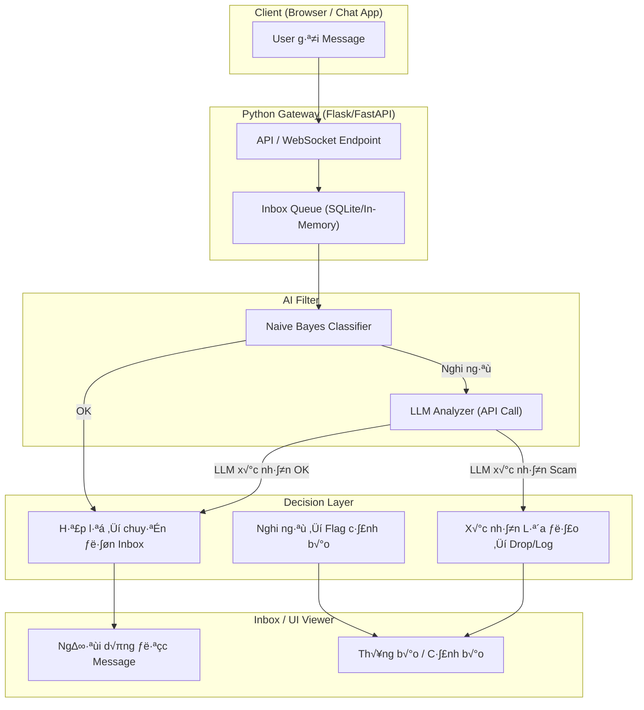

Giúp tôi xây dựng  **skeleton code Python cho toàn bộ kiến trúc này** (Flask API + queue + filter stub + LLM call stub), để chạy demo end-to-end cho demo sau đây. Tôi sẽ vẽ kiến trúc demo của bạn dưới dạng **Mermaid chart** (block diagram + data flow). Trong demo này, chúng ta thay email bằng “chat message”, nhưng vẫn mô phỏng được pipeline:



**Ý nghĩa kiến trúc:**
1. **Client**: gửi tin nhắn (giả lập email).
2. **Gateway**: nhận message qua API/WebSocket, lưu tạm vào queue hoặc DB.
3. **AI Filter**:
   * Naive Bayes lọc nhanh theo training dataset. Gửi dataset giả lập cho tôi.
   * Nếu nghi ngờ → gửi lên LLM API (OpenAI, Groq, OpenRouter…) để phân tích ngữ cảnh sâu.
4. **Decision Layer**: quyết định pass/block/flag message.
5. **User Inbox**: ng∆∞·ªùi d√πng xem message ho·∫∑c c·∫£nh b√°o.
Cái hay của demo này: **không cần dựng cả mail server**, chỉ cần Flask/FastAPI, SQLite, và model Naive Bayes.

Tôi sẽ giúp bạn xây dựng skeleton code Python cho toàn bộ kiến trúc này. Đây là một hệ thống demo hoàn chỉnh:

## 1. Cấu trúc project

```
spam_filter_demo/
├── app.py                 # Flask app chính
├── models/
│   ├── __init__.py
│   ├── naive_bayes.py     # Naive Bayes classifier
│   └── llm_analyzer.py    # LLM API calls
├── database/
│   ├── __init__.py
│   └── db_manager.py      # SQLite operations
├── config.py              # Configuration
├── static/                # Frontend files
│   ├── index.html
│   ├── style.css
│   └── app.js
├── data/
│   └── training_data.json # Dataset giả lập
└── requirements.txt
```

## 2. requirements.txt

```txt
Flask==2.3.3
Flask-SocketIO==5.3.6
scikit-learn==1.3.0
pandas==2.0.3
numpy==1.24.3
requests==2.31.0
python-socketio==5.8.0
```

## 3. config.py

```python
import os

class Config:
    SECRET_KEY = os.environ.get('SECRET_KEY') or 'dev-secret-key-12345'
    DATABASE_URL = 'database/messages.db'
    
    # LLM API Configuration (chọn một trong các provider)
    LLM_PROVIDER = 'openai'  # 'openai', 'groq', 'openrouter'
    
    # OpenAI
    OPENAI_API_KEY = os.environ.get('OPENAI_API_KEY') or 'your-openai-key'
    
    # Groq
    GROQ_API_KEY = os.environ.get('GROQ_API_KEY') or 'your-groq-key'
    
    # OpenRouter
    OPENROUTER_API_KEY = os.environ.get('OPENROUTER_API_KEY') or 'your-openrouter-key'
    
    # Filter thresholds
    NAIVE_BAYES_THRESHOLD = 0.7
    SUSPICIOUS_THRESHOLD = 0.5
```

## 4. data/training_data.json

```json
{
    "legitimate": [
        "Xin chào, tôi muốn hỏi về sản phẩm của công ty",
        "Cảm ơn bạn đã hỗ trợ tôi hôm qua",
        "Khi nào có meeting tiếp theo?",
        "Báo cáo tháng này đã hoàn thành",
        "Chúc mừng sinh nhật! Chúc bạn nhiều sức khỏe",
        "Tôi cần hỗ trợ về tài khoản của mình",
        "Lịch làm việc tuần này thế nào?",
        "Sản phẩm này có bảo hành không?",
        "Xin lỗi vì phản hồi muộn",
        "Có thể gửi thêm thông tin không?"
    ],
    "spam": [
        "CHÚC MỪNG! Bạn đã trúng giải 100 triệu VND! Click link ngay",
        "Vay tiền nhanh 24/7, không cần thế chấp! Liên hệ ngay",
        "Khuyến mãi đặc biệt chỉ hôm nay! Giảm 90% tất cả sản phẩm",
        "Bạn có muốn kiếm 50 triệu/tháng tại nhà không?",
        "CẢNH BÁO! Tài khoản sẽ bị khóa nếu không xác thực ngay",
        "Nhấp vào đây để nhận iPhone 15 Pro Max miễn phí",
        "Đầu tư Forex với lợi nhuận 500% mỗi tháng",
        "Thuốc tăng cường sinh lý nam 100% từ thiên nhiên",
        "Mua 1 tặng 10! Cơ hội có 1 không 2!",
        "Xác thực thông tin ngân hàng để tránh bị hack"
    ],
    "suspicious": [
        "Anh có thể chuyển khoản giúp em không? Em sẽ trả sau",
        "Link này hay lắm, bạn vào xem đi",
        "Tôi cần tiền gấp, bạn có thể giúp không?",
        "Nhấp vào đây để xem ảnh",
        "Bạn có tin tôi không? Đây là cơ hội đầu tư tốt",
        "Gửi mã OTP giúp tôi, tôi đang gặp khó khăn",
        "Tải app này để có tiền thưởng",
        "Bạn muốn làm giàu nhanh không?",
        "Chương trình ưu đãi đặc biệt cho bạn",
        "Xác nhận thông tin để nhận quà"
    ]
}
```

## 5. database/db_manager.py

```python
import sqlite3
import json
from datetime import datetime
from typing import List, Dict, Optional

class DatabaseManager:
    def __init__(self, db_path: str):
        self.db_path = db_path
        self.init_database()
    
    def init_database(self):
        """Khởi tạo database và các bảng"""
        conn = sqlite3.connect(self.db_path)
        cursor = conn.cursor()
        
        # B·∫£ng messages (queue)
        cursor.execute('''
            CREATE TABLE IF NOT EXISTS messages (
                id INTEGER PRIMARY KEY AUTOINCREMENT,
                content TEXT NOT NULL,
                sender TEXT NOT NULL,
                status TEXT DEFAULT 'pending',
                naive_bayes_score REAL,
                llm_score REAL,
                classification TEXT,
                created_at TIMESTAMP DEFAULT CURRENT_TIMESTAMP,
                processed_at TIMESTAMP
            )
        ''')
        
        # B·∫£ng logs
        cursor.execute('''
            CREATE TABLE IF NOT EXISTS filter_logs (
                id INTEGER PRIMARY KEY AUTOINCREMENT,
                message_id INTEGER,
                step TEXT,
                result TEXT,
                details TEXT,
                timestamp TIMESTAMP DEFAULT CURRENT_TIMESTAMP,
                FOREIGN KEY (message_id) REFERENCES messages (id)
            )
        ''')
        
        conn.commit()
        conn.close()
    
    def add_message(self, content: str, sender: str) -> int:
        """Thêm message vào queue"""
        conn = sqlite3.connect(self.db_path)
        cursor = conn.cursor()
        
        cursor.execute(
            "INSERT INTO messages (content, sender) VALUES (?, ?)",
            (content, sender)
        )
        
        message_id = cursor.lastrowid
        conn.commit()
        conn.close()
        
        return message_id
    
    def get_pending_messages(self) -> List[Dict]:
        """Lấy các message chưa xử lý"""
        conn = sqlite3.connect(self.db_path)
        conn.row_factory = sqlite3.Row
        cursor = conn.cursor()
        
        cursor.execute(
            "SELECT * FROM messages WHERE status = 'pending' ORDER BY created_at"
        )
        
        messages = [dict(row) for row in cursor.fetchall()]
        conn.close()
        
        return messages
    
    def update_message_status(self, message_id: int, status: str, 
                            classification: str = None, 
                            naive_bayes_score: float = None,
                            llm_score: float = None):
        """C·∫≠p nh·∫≠t tr·∫°ng th√°i message"""
        conn = sqlite3.connect(self.db_path)
        cursor = conn.cursor()
        
        update_fields = ["status = ?", "processed_at = CURRENT_TIMESTAMP"]
        values = [status]
        
        if classification:
            update_fields.append("classification = ?")
            values.append(classification)
        
        if naive_bayes_score is not None:
            update_fields.append("naive_bayes_score = ?")
            values.append(naive_bayes_score)
            
        if llm_score is not None:
            update_fields.append("llm_score = ?")
            values.append(llm_score)
        
        values.append(message_id)
        
        query = f"UPDATE messages SET {', '.join(update_fields)} WHERE id = ?"
        cursor.execute(query, values)
        
        conn.commit()
        conn.close()
    
    def log_filter_step(self, message_id: int, step: str, result: str, details: str = None):
        """Ghi log c√°c b∆∞·ªõc filter"""
        conn = sqlite3.connect(self.db_path)
        cursor = conn.cursor()
        
        cursor.execute(
            "INSERT INTO filter_logs (message_id, step, result, details) VALUES (?, ?, ?, ?)",
            (message_id, step, result, details or "")
        )
        
        conn.commit()
        conn.close()
    
    def get_inbox_messages(self, status: str = 'approved') -> List[Dict]:
        """Lấy messages trong inbox"""
        conn = sqlite3.connect(self.db_path)
        conn.row_factory = sqlite3.Row
        cursor = conn.cursor()
        
        cursor.execute(
            "SELECT * FROM messages WHERE status = ? ORDER BY created_at DESC",
            (status,)
        )
        
        messages = [dict(row) for row in cursor.fetchall()]
        conn.close()
        
        return messages
    
    def get_all_messages_with_logs(self) -> List[Dict]:
        """Lấy tất cả messages kèm logs để debug"""
        conn = sqlite3.connect(self.db_path)
        conn.row_factory = sqlite3.Row
        cursor = conn.cursor()
        
        query = '''
            SELECT m.*, 
                   GROUP_CONCAT(
                       fl.step || ': ' || fl.result || 
                       CASE WHEN fl.details != '' THEN ' (' || fl.details || ')' ELSE '' END
                       , ' | '
                   ) as filter_history
            FROM messages m
            LEFT JOIN filter_logs fl ON m.id = fl.message_id
            GROUP BY m.id
            ORDER BY m.created_at DESC
        '''
        
        cursor.execute(query)
        messages = [dict(row) for row in cursor.fetchall()]
        conn.close()
        
        return messages
```

## 6. models/naive_bayes.py

```python
import json
import pickle
import os
from sklearn.feature_extraction.text import TfidfVectorizer
from sklearn.naive_bayes import MultinomialNB
from sklearn.pipeline import Pipeline
import re

class NaiveBayesFilter:
    def __init__(self, model_path: str = 'models/nb_model.pkl'):
        self.model_path = model_path
        self.pipeline = None
        self.load_or_train_model()
    
    def preprocess_text(self, text: str) -> str:
        """Tiền xử lý văn bản tiếng Việt"""
        # Chuyển về chữ thường
        text = text.lower()
        # Loại bỏ ký tự đặc biệt, giữ lại chữ cái và số
        text = re.sub(r'[^\w\s]', ' ', text)
        # Loại bỏ khoảng trắng thừa
        text = re.sub(r'\s+', ' ', text).strip()
        return text
    
    def load_training_data(self) -> tuple:
        """Load dữ liệu training từ file JSON"""
        with open('data/training_data.json', 'r', encoding='utf-8') as f:
            data = json.load(f)
        
        texts = []
        labels = []
        
        # Legitimate messages (label = 0)
        for text in data['legitimate']:
            texts.append(self.preprocess_text(text))
            labels.append(0)
        
        # Spam messages (label = 2)
        for text in data['spam']:
            texts.append(self.preprocess_text(text))
            labels.append(2)
        
        # Suspicious messages (label = 1)
        for text in data['suspicious']:
            texts.append(self.preprocess_text(text))
            labels.append(1)
        
        return texts, labels
    
    def train_model(self):
        """Huấn luyện model Naive Bayes"""
        print("Training Naive Bayes model...")
        
        texts, labels = self.load_training_data()
        
        # T·∫°o pipeline: TF-IDF + Naive Bayes
        self.pipeline = Pipeline([
            ('tfidf', TfidfVectorizer(
                max_features=1000,
                ngram_range=(1, 2),
                stop_words=None  # Không dùng stop words cho tiếng Việt
            )),
            ('nb', MultinomialNB(alpha=1.0))
        ])
        
        # Train model
        self.pipeline.fit(texts, labels)
        
        # L∆∞u model
        os.makedirs(os.path.dirname(self.model_path), exist_ok=True)
        with open(self.model_path, 'wb') as f:
            pickle.dump(self.pipeline, f)
        
        print(f"Model saved to {self.model_path}")
    
    def load_model(self):
        """Load model đã train"""
        try:
            with open(self.model_path, 'rb') as f:
                self.pipeline = pickle.load(f)
            print(f"Model loaded from {self.model_path}")
            return True
        except FileNotFoundError:
            print(f"Model file not found: {self.model_path}")
            return False
    
    def load_or_train_model(self):
        """Load model hoặc train nếu chưa có"""
        if not self.load_model():
            self.train_model()
    
    def predict(self, text: str) -> tuple:
        """
        Dự đoán phân loại message
        Returns: (prediction, probability_scores)
        prediction: 0=legitimate, 1=suspicious, 2=spam
        probability_scores: [prob_legitimate, prob_suspicious, prob_spam]
        """
        if not self.pipeline:
            raise Exception("Model chưa được load hoặc train")
        
        processed_text = self.preprocess_text(text)
        
        # Predict class
        prediction = self.pipeline.predict([processed_text])[0]
        
        # Get probability scores
        probabilities = self.pipeline.predict_proba([processed_text])[0]
        
        return int(prediction), probabilities.tolist()
    
    def get_classification_name(self, prediction: int) -> str:
        """Chuyển đổi số prediction thành tên"""
        mapping = {0: 'legitimate', 1: 'suspicious', 2: 'spam'}
        return mapping.get(prediction, 'unknown')
```

## 7. models/llm_analyzer.py

```python
import requests
import json
from config import Config

class LLMAnalyzer:
    def __init__(self):
        self.config = Config()
        self.provider = self.config.LLM_PROVIDER.lower()
    
    def analyze_message(self, message: str) -> dict:
        """
        Phân tích message bằng LLM
        Returns: {
            'is_spam': bool,
            'confidence': float,
            'reason': str,
            'classification': str
        }
        """
        try:
            if self.provider == 'openai':
                return self._analyze_with_openai(message)
            elif self.provider == 'groq':
                return self._analyze_with_groq(message)
            elif self.provider == 'openrouter':
                return self._analyze_with_openrouter(message)
            else:
                # Fallback: mock response for demo
                return self._mock_analysis(message)
        except Exception as e:
            print(f"LLM Analysis error: {e}")
            # Trả về kết quả an toàn khi có lỗi
            return {
                'is_spam': True,  # Conservative approach
                'confidence': 0.5,
                'reason': f'Analysis failed: {str(e)}',
                'classification': 'suspicious'
            }
    
    def _create_prompt(self, message: str) -> str:
        """T·∫°o prompt cho LLM"""
        return f"""
Analyze the following Vietnamese message for spam/scam detection:

Message: "{message}"

Please analyze and respond in JSON format:
{{
    "is_spam": true/false,
    "confidence": 0.0-1.0,
    "reason": "explanation in Vietnamese",
    "classification": "legitimate/suspicious/spam"
}}

Consider these factors:
- Urgent money requests
- Suspicious links or downloads
- Too-good-to-be-true offers
- Requests for personal information
- Grammar and spelling patterns
- Social engineering tactics

Response (JSON only):
"""
    
    def _analyze_with_openai(self, message: str) -> dict:
        """Phân tích bằng OpenAI API"""
        url = "https://api.openai.com/v1/chat/completions"
        headers = {
            "Authorization": f"Bearer {self.config.OPENAI_API_KEY}",
            "Content-Type": "application/json"
        }
        
        payload = {
            "model": "gpt-3.5-turbo",
            "messages": [
                {"role": "user", "content": self._create_prompt(message)}
            ],
            "max_tokens": 200,
            "temperature": 0.3
        }
        
        response = requests.post(url, headers=headers, json=payload, timeout=30)
        response.raise_for_status()
        
        result = response.json()
        content = result['choices'][0]['message']['content']
        
        return self._parse_llm_response(content)
    
    def _analyze_with_groq(self, message: str) -> dict:
        """Phân tích bằng Groq API"""
        url = "https://api.groq.com/openai/v1/chat/completions"
        headers = {
            "Authorization": f"Bearer {self.config.GROQ_API_KEY}",
            "Content-Type": "application/json"
        }
        
        payload = {
            "model": "mixtral-8x7b-32768",
            "messages": [
                {"role": "user", "content": self._create_prompt(message)}
            ],
            "max_tokens": 200,
            "temperature": 0.3
        }
        
        response = requests.post(url, headers=headers, json=payload, timeout=30)
        response.raise_for_status()
        
        result = response.json()
        content = result['choices'][0]['message']['content']
        
        return self._parse_llm_response(content)
    
    def _analyze_with_openrouter(self, message: str) -> dict:
        """Phân tích bằng OpenRouter API"""
        url = "https://openrouter.ai/api/v1/chat/completions"
        headers = {
            "Authorization": f"Bearer {self.config.OPENROUTER_API_KEY}",
            "Content-Type": "application/json",
            "HTTP-Referer": "http://localhost:5000",
            "X-Title": "Spam Filter Demo"
        }
        
        payload = {
            "model": "microsoft/wizardlm-2-8x22b",
            "messages": [
                {"role": "user", "content": self._create_prompt(message)}
            ],
            "max_tokens": 200,
            "temperature": 0.3
        }
        
        response = requests.post(url, headers=headers, json=payload, timeout=30)
        response.raise_for_status()
        
        result = response.json()
        content = result['choices'][0]['message']['content']
        
        return self._parse_llm_response(content)
    
    def _mock_analysis(self, message: str) -> dict:
        """Mock analysis cho demo (khi không có API key)"""
        message_lower = message.lower()
        
        # Từ khóa spam
        spam_keywords = [
            'trúng giải', 'vay tiền', 'khuyến mãi', 'miễn phí', 
            'click link', 'chuyển khoản', 'mã otp', 'xác thực',
            'làm giàu', 'đầu tư', 'lợi nhuận', 'cảnh báo'
        ]
        
        spam_count = sum(1 for keyword in spam_keywords if keyword in message_lower)
        
        if spam_count >= 2:
            return {
                'is_spam': True,
                'confidence': 0.8,
                'reason': f'Phát hiện {spam_count} từ khóa nghi vấn spam',
                'classification': 'spam'
            }
        elif spam_count == 1:
            return {
                'is_spam': False,
                'confidence': 0.6,
                'reason': 'Có 1 từ khóa nghi vấn nhưng chưa đủ để xác định spam',
                'classification': 'suspicious'
            }
        else:
            return {
                'is_spam': False,
                'confidence': 0.9,
                'reason': 'Không phát hiện từ khóa spam',
                'classification': 'legitimate'
            }
    
    def _parse_llm_response(self, content: str) -> dict:
        """Parse JSON response t·ª´ LLM"""
        try:
            # Tìm JSON trong response
            start = content.find('{')
            end = content.rfind('}') + 1
            
            if start != -1 and end != 0:
                json_str = content[start:end]
                result = json.loads(json_str)
                
                # Validate required fields
                required_fields = ['is_spam', 'confidence', 'reason', 'classification']
                for field in required_fields:
                    if field not in result:
                        raise ValueError(f"Missing field: {field}")
                
                return result
            else:
                raise ValueError("No JSON found in response")
        
        except Exception as e:
            print(f"Error parsing LLM response: {e}")
            print(f"Raw content: {content}")
            
            # Fallback response
            return {
                'is_spam': True,
                'confidence': 0.5,
                'reason': 'Không thể phân tích response từ LLM',
                'classification': 'suspicious'
            }
```

## 8. app.py (Flask App chính)

```python
from flask import Flask, render_template, request, jsonify
from flask_socketio import SocketIO, emit
import threading
import time
from datetime import datetime

from config import Config
from database.db_manager import DatabaseManager
from models.naive_bayes import NaiveBayesFilter
from models.llm_analyzer import LLMAnalyzer

app = Flask(__name__)
app.config.from_object(Config)
socketio = SocketIO(app, cors_allowed_origins="*")

# Khởi tạo components
db = DatabaseManager(Config.DATABASE_URL)
nb_filter = NaiveBayesFilter()
llm_analyzer = LLMAnalyzer()

# Background processor
class MessageProcessor:
    def __init__(self):
        self.running = False
        self.thread = None
    
    def start(self):
        if not self.running:
            self.running = True
            self.thread = threading.Thread(target=self._process_loop)
            self.thread.daemon = True
            self.thread.start()
            print("Message processor started")
    
    def stop(self):
        self.running = False
        if self.thread:
            self.thread.join()
        print("Message processor stopped")
    
    def _process_loop(self):
        """Vòng lặp xử lý messages"""
        while self.running:
            try:
                pending_messages = db.get_pending_messages()
                
                for message in pending_messages:
                    if not self.running:
                        break
                    
                    self._process_message(message)
                    
                    # Emit update to clients
                    socketio.emit('message_processed', {
                        'message_id': message['id'],
                        'status': 'processed'
                    })
                
                time.sleep(2)  # Kiểm tra mỗi 2 giây
                
            except Exception as e:
                print(f"Error in process loop: {e}")
                time.sleep(5)
    
    def _process_message(self, message):
        """Xử lý một message qua pipeline filter"""
        message_id = message['id']
        content = message['content']
        
        try:
            # Step 1: Naive Bayes Classification
            prediction, probabilities = nb_filter.predict(content)
            nb_classification = nb_filter.get_classification_name(prediction)
            max_prob = max(probabilities)
            
            db.log_filter_step(
                message_id, 
                'naive_bayes', 
                nb_classification,
                f'Probability: {max_prob:.3f}'
            )
            
            # Decision logic
            if prediction == 0 and max_prob >= Config.NAIVE_BAYES_THRESHOLD:
                # Legitimate v·ªõi confidence cao ‚Üí Pass
                final_status = 'approved'
                final_classification = 'legitimate'
                db.log_filter_step(message_id, 'decision', 'approved', 'NB high confidence legitimate')
                
            elif prediction == 2 and max_prob >= Config.NAIVE_BAYES_THRESHOLD:
                # Spam v·ªõi confidence cao ‚Üí Block
                final_status = 'blocked'
                final_classification = 'spam'
                db.log_filter_step(message_id, 'decision', 'blocked', 'NB high confidence spam')
                
            else:
                # Suspicious hoặc low confidence → Gửi qua LLM
                db.log_filter_step(message_id, 'llm_analysis', 'started', 'Low NB confidence, escalating to LLM')
                
                llm_result = llm_analyzer.analyze_message(content)
                
                db.log_filter_step(
                    message_id, 
                    'llm_analysis', 
                    llm_result['classification'],
                    f"Confidence: {llm_result['confidence']:.3f}, Reason: {llm_result['reason'][:100]}"
                )
                
                # Final decision based on LLM
                if llm_result['is_spam']:
                    final_status = 'blocked'
                    final_classification = 'spam'
                    db.log_filter_step(message_id, 'decision', 'blocked', 'LLM confirmed spam')
                else:
                    if llm_result['classification'] == 'suspicious':
                        final_status = 'flagged'
                        final_classification = 'suspicious'
                        db.log_filter_step(message_id, 'decision', 'flagged', 'LLM marked as suspicious')
                    else:
                        final_status = 'approved'
                        final_classification = 'legitimate'
                        db.log_filter_step(message_id, 'decision', 'approved', 'LLM confirmed legitimate')
            
            # Update message status
            db.update_message_status(
                message_id,
                final_status,
                final_classification,
                max_prob,
                llm_result.get('confidence') if 'llm_result' in locals() else None
            )
            
            print(f"Processed message {message_id}: {final_status} ({final_classification})")
            
        except Exception as e:
            print(f"Error processing message {message_id}: {e}")
            db.log_filter_step(message_id, 'error', 'failed', str(e))
            db.update_message_status(message_id, 'error', 'error')

# Khởi tạo processor
processor = MessageProcessor()

# Routes
@app.route('/')
def index():
    return render_template('index.html')

@app.route('/api/send_message', methods=['POST'])
def send_message():
    """API nh·∫≠n message m·ªõi"""
    data = request.json
    content = data.get('content', '').strip()
    sender = data.get('sender', 'Anonymous')
    
    if not content:
        return jsonify({'error': 'Message content is required'}), 400
    
    # Thêm vào queue
    message_id = db.add_message(content, sender)
    
    return jsonify({
        'success': True,
        'message_id': message_id,
        'message': 'Message added to queue for processing'
    })

@app.route('/api/inbox')
def get_inbox():
    """Lấy messages trong inbox"""
    status = request.args.get('status', 'approved')
    messages = db.get_inbox_messages(status)
    return jsonify(messages)

@app.route('/api/admin/messages')
def get_all_messages():
    """Admin: xem tất cả messages và logs"""
    messages = db.get_all_messages_with_logs()
    return jsonify(messages)

@app.route('/api/stats')
def get_stats():
    """Thống kê tổng quan"""
    # TODO: Implement stats t·ª´ database
    return jsonify({
        'total_processed': 0,
        'legitimate': 0,
        'suspicious': 0,
        'spam': 0,
        'blocked': 0
    })

# WebSocket events
@socketio.on('connect')
def handle_connect():
    print('Client connected')
    emit('status', {'message': 'Connected to spam filter system'})

@socketio.on('disconnect')
def handle_disconnect():
    print('Client disconnected')

# Start background processor when app starts
@app.before_first_request
def start_processor():
    processor.start()

if __name__ == '__main__':
    import os
    
    # Tạo thư mục cần thiết
    os.makedirs('database', exist_ok=True)
    os.makedirs('models', exist_ok=True)
    os.makedirs('static', exist_ok=True)
    
    print("=== Spam Filter Demo Starting ===")
    print("1. Training/Loading Naive Bayes model...")
    print("2. Initializing database...")
    print("3. Starting Flask app...")
    
    socketio.run(app, debug=True, host='0.0.0.0', port=5000)
```

## 9. Frontend (static/index.html)
## 9. Frontend (static/index.html)

```html
<!DOCTYPE html>
<html lang="vi">
<head>
    <meta charset="UTF-8">
    <meta name="viewport" content="width=device-width, initial-scale=1.0">
    <title>Spam Filter Demo - Anti-Scam Chat System</title>
    <link rel="stylesheet" href="{{ url_for('static', filename='style.css') }}">
    <script src="https://cdn.socket.io/4.5.0/socket.io.min.js"></script>
</head>
<body>
    <div class="container">
        <!-- Header -->
        <header class="header">
            <h1>🛡️ Spam Filter Demo</h1>
            <p>AI-Powered Anti-Scam Chat System</p>
            <div class="status-indicator" id="connectionStatus">
                <span class="status-dot offline"></span>
                <span>Disconnected</span>
            </div>
        </header>

        <!-- Main Content -->
        <div class="main-content">
            <!-- Left Panel: Chat Interface -->
            <div class="panel chat-panel">
                <h2>💬 Send Message</h2>
                
                <form id="messageForm" class="message-form">
                    <div class="form-group">
                        <label for="sender">Sender Name:</label>
                        <input type="text" id="sender" name="sender" placeholder="Your name..." required>
                    </div>
                    
                    <div class="form-group">
                        <label for="message">Message:</label>
                        <textarea id="message" name="message" rows="4" 
                                placeholder="Type your message here..." required></textarea>
                    </div>
                    
                    <button type="submit" class="btn btn-primary">Send Message</button>
                </form>

                <!-- Quick Test Messages -->
                <div class="quick-tests">
                    <h3>üß™ Quick Tests</h3>
                    <div class="test-buttons">
                        <button class="btn btn-small btn-success" onclick="sendTestMessage('legitimate')">
                            ‚úÖ Legitimate
                        </button>
                        <button class="btn btn-small btn-warning" onclick="sendTestMessage('suspicious')">
                            ⚠️ Suspicious
                        </button>
                        <button class="btn btn-small btn-danger" onclick="sendTestMessage('spam')">
                            ‚ùå Spam
                        </button>
                    </div>
                </div>

                <!-- Processing Status -->
                <div id="processingStatus" class="processing-status" style="display: none;">
                    <div class="loading-spinner"></div>
                    <span>Processing message...</span>
                </div>
            </div>

            <!-- Right Panel: Results -->
            <div class="panel results-panel">
                <!-- Tabs -->
                <div class="tabs">
                    <button class="tab-button active" onclick="showTab('inbox')">
                        üì• Inbox
                    </button>
                    <button class="tab-button" onclick="showTab('flagged')">
                        ⚠️ Flagged
                    </button>
                    <button class="tab-button" onclick="showTab('blocked')">
                        üö´ Blocked
                    </button>
                    <button class="tab-button" onclick="showTab('admin')">
                        üîß Admin
                    </button>
                </div>

                <!-- Tab Content -->
                <div id="inbox-tab" class="tab-content active">
                    <h3>üì• Clean Messages</h3>
                    <div id="inboxMessages" class="message-list">
                        <p class="empty-state">No messages yet...</p>
                    </div>
                </div>

                <div id="flagged-tab" class="tab-content">
                    <h3>⚠️ Flagged Messages</h3>
                    <div id="flaggedMessages" class="message-list">
                        <p class="empty-state">No flagged messages...</p>
                    </div>
                </div>

                <div id="blocked-tab" class="tab-content">
                    <h3>üö´ Blocked Messages</h3>
                    <div id="blockedMessages" class="message-list">
                        <p class="empty-state">No blocked messages...</p>
                    </div>
                </div>

                <div id="admin-tab" class="tab-content">
                    <h3>üîß Admin Panel</h3>
                    <div class="admin-controls">
                        <button class="btn btn-info" onclick="refreshAllData()">
                            🔄 Refresh All
                        </button>
                        <button class="btn btn-secondary" onclick="exportLogs()">
                            üìä Export Logs
                        </button>
                    </div>
                    <div id="adminMessages" class="message-list admin-list">
                        <p class="empty-state">Loading admin data...</p>
                    </div>
                </div>
            </div>
        </div>

        <!-- Stats Bar -->
        <div class="stats-bar">
            <div class="stat-item">
                <span class="stat-label">Total Processed:</span>
                <span id="totalProcessed" class="stat-value">0</span>
            </div>
            <div class="stat-item">
                <span class="stat-label">Legitimate:</span>
                <span id="legitimateCount" class="stat-value">0</span>
            </div>
            <div class="stat-item">
                <span class="stat-label">Suspicious:</span>
                <span id="suspiciousCount" class="stat-value">0</span>
            </div>
            <div class="stat-item">
                <span class="stat-label">Blocked:</span>
                <span id="blockedCount" class="stat-value">0</span>
            </div>
        </div>

        <!-- Toast Notifications -->
        <div id="toastContainer" class="toast-container"></div>
    </div>

    <script src="{{ url_for('static', filename='app.js') }}"></script>
</body>
</html>
```

## 10. static/style.css

```css
/* Reset và Base Styles */
* {
    margin: 0;
    padding: 0;
    box-sizing: border-box;
}

body {
    font-family: 'Segoe UI', Tahoma, Geneva, Verdana, sans-serif;
    background: linear-gradient(135deg, #667eea 0%, #764ba2 100%);
    min-height: 100vh;
    color: #333;
}

.container {
    max-width: 1400px;
    margin: 0 auto;
    padding: 20px;
}

/* Header */
.header {
    background: rgba(255, 255, 255, 0.95);
    border-radius: 15px;
    padding: 30px;
    text-align: center;
    margin-bottom: 20px;
    box-shadow: 0 8px 32px rgba(0, 0, 0, 0.1);
    backdrop-filter: blur(10px);
}

.header h1 {
    font-size: 2.5em;
    margin-bottom: 10px;
    background: linear-gradient(45deg, #667eea, #764ba2);
    -webkit-background-clip: text;
    -webkit-text-fill-color: transparent;
    background-clip: text;
}

.header p {
    font-size: 1.1em;
    color: #666;
    margin-bottom: 15px;
}

/* Status Indicator */
.status-indicator {
    display: inline-flex;
    align-items: center;
    gap: 8px;
    padding: 8px 16px;
    border-radius: 20px;
    background: #f8f9fa;
    border: 2px solid #e9ecef;
    font-size: 0.9em;
    font-weight: 500;
}

.status-dot {
    width: 10px;
    height: 10px;
    border-radius: 50%;
    animation: pulse 2s infinite;
}

.status-dot.online {
    background: #28a745;
}

.status-dot.offline {
    background: #dc3545;
    animation: none;
}

@keyframes pulse {
    0% { opacity: 1; }
    50% { opacity: 0.5; }
    100% { opacity: 1; }
}

/* Main Content Layout */
.main-content {
    display: grid;
    grid-template-columns: 1fr 1fr;
    gap: 20px;
    margin-bottom: 20px;
}

@media (max-width: 768px) {
    .main-content {
        grid-template-columns: 1fr;
    }
}

/* Panel Styles */
.panel {
    background: rgba(255, 255, 255, 0.95);
    border-radius: 15px;
    padding: 25px;
    box-shadow: 0 8px 32px rgba(0, 0, 0, 0.1);
    backdrop-filter: blur(10px);
}

.panel h2 {
    margin-bottom: 20px;
    color: #333;
    font-size: 1.5em;
}

/* Message Form */
.message-form {
    margin-bottom: 30px;
}

.form-group {
    margin-bottom: 20px;
}

.form-group label {
    display: block;
    margin-bottom: 8px;
    font-weight: 600;
    color: #555;
}

.form-group input,
.form-group textarea {
    width: 100%;
    padding: 12px 16px;
    border: 2px solid #e9ecef;
    border-radius: 8px;
    font-size: 14px;
    transition: border-color 0.3s, box-shadow 0.3s;
}

.form-group input:focus,
.form-group textarea:focus {
    outline: none;
    border-color: #667eea;
    box-shadow: 0 0 0 3px rgba(102, 126, 234, 0.1);
}

/* Buttons */
.btn {
    display: inline-block;
    padding: 12px 24px;
    border: none;
    border-radius: 8px;
    font-size: 14px;
    font-weight: 600;
    text-decoration: none;
    cursor: pointer;
    transition: all 0.3s;
    text-align: center;
}

.btn-primary {
    background: linear-gradient(45deg, #667eea, #764ba2);
    color: white;
}

.btn-primary:hover {
    transform: translateY(-2px);
    box-shadow: 0 6px 20px rgba(102, 126, 234, 0.4);
}

.btn-success {
    background: #28a745;
    color: white;
}

.btn-warning {
    background: #ffc107;
    color: #212529;
}

.btn-danger {
    background: #dc3545;
    color: white;
}

.btn-info {
    background: #17a2b8;
    color: white;
}

.btn-secondary {
    background: #6c757d;
    color: white;
}

.btn-small {
    padding: 8px 16px;
    font-size: 12px;
}

.btn:hover {
    transform: translateY(-2px);
    box-shadow: 0 4px 15px rgba(0, 0, 0, 0.2);
}

/* Quick Tests */
.quick-tests {
    margin-top: 20px;
    padding-top: 20px;
    border-top: 1px solid #e9ecef;
}

.quick-tests h3 {
    margin-bottom: 15px;
    font-size: 1.1em;
    color: #666;
}

.test-buttons {
    display: flex;
    gap: 10px;
    flex-wrap: wrap;
}

/* Processing Status */
.processing-status {
    display: flex;
    align-items: center;
    gap: 10px;
    padding: 15px;
    background: #e3f2fd;
    border-radius: 8px;
    color: #1565c0;
    font-weight: 500;
    margin-top: 20px;
}

.loading-spinner {
    width: 20px;
    height: 20px;
    border: 2px solid #e3f2fd;
    border-top: 2px solid #1565c0;
    border-radius: 50%;
    animation: spin 1s linear infinite;
}

@keyframes spin {
    0% { transform: rotate(0deg); }
    100% { transform: rotate(360deg); }
}

/* Tabs */
.tabs {
    display: flex;
    margin-bottom: 20px;
    border-bottom: 2px solid #e9ecef;
}

.tab-button {
    background: none;
    border: none;
    padding: 12px 20px;
    cursor: pointer;
    font-size: 14px;
    font-weight: 500;
    color: #666;
    transition: all 0.3s;
    border-bottom: 2px solid transparent;
}

.tab-button:hover {
    color: #667eea;
    background: rgba(102, 126, 234, 0.05);
}

.tab-button.active {
    color: #667eea;
    border-bottom-color: #667eea;
    background: rgba(102, 126, 234, 0.1);
}

/* Tab Content */
.tab-content {
    display: none;
}

.tab-content.active {
    display: block;
}

.tab-content h3 {
    margin-bottom: 15px;
    font-size: 1.2em;
    color: #333;
}

/* Message List */
.message-list {
    max-height: 500px;
    overflow-y: auto;
}

.message-item {
    background: #f8f9fa;
    border-radius: 10px;
    padding: 15px;
    margin-bottom: 15px;
    border-left: 4px solid #e9ecef;
    transition: transform 0.2s;
}

.message-item:hover {
    transform: translateX(5px);
}

.message-item.legitimate {
    border-left-color: #28a745;
    background: rgba(40, 167, 69, 0.05);
}

.message-item.suspicious {
    border-left-color: #ffc107;
    background: rgba(255, 193, 7, 0.05);
}

.message-item.spam {
    border-left-color: #dc3545;
    background: rgba(220, 53, 69, 0.05);
}

.message-header {
    display: flex;
    justify-content: space-between;
    align-items: center;
    margin-bottom: 10px;
}

.message-sender {
    font-weight: 600;
    color: #333;
}

.message-time {
    font-size: 12px;
    color: #666;
}

.message-content {
    margin-bottom: 10px;
    line-height: 1.5;
}

.message-meta {
    display: flex;
    gap: 15px;
    font-size: 12px;
    color: #666;
}

.classification-badge {
    padding: 4px 8px;
    border-radius: 12px;
    font-size: 11px;
    font-weight: 600;
    text-transform: uppercase;
}

.classification-badge.legitimate {
    background: #d4edda;
    color: #155724;
}

.classification-badge.suspicious {
    background: #fff3cd;
    color: #856404;
}

.classification-badge.spam {
    background: #f8d7da;
    color: #721c24;
}

/* Admin List */
.admin-list .message-item {
    border-left: 4px solid #17a2b8;
}

.filter-history {
    margin-top: 10px;
    padding-top: 10px;
    border-top: 1px solid #dee2e6;
    font-size: 11px;
    color: #666;
    font-family: monospace;
}

/* Admin Controls */
.admin-controls {
    margin-bottom: 20px;
    display: flex;
    gap: 10px;
}

/* Empty State */
.empty-state {
    text-align: center;
    color: #666;
    font-style: italic;
    padding: 40px 20px;
}

/* Stats Bar */
.stats-bar {
    display: grid;
    grid-template-columns: repeat(auto-fit, minmax(200px, 1fr));
    gap: 15px;
    background: rgba(255, 255, 255, 0.95);
    border-radius: 15px;
    padding: 20px;
    box-shadow: 0 8px 32px rgba(0, 0, 0, 0.1);
    backdrop-filter: blur(10px);
}

.stat-item {
    text-align: center;
    padding: 15px;
    background: #f8f9fa;
    border-radius: 10px;
}

.stat-label {
    display: block;
    font-size: 12px;
    color: #666;
    margin-bottom: 5px;
    font-weight: 500;
}

.stat-value {
    display: block;
    font-size: 24px;
    font-weight: 700;
    color: #333;
}

/* Toast Notifications */
.toast-container {
    position: fixed;
    top: 20px;
    right: 20px;
    z-index: 1000;
}

.toast {
    background: white;
    border-radius: 10px;
    padding: 15px 20px;
    margin-bottom: 10px;
    box-shadow: 0 6px 25px rgba(0, 0, 0, 0.15);
    border-left: 4px solid #667eea;
    animation: slideInRight 0.3s ease-out;
    min-width: 300px;
}

.toast.success {
    border-left-color: #28a745;
}

.toast.error {
    border-left-color: #dc3545;
}

.toast.warning {
    border-left-color: #ffc107;
}

@keyframes slideInRight {
    from {
        transform: translateX(100%);
        opacity: 0;
    }
    to {
        transform: translateX(0);
        opacity: 1;
    }
}

/* Scrollbar Styling */
.message-list::-webkit-scrollbar {
    width: 6px;
}

.message-list::-webkit-scrollbar-track {
    background: #f1f1f1;
    border-radius: 3px;
}

.message-list::-webkit-scrollbar-thumb {
    background: #c1c1c1;
    border-radius: 3px;
}

.message-list::-webkit-scrollbar-thumb:hover {
    background: #a8a8a8;
}

/* Responsive Design */
@media (max-width: 768px) {
    .container {
        padding: 10px;
    }
    
    .header {
        padding: 20px;
    }
    
    .header h1 {
        font-size: 2em;
    }
    
    .test-buttons {
        justify-content: center;
    }
    
    .admin-controls {
        flex-direction: column;
    }
    
    .stats-bar {
        grid-template-columns: repeat(2, 1fr);
    }
}

@media (max-width: 480px) {
    .tabs {
        flex-wrap: wrap;
    }
    
    .tab-button {
        padding: 8px 12px;
        font-size: 12px;
    }
    
    .stats-bar {
        grid-template-columns: 1fr;
    }
}
```

## 11. static/app.js

```javascript
class SpamFilterApp {
    constructor() {
        this.socket = null;
        this.currentTab = 'inbox';
        this.testMessages = {
            legitimate: [
                "Xin chào, tôi muốn hỏi về sản phẩm của công ty",
                "Cảm ơn bạn đã hỗ trợ tôi hôm qua",
                "Khi nào có meeting tiếp theo?"
            ],
            suspicious: [
                "Anh có thể chuyển khoản giúp em không? Em sẽ trả sau",
                "Link này hay lắm, bạn vào xem đi",
                "Gửi mã OTP giúp tôi, tôi đang gặp khó khăn"
            ],
            spam: [
                "CHÚC MỪNG! Bạn đã trúng giải 100 triệu VND! Click link ngay",
                "Vay tiền nhanh 24/7, không cần thế chấp! Liên hệ ngay",
                "CẢNH BÁO! Tài khoản sẽ bị khóa nếu không xác thực ngay"
            ]
        };
        
        this.init();
    }
    
    init() {
        this.initSocket();
        this.initEventListeners();
        this.loadInitialData();
    }
    
    initSocket() {
        this.socket = io();
        
        this.socket.on('connect', () => {
            this.updateConnectionStatus(true);
            this.showToast('Connected to server', 'success');
        });
        
        this.socket.on('disconnect', () => {
            this.updateConnectionStatus(false);
            this.showToast('Disconnected from server', 'error');
        });
        
        this.socket.on('message_processed', (data) => {
            this.showToast(`Message ${data.message_id} processed`, 'success');
            this.loadTabData(this.currentTab);
            this.loadStats();
        });
        
        this.socket.on('status', (data) => {
            console.log('Server status:', data);
        });
    }
    
    initEventListeners() {
        // Message form submission
        const messageForm = document.getElementById('messageForm');
        messageForm.addEventListener('submit', (e) => {
            e.preventDefault();
            this.sendMessage();
        });
        
        // Tab switching
        document.querySelectorAll('.tab-button').forEach(button => {
            button.addEventListener('click', (e) => {
                const tabName = e.target.onclick.toString().match(/showTab\('(.+)'\)/)[1];
                this.showTab(tabName);
            });
        });
        
        // Auto-refresh every 10 seconds
        setInterval(() => {
            this.loadTabData(this.currentTab);
            this.loadStats();
        }, 10000);
    }
    
    updateConnectionStatus(connected) {
        const statusIndicator = document.getElementById('connectionStatus');
        const dot = statusIndicator.querySelector('.status-dot');
        const text = statusIndicator.querySelector('span:last-child');
        
        if (connected) {
            dot.className = 'status-dot online';
            text.textContent = 'Connected';
        } else {
            dot.className = 'status-dot offline';
            text.textContent = 'Disconnected';
        }
    }
    
    async sendMessage() {
        const senderInput = document.getElementById('sender');
        const messageInput = document.getElementById('message');
        const processingStatus = document.getElementById('processingStatus');
        
        const sender = senderInput.value.trim();
        const content = messageInput.value.trim();
        
        if (!sender || !content) {
            this.showToast('Please fill in all fields', 'warning');
            return;
        }
        
        // Show processing status
        processingStatus.style.display = 'flex';
        
        try {
            const response = await fetch('/api/send_message', {
                method: 'POST',
                headers: {
                    'Content-Type': 'application/json',
                },
                body: JSON.stringify({ sender, content })
            });
            
            const data = await response.json();
            
            if (data.success) {
                this.showToast(`Message sent! ID: ${data.message_id}`, 'success');
                messageInput.value = '';
                
                // Auto-refresh after 3 seconds
                setTimeout(() => {
                    this.loadTabData(this.currentTab);
                    this.loadStats();
                }, 3000);
            } else {
                this.showToast(data.error || 'Failed to send message', 'error');
            }
        } catch (error) {
            console.error('Error sending message:', error);
            this.showToast('Network error', 'error');
        } finally {
            processingStatus.style.display = 'none';
        }
    }
    
    sendTestMessage(type) {
        const messages = this.testMessages[type];
        const randomMessage = messages[Math.floor(Math.random() * messages.length)];
        
        document.getElementById('sender').value = `Test User (${type})`;
        document.getElementById('message').value = randomMessage;
        
        this.sendMessage();
    }
    
    showTab(tabName) {
        // Update active tab button
        document.querySelectorAll('.tab-button').forEach(button => {
            button.classList.remove('active');
        });
        event.target.classList.add('active');
        
        // Update active tab content
        document.querySelectorAll('.tab-content').forEach(content => {
            content.classList.remove('active');
        });
        document.getElementById(`${tabName}-tab`).classList.add('active');
        
        this.currentTab = tabName;
        this.loadTabData(tabName);
    }
    
    async loadTabData(tabName) {
        let apiEndpoint;
        let containerId;
        
        switch (tabName) {
            case 'inbox':
                apiEndpoint = '/api/inbox?status=approved';
                containerId = 'inboxMessages';
                break;
            case 'flagged':
                apiEndpoint = '/api/inbox?status=flagged';
                containerId = 'flaggedMessages';
                break;
            case 'blocked':
                apiEndpoint = '/api/inbox?status=blocked';
                containerId = 'blockedMessages';
                break;
            case 'admin':
                apiEndpoint = '/api/admin/messages';
                containerId = 'adminMessages';
                break;
            default:
                return;
        }
        
        try {
            const response = await fetch(apiEndpoint);
            const data = await response.json();
            
            this.renderMessages(data, containerId, tabName === 'admin');
        } catch (error) {
            console.error(`Error loading ${tabName} data:`, error);
            this.showToast(`Failed to load ${tabName} data`, 'error');
        }
    }
    
    renderMessages(messages, containerId, isAdmin = false) {
        const container = document.getElementById(containerId);
        
        if (!messages || messages.length === 0) {
            container.innerHTML = '<p class="empty-state">No messages found...</p>';
            return;
        }
        
        const messagesHtml = messages.map(message => {
            const createdAt = new Date(message.created_at);
            const timeStr = createdAt.toLocaleString();
            
            let classificationBadge = '';
            if (message.classification) {
                classificationBadge = `
                    <span class="classification-badge ${message.classification}">
                        ${message.classification.toUpperCase()}
                    </span>
                `;
            }
            
            let scores = '';
            if (message.naive_bayes_score !== null) {
                scores += `NB: ${(message.naive_bayes_score * 100).toFixed(1)}%`;
            }
            if (message.llm_score !== null) {
                if (scores) scores += ' | ';
                scores += `LLM: ${(message.llm_score * 100).toFixed(1)}%`;
            }
            
            let adminInfo = '';
            if (isAdmin && message.filter_history) {
                adminInfo = `
                    <div class="filter-history">
                        <strong>Filter History:</strong><br>
                        ${message.filter_history.replace(/\|/g, '<br>')}
                    </div>
                `;
            }
            
            return `
                <div class="message-item ${message.classification || ''}">
                    <div class="message-header">
                        <span class="message-sender">${this.escapeHtml(message.sender)}</span>
                        <span class="message-time">${timeStr}</span>
                    </div>
                    <div class="message-content">
                        ${this.escapeHtml(message.content)}
                    </div>
                    <div class="message-meta">
                        <span>ID: ${message.id}</span>
                        <span>Status: ${message.status}</span>
                        ${classificationBadge}
                        ${scores ? `<span>Scores: ${scores}</span>` : ''}
                    </div>
                    ${adminInfo}
                </div>
            `;
        }).join('');
        
        container.innerHTML = messagesHtml;
    }
    
    async loadStats() {
        try {
            const response = await fetch('/api/stats');
            const stats = await response.json();
            
            document.getElementById('totalProcessed').textContent = stats.total_processed || '0';
            document.getElementById('legitimateCount').textContent = stats.legitimate || '0';
            document.getElementById('suspiciousCount').textContent = stats.suspicious || '0';
            document.getElementById('blockedCount').textContent = stats.blocked || '0';
        } catch (error) {
            console.error('Error loading stats:', error);
        }
    }
    
    loadInitialData() {
        this.loadTabData('inbox');
        this.loadStats();
    }
    
    refreshAllData() {
        this.loadTabData(this.currentTab);
        this.loadStats();
        this.showToast('Data refreshed', 'success');
    }
    
    exportLogs() {
        // Simple CSV export functionality
        fetch('/api/admin/messages')
            .then(response => response.json())
            .then(data => {
                const csv = this.convertToCSV(data);
                this.downloadCSV(csv, 'spam_filter_logs.csv');
                this.showToast('Logs exported', 'success');
            })
            .catch(error => {
                console.error('Export error:', error);
                this.showToast('Export failed', 'error');
            });
    }
    
    convertToCSV(data) {
        const headers = ['ID', 'Content', 'Sender', 'Status', 'Classification', 'NB Score', 'LLM Score', 'Created At', 'Filter History'];
        
        const rows = data.map(item => [
            item.id,
            `"${(item.content || '').replace(/"/g, '""')}"`,
            `"${(item.sender || '').replace(/"/g, '""')}"`,
            item.status || '',
            item.classification || '',
            item.naive_bayes_score || '',
            item.llm_score || '',
            item.created_at || '',
            `"${(item.filter_history || '').replace(/"/g, '""')}"`
        ]);
        
        return [headers.join(','), ...rows.map(row => row.join(','))].join('\n');
    }
    
    downloadCSV(csv, filename) {
        const blob = new Blob([csv], { type: 'text/csv;charset=utf-8;' });
        const link = document.createElement('a');
        if (link.download !== undefined) {
            const url = URL.createObjectURL(blob);
            link.setAttribute('href', url);
            link.setAttribute('download', filename);
            link.style.visibility = 'hidden';
            document.body.appendChild(link);
            link.click();
            document.body.removeChild(link);
        }
    }
    
    showToast(message, type = 'info') {
        const toastContainer = document.getElementById('toastContainer');
        const toast = document.createElement('div');
        toast.className = `toast ${type}`;
        
        const icon = {
            success: '‚úÖ',
            error: '‚ùå',
            warning: '⚠️',
            info: 'ℹ️'
        }[type] || 'ℹ️';
        
        toast.innerHTML = `
            <div style="display: flex; align-items: center; gap: 10px;">
                <span style="font-size: 16px;">${icon}</span>
                <span>${this.escapeHtml(message)}</span>
            </div>
        `;
        
        toastContainer.appendChild(toast);
        
        // Auto remove after 5 seconds
        setTimeout(() => {
            if (toast.parentNode) {
                toast.style.animation = 'slideOutRight 0.3s ease-in forwards';
                setTimeout(() => {
                    if (toast.parentNode) {
                        toastContainer.removeChild(toast);
                    }
                }, 300);
            }
        }, 5000);
    }
    
    escapeHtml(text) {
        const map = {
            '&': '&amp;',
            '<': '&lt;',
            '>': '&gt;',
            '"': '&quot;',
            "'": '&#039;'
        };
        return text.replace(/[&<>"']/g, m => map[m]);
    }
}

// Global functions for HTML onclick handlers
function showTab(tabName) {
    app.showTab(tabName);
}

function sendTestMessage(type) {
    app.sendTestMessage(type);
}

function refreshAllData() {
    app.refreshAllData();
}

function exportLogs() {
    app.exportLogs();
}

// Initialize app when DOM is loaded
document.addEventListener('DOMContentLoaded', () => {
    window.app = new SpamFilterApp();
});

// Add slide out animation
const style = document.createElement('style');
style.textContent = `
    @keyframes slideOutRight {
        from {
            transform: translateX(0);
            opacity: 1;
        }
        to {
            transform: translateX(100%);
            opacity: 0;
        }
    }
`;
document.head.appendChild(style);
```

## 12. Cập nhật app.py - thêm API stats thực tế

```python
# Thêm vào app.py sau route '/api/admin/messages'

@app.route('/api/stats')
def get_stats():
    """Thống kê tổng quan từ database"""
    conn = sqlite3.connect(Config.DATABASE_URL)
    cursor = conn.cursor()
    
    # Đếm theo classification
    cursor.execute("""
        SELECT 
            classification,
            COUNT(*) as count
        FROM messages 
        WHERE status != 'pending'
        GROUP BY classification
    """)
    
    classification_counts = dict(cursor.fetchall())
    
    # Đếm theo status
    cursor.execute("""
        SELECT 
            status,
            COUNT(*) as count
        FROM messages 
        GROUP BY status
    """)
    
    status_counts = dict(cursor.fetchall())
    
    # Tổng số đã xử lý
    cursor.execute("SELECT COUNT(*) FROM messages WHERE status != 'pending'")
    total_processed = cursor.fetchone()[0]
    
    conn.close()
    
    return jsonify({
        'total_processed': total_processed,
        'legitimate': classification_counts.get('legitimate', 0),
        'suspicious': classification_counts.get('suspicious', 0),
        'spam': classification_counts.get('spam', 0),
        'blocked': status_counts.get('blocked', 0),
        'flagged': status_counts.get('flagged', 0),
        'approved': status_counts.get('approved', 0)
    })
```

## 13. C·∫≠p nh·∫≠t models/__init__.py

```python
# models/__init__.py
from .naive_bayes import NaiveBayesFilter
from .llm_analyzer import LLMAnalyzer

__all__ = ['NaiveBayesFilter', 'LLMAnalyzer']
```

## 14. C·∫≠p nh·∫≠t database/__init__.py

```python
# database/__init__.py
from .db_manager import DatabaseManager

__all__ = ['DatabaseManager']
```

## 15. Script khởi tạo (run_demo.py)

```python
#!/usr/bin/env python3
"""
Script khởi tạo demo Spam Filter
"""

import os
import sys
import subprocess
import json

def check_requirements():
    """Kiểm tra và cài đặt requirements"""
    print("üîç Checking requirements...")
    
    try:
        import flask
        import sklearn
        import pandas
        import numpy
        print("‚úÖ All Python packages are installed")
    except ImportError as e:
        print(f"‚ùå Missing package: {e}")
        print("📦 Installing requirements...")
        subprocess.check_call([sys.executable, "-m", "pip", "install", "-r", "requirements.txt"])

def create_directories():
    """Tạo thư mục cần thiết"""
    print("📁 Creating directories...")
    
    dirs = ['database', 'models', 'static', 'data']
    for dir_name in dirs:
        os.makedirs(dir_name, exist_ok=True)
        print(f"   ‚úÖ {dir_name}/")

def create_training_data():
    """Tạo file training data nếu chưa có"""
    data_file = 'data/training_data.json'
    
    if os.path.exists(data_file):
        print("‚úÖ Training data already exists")
        return
    
    print("üìä Creating training data...")
    
    training_data = {
        "legitimate": [
            "Xin chào, tôi muốn hỏi về sản phẩm của công ty",
            "Cảm ơn bạn đã hỗ trợ tôi hôm qua",
            "Khi nào có meeting tiếp theo?",
            "Báo cáo tháng này đã hoàn thành",
            "Chúc mừng sinh nhật! Chúc bạn nhiều sức khỏe",
            "Tôi cần hỗ trợ về tài khoản của mình",
            "Lịch làm việc tuần này thế nào?",
            "Sản phẩm này có bảo hành không?",
            "Xin lỗi vì phản hồi muộn",
            "Có thể gửi thêm thông tin không?",
            "Tài liệu dự án đã gửi qua email",
            "Cảm ơn vì buổi họp hôm nay",
            "Deadline dự án là khi nào?",
            "Tôi sẽ hoàn thành công việc vào thứ Hai",
            "Chúc cuối tuần vui vẻ!"
        ],
        "spam": [
            "CHÚC MỪNG! Bạn đã trúng giải 100 triệu VND! Click link ngay",
            "Vay tiền nhanh 24/7, không cần thế chấp! Liên hệ ngay",
            "Khuyến mãi đặc biệt chỉ hôm nay! Giảm 90% tất cả sản phẩm",
            "Bạn có muốn kiếm 50 triệu/tháng tại nhà không?",
            "CẢNH BÁO! Tài khoản sẽ bị khóa nếu không xác thực ngay",
            "Nhấp vào đây để nhận iPhone 15 Pro Max miễn phí",
            "Đầu tư Forex với lợi nhuận 500% mỗi tháng",
            "Thuốc tăng cường sinh lý nam 100% từ thiên nhiên",
            "Mua 1 tặng 10! Cơ hội có 1 không 2!",
            "Xác thực thông tin ngân hàng để tránh bị hack",
            "Trúng số độc đắc 5 tỷ VND! Nhanh tay nhận thưởng",
            "Làm việc online kiếm 100k/giờ, không cần kinh nghiệm",
            "Ưu đãi sốc: Giảm giá 95% chỉ còn 5 phút",
            "Bí quyết làm giàu không ai biết! Download ngay",
            "Nhận 10 triệu miễn phí khi đăng ký tài khoản"
        ],
        "suspicious": [
            "Anh có thể chuyển khoản giúp em không? Em sẽ trả sau",
            "Link này hay lắm, bạn vào xem đi",
            "Tôi cần tiền gấp, bạn có thể giúp không?",
            "Nhấp vào đây để xem ảnh",
            "Bạn có tin tôi không? Đây là cơ hội đầu tư tốt",
            "Gửi mã OTP giúp tôi, tôi đang gặp khó khăn",
            "Tải app này để có tiền thưởng",
            "Bạn muốn làm giàu nhanh không?",
            "Chương trình ưu đãi đặc biệt cho bạn",
            "Xác nhận thông tin để nhận quà",
            "Bạn có thẻ ATM không? Cho mình mượn một chút",
            "Đầu tư với tôi, lãi suất cao, không rủi ro",
            "Bạn có muốn mua thẻ điện thoại giá rẻ không?",
            "Tôi có thông tin nội bộ về cổ phiếu này",
            "Bạn quan tâm đến việc làm thêm tại nhà không?"
        ]
    }
    
    with open(data_file, 'w', encoding='utf-8') as f:
        json.dump(training_data, f, ensure_ascii=False, indent=2)
    
    print("‚úÖ Training data created")

def setup_config():
    """Hiển thị hướng dẫn cấu hình"""
    print("\nüîß CONFIGURATION SETUP")
    print("=" * 50)
    print("Để sử dụng LLM analysis, bạn cần cấu hình API key:")
    print("")
    print("1. OpenAI API:")
    print("   export OPENAI_API_KEY='your-api-key'")
    print("")
    print("2. Groq API:")
    print("   export GROQ_API_KEY='your-api-key'")
    print("")
    print("3. OpenRouter API:")
    print("   export OPENROUTER_API_KEY='your-api-key'")
    print("")
    print("📝 Nếu không có API key, hệ thống sẽ dùng mock analysis để demo")
    print("=" * 50)

def main():
    print("üöÄ Spam Filter Demo Setup")
    print("=" * 30)
    
    check_requirements()
    create_directories()
    create_training_data()
    setup_config()
    
    print("\n‚úÖ Setup completed!")
    print("\n🏃‍♂️ To run the demo:")
    print("   python app.py")
    print("\nüåê Then open: http://localhost:5000")
    print("\nüìö Features:")
    print("   • Send test messages")
    print("   • Real-time processing")
    print("   • Naive Bayes + LLM pipeline")
    print("   • Admin panel with logs")
    print("   • Export functionality")

if __name__ == "__main__":
    main()
```

## 16. H∆∞·ªõng d·∫´n ch·∫°y demo

T·∫°o file **README.md**:

```markdown
# 🛡️ Spam Filter Demo - AI-Powered Anti-Scam Chat System

Demo hệ thống lọc spam/lừa đảo sử dụng Naive Bayes + LLM cho tin nhắn tiếng Việt.

## ✨ Tính năng chính

- **Real-time Processing**: Xử lý tin nhắn theo thời gian thực
- **AI Pipeline**: Naive Bayes ‚Üí LLM Analysis ‚Üí Decision
- **Multi-provider LLM**: OpenAI, Groq, OpenRouter
- **Admin Dashboard**: Theo dõi logs và thống kê
- **Export Data**: Xuất logs ra CSV
- **Responsive UI**: Giao diện đẹp, responsive

## 🏗️ Kiến trúc hệ thống

```
Client ‚Üí Flask API ‚Üí SQLite Queue ‚Üí Naive Bayes ‚Üí LLM ‚Üí Decision ‚Üí Inbox
```

## 🚀 Cài đặt và chạy

### 1. Clone project và setup

```bash
# Tạo thư mục và copy các file
mkdir spam_filter_demo
cd spam_filter_demo

# Copy tất cả các file theo cấu trúc đã cung cấp
# Ho·∫∑c t·∫°o t·ª´ng file theo h∆∞·ªõng d·∫´n

# Ch·∫°y script setup
python run_demo.py
```

### 2. Cấu hình API Key (tuỳ chọn)

```bash
# OpenAI (khuyên dùng)
export OPENAI_API_KEY="your-openai-key"

# Hoặc Groq (nhanh, miễn phí)
export GROQ_API_KEY="your-groq-key"

# Ho·∫∑c OpenRouter
export OPENROUTER_API_KEY="your-openrouter-key"
```

**Lưu ý**: Nếu không có API key, hệ thống sẽ dùng mock analysis để demo.

### 3. Chạy ứng dụng

```bash
python app.py
```

Mở trình duyệt: http://localhost:5000

## 🎮 Cách sử dụng demo

### Gửi tin nhắn test

1. **Quick Test**: Nhấn các nút Legitimate/Suspicious/Spam
2. **Custom Message**: Nhập tin nhắn tự do
3. **Real-time**: Xem kết quả xử lý theo thời gian thực

### Xem k·∫øt qu·∫£

- **📥 Inbox**: Tin nhắn hợp lệ
- **⚠️ Flagged**: Tin nhắn nghi vấn  
- **🚫 Blocked**: Tin nhắn spam đã chặn
- **🔧 Admin**: Xem tất cả + filter logs

### Export dữ liệu

Click "Export Logs" để tải file CSV với đầy đủ thông tin xử lý.

## 📊 Ví dụ tin nhắn test

### ‚úÖ Legitimate
- "Xin chào, tôi muốn hỏi về sản phẩm"
- "Cảm ơn bạn đã hỗ trợ"
- "Khi nào có meeting tiếp theo?"

### ⚠️ Suspicious  
- "Anh chuyển khoản giúp em được không?"
- "Link này hay lắm, vào xem đi"
- "Gửi mã OTP giúp tôi"

### ‚ùå Spam
- "CHÚC MỪNG! Trúng 100 triệu VND"
- "Vay tiền nhanh không thế chấp"
- "CẢNH BÁO! Tài khoản sẽ bị khóa"

## 🔧 Cấu hình

Chỉnh sửa `config.py`:

- **LLM_PROVIDER**: 'openai', 'groq', ho·∫∑c 'openrouter'
- **NAIVE_BAYES_THRESHOLD**: Ng∆∞·ª°ng confidence (0.7)
- **Database path**: SQLite location

## 📁 Cấu trúc project

```
spam_filter_demo/
├── app.py                 # Flask app chính
├── config.py              # Cấu hình  
├── run_demo.py           # Script setup
├── requirements.txt       
├── models/
│   ├── naive_bayes.py     # NB classifier
│   └── llm_analyzer.py    # LLM calls
├── database/
│   └── db_manager.py      # SQLite operations
├── static/                # Frontend
│   ├── index.html
│   ├── style.css
│   └── app.js
└── data/
    └── training_data.json # Training dataset
```

## 🎯 Workflow xử lý

1. **Nh·∫≠n message** ‚Üí Queue (SQLite)
2. **Naive Bayes** ph√¢n lo·∫°i c∆° b·∫£n
3. **High confidence** ‚Üí Pass/Block ngay
4. **Low confidence** → Gửi LLM phân tích
5. **Final decision** ‚Üí Inbox/Flag/Block
6. **Real-time update** ‚Üí WebSocket to client

## 🛠️ Tech Stack

- **Backend**: Flask, SQLite, scikit-learn
- **AI**: Naive Bayes, OpenAI/Groq/OpenRouter
- **Frontend**: Vanilla JS, WebSocket
- **Styling**: CSS Grid, Flexbox, Responsive

## 📈 Mở rộng

- Thêm training data từ thực tế
- Integrate v·ªõi email/SMS gateway
- Fine-tune model với dữ liệu Việt Nam
- Thêm rule-based filters
- Database scaling (PostgreSQL)

---

**Demo by**: Spam Filter Team
**License**: MIT
```

Bây giờ bạn có một hệ thống demo hoàn chỉnh! Để chạy:

1. **Tạo thư mục** và copy tất cả các file theo cấu trúc
2. **Ch·∫°y setup**: `python run_demo.py`  
3. **Ch·∫°y app**: `python app.py`
4. **Mở browser**: http://localhost:5000

Hệ thống sẽ hoạt động ngay cả khi không có API key (dùng mock analysis). Bạn có thể test với các tin nhắn mẫu hoặc nhập tin nhắn tự do để xem pipeline AI hoạt động!
