```mermaid
flowchart TB
    subgraph Problem["❓ THE CHALLENGE"]
        P1["Build a Generator that:<br/>• Takes random noise<br/>• Outputs realistic images<br/>• Learns automatically"]
    end
    
    subgraph Solution["✅ THE SOLUTION: TensorFlow"]
        S1["🧰 TensorFlow Toolkit"]
        
        T1["Pre-built Layers<br/>Like LEGO bricks"]
        T2["Automatic Gradients<br/>No manual math"]
        T3["GPU Support<br/>Fast training"]
        T4["Easy Assembly<br/>Stack layers together"]
        
        S1 --> T1
        S1 --> T2
        S1 --> T3
        S1 --> T4
    end
    
    subgraph Alternative["🔧 ALTERNATIVES"]
        A1["PyTorch<br/>(More flexible)"]
        A2["JAX<br/>(Research focused)"]
        A3["Keras<br/>(Simpler, now part of TF)"]
    end
    
    Problem --> Solution
    Solution -.->|"Similar tools"| Alternative
    
    Result["🎯 RESULT<br/>Build GANs 100x faster<br/>with fewer errors"]
    
    Solution --> Result
    
    style Problem fill:#ffebee,stroke:#c62828,stroke-width:2px
    style Solution fill:#e8f5e9,stroke:#2e7d32,stroke-width:3px
    style Alternative fill:#e3f2fd,stroke:#1565c0,stroke-width:2px
    style Result fill:#fff3e0,stroke:#ef6c00,stroke-width:3px
```

```mermaid
flowchart TB
    subgraph Factory["🏭 THE GENERATOR FACTORY"]
        INPUT["🎲 INPUT LAYER<br/>Raw Materials<br/><br/>Random noise:<br/>100 numbers<br/>[0.5, -0.3, 0.8, ...]"]
        
        DENSE["🔷 DENSE LAYER<br/>Mixing Station<br/><br/>Expands data:<br/>100 → 12,544 values<br/>(7×7×256)"]
        
        NORM["⚖️ BATCH NORMALIZATION<br/>Quality Control<br/><br/>Stabilizes values:<br/>Mean=0, StdDev=1<br/>Prevents explosions"]
        
        ACT["⚡ ACTIVATION LAYER<br/>Chemical Reaction<br/><br/>Adds non-linearity:<br/>LeakyReLU function<br/>Enables learning"]
        
        RESHAPE["📦 RESHAPE LAYER<br/>Molding Press<br/><br/>Changes shape:<br/>Flat → 3D grid<br/>7×7×256 cube"]
        
        CONV["🎨 CONVOLUTION LAYERS<br/>Detail Work<br/><br/>Adds fine details:<br/>Upsamples to larger<br/>14×14, then 28×28"]
        
        OUTPUT["🖼️ OUTPUT LAYER<br/>Final Product<br/><br/>Generated image:<br/>28×28 pixels<br/>Realistic digit!"]
        
        INPUT --> DENSE
        DENSE --> NORM
        NORM --> ACT
        ACT --> RESHAPE
        RESHAPE --> CONV
        CONV --> OUTPUT
    end
    
    subgraph Info["📊 INFORMATION FLOW"]
        I1["Size: 100"]
        I2["Size: 12,544"]
        I3["Size: 12,544"]
        I4["Size: 12,544"]
        I5["Size: 7×7×256"]
        I6["Size: 28×28×1"]
        I7["Size: 784 pixels"]
    end
    
    INPUT -.-> I1
    DENSE -.-> I2
    NORM -.-> I3
    ACT -.-> I4
    RESHAPE -.-> I5
    CONV -.-> I6
    OUTPUT -.-> I7
    
    style INPUT fill:#f3e5f5,stroke:#7b1fa2,stroke-width:2px
    style DENSE fill:#e3f2fd,stroke:#1565c0,stroke-width:2px
    style NORM fill:#fff3e0,stroke:#ef6c00,stroke-width:2px
    style ACT fill:#ffebee,stroke:#c62828,stroke-width:2px
    style RESHAPE fill:#e8f5e9,stroke:#2e7d32,stroke-width:2px
    style CONV fill:#e1f5fe,stroke:#0277bd,stroke-width:2px
    style OUTPUT fill:#c8e6c9,stroke:#388e3c,stroke-width:3px
```

```mermaid
flowchart TB
    subgraph Dense["🔷 DENSE LAYER"]
        D_IN["Input: 100 numbers"]
        D_PROCESS["Every input connects<br/>to every output<br/>1,254,400 connections"]
        D_OUT["Output: 12,544 numbers"]
        D_IN --> D_PROCESS --> D_OUT
        
        D_VISUAL["Visualization:<br/>●●●●●●● (100)<br/>↓↓↓↓↓↓↓ (fully connected)<br/>●●●●●●●●●●●●●... (12,544)"]
    end
    
    subgraph Norm["⚖️ BATCH NORMALIZATION"]
        N_PROBLEM["Problem:<br/>Values: [50, 1000, -200, 8000]<br/>Too unstable!"]
        N_PROCESS["Solution:<br/>Normalize to mean=0, std=1"]
        N_OUT["Result:<br/>Values: [-0.5, 0.3, -0.8, 1.0]<br/>Nice and stable!"]
        N_PROBLEM --> N_PROCESS --> N_OUT
    end
    
    subgraph Activation["⚡ LEAKY RELU"]
        A_RULE["Rule:<br/>• If x > 0: output = x<br/>• If x ≤ 0: output = 0.01×x"]
        A_EXAMPLE["Example:<br/>Input: [5, -3, 2, -8]<br/>Output: [5, -0.03, 2, -0.08]"]
        A_RULE --> A_EXAMPLE
        
        A_VISUAL["Graph:<br/>     ↑<br/>    /│<br/>   / │<br/>  /  │<br/> /___│___→<br/>/    │"]
    end
    
    subgraph Reshape["📦 RESHAPE"]
        R_BEFORE["Before:<br/>[x₁,x₂,x₃,...,x₁₂₅₄₄]<br/>Flat 1D array"]
        R_AFTER["After:<br/>7×7×256 cube<br/>3D structure"]
        R_BEFORE --> R_AFTER
        
        R_VISUAL["Like organizing:<br/>📚📚📚📚 (pile)<br/>↓<br/>📚|📚|📚<br/>📚|📚|📚 (shelf)"]
    end
    
    Dense --> Norm --> Activation --> Reshape
    
    style Dense fill:#e3f2fd,stroke:#1565c0,stroke-width:3px
    style Norm fill:#fff3e0,stroke:#ef6c00,stroke-width:3px
    style Activation fill:#ffebee,stroke:#c62828,stroke-width:3px
    style Reshape fill:#e8f5e9,stroke:#2e7d32,stroke-width:3px
```

```mermaid
flowchart LR
    subgraph Stage1["STAGE 1<br/>🎲 Random Noise"]
        S1["100 numbers<br/>[0.5, -0.3, ...]<br/><br/>Shape: (100,)"]
    end
    
    subgraph Stage2["STAGE 2<br/>🔷 Expansion"]
        S2["Dense layer<br/>12,544 values<br/><br/>Shape: (12544,)"]
    end
    
    subgraph Stage3["STAGE 3<br/>⚖️ Stabilization"]
        S3["Batch norm<br/>Controlled values<br/><br/>Shape: (12544,)"]
    end
    
    subgraph Stage4["STAGE 4<br/>⚡ Activation"]
        S4["LeakyReLU<br/>Non-linear patterns<br/><br/>Shape: (12544,)"]
    end
    
    subgraph Stage5["STAGE 5<br/>📦 Reshape"]
        S5["3D structure<br/>7×7×256<br/><br/>Shape: (7,7,256)"]
    end
    
    subgraph Stage6["STAGE 6<br/>🔺 Upsample"]
        S6A["Conv layer 1<br/>14×14×128<br/><br/>Shape: (14,14,128)"]
        S6B["Conv layer 2<br/>28×28×64<br/><br/>Shape: (28,28,64)"]
    end
    
    subgraph Stage7["STAGE 7<br/>🎨 Output"]
        S7["Final image<br/>28×28 pixels<br/><br/>Shape: (28,28,1)<br/><br/>✅ Digit image!"]
    end
    
    S1 --> S2 --> S3 --> S4 --> S5 --> S6A --> S6B --> S7
    
    VISUAL1["100 dots<br/>●"]
    VISUAL2["Small blob<br/>●●●"]
    VISUAL3["7×7 grid<br/>▪️▪️▪️<br/>▪️▪️▪️"]
    VISUAL4["14×14 grid<br/>▪️▪️▪️▪️▪️<br/>▪️▪️▪️▪️▪️"]
    VISUAL5["28×28 image<br/>███<br/>█ █<br/>███<br/>(digit 0)"]
    
    S1 -.-> VISUAL1
    S2 -.-> VISUAL2
    S5 -.-> VISUAL3
    S6A -.-> VISUAL4
    S7 -.-> VISUAL5
    
    style Stage1 fill:#f3e5f5,stroke:#7b1fa2,stroke-width:2px
    style Stage2 fill:#e3f2fd,stroke:#1565c0,stroke-width:2px
    style Stage3 fill:#fff3e0,stroke:#ef6c00,stroke-width:2px
    style Stage4 fill:#ffebee,stroke:#c62828,stroke-width:2px
    style Stage5 fill:#e8f5e9,stroke:#2e7d32,stroke-width:2px
    style Stage6 fill:#e1f5fe,stroke:#0277bd,stroke-width:2px
    style Stage7 fill:#c8e6c9,stroke:#388e3c,stroke-width:3px
```

# Revised Slide 12: TensorFlow for GANs (No Code - Concept Focus)

Tôi sẽ chia thành 4 slides dễ hiểu, tập trung vào KHÁI NIỆM thay vì code:

---

## **Slide 12A: What is TensorFlow? - Your GAN Building Toolkit**

### Understanding TensorFlow Framework

**What is TensorFlow?**

Think of TensorFlow as a **LEGO set for building AI**:
- LEGO gives you bricks to build castles, cars, houses
- TensorFlow gives you "layers" to build neural networks
- You don't need to create bricks from scratch - they're ready to use!

**Why Do We Need TensorFlow for GANs?**

❌ **Without TensorFlow:**
- Write thousands of lines of math code manually
- Calculate gradients by hand (very error-prone)
- Manage GPU computations yourself
- Takes months to build one GAN

✅ **With TensorFlow:**
- Pre-built components ready to use
- Automatic gradient calculation
- GPU support built-in
- Build a GAN in hours, not months!

**Real-World Analogy:**

| Building a House | Building a GAN |
|-----------------|----------------|
| 🧱 Bricks | Neural network layers |
| 🔨 Tools | TensorFlow framework |
| 📐 Blueprint | Model architecture |
| 👷 Builder | You (the developer) |
| 🏠 House | Working GAN |

---

**Mermaid Diagram:**



---

## **Slide 12B: Generator Architecture - The Building Blocks**

### How a Generator is Built (Layer by Layer)

**The Generator's Job:**
Transform random noise → realistic image

**Think of it as a Factory Assembly Line:**

Each station (layer) transforms the product step-by-step:
1. Raw materials arrive → **Input Layer**
2. Initial shaping → **Dense Layer**
3. Quality control → **Batch Normalization**
4. Refinement → **Activation Layer**
5. Reshaping → **Reshape Layer**
6. Final polish → **Output Layer**

---

### **The 6 Essential Building Blocks:**

| Layer Type | Factory Analogy | What It Does | Example |
|-----------|----------------|--------------|---------|
| **🎲 Input** | Raw materials | Accepts random noise | 100 random numbers |
| **🔷 Dense** | Mixing station | Combines inputs | 100 → 12,544 values |
| **⚖️ Batch Norm** | Quality check | Stabilizes values | Prevents extreme numbers |
| **⚡ Activation** | Chemical reaction | Adds non-linearity | Makes patterns possible |
| **📦 Reshape** | Molding press | Changes dimensions | Flat → 7×7×256 grid |
| **🎨 Output** | Final product | Creates image | 28×28 pixel image |

---

**Real Example: MNIST Digit Generator**

**Step-by-step transformation:**

```
Input:  [0.5, -0.3, 0.8, ...] (100 numbers)
   ↓
Dense: Expand to 12,544 numbers
   ↓
Normalize: Stabilize the values
   ↓
Activate: Add complexity
   ↓
Reshape: Form 7×7×256 cube
   ↓
... more layers ...
   ↓
Output: 28×28 image of digit "7"
```

---

**Mermaid Diagram:**



---

## **Slide 12C: Understanding Each Layer in Detail**

### Deep Dive into Generator Components

---

### **1. 🔷 Dense Layer (Fully Connected Layer)**

**What it does:** Connects every input to every output

**Analogy:** Like a switchboard where every input wire connects to every output wire

**Example:**
- Input: 100 numbers
- Output: 12,544 numbers (7×7×256)
- Connections: 100 × 12,544 = **1,254,400 connections!**

**Why needed:** Expands small random noise into large feature space

---

### **2. ⚖️ Batch Normalization**

**What it does:** Keeps numbers in a reasonable range

**Problem it solves:**
- Without normalization: values can explode (1000, 5000, 99999)
- Training becomes unstable and fails

**How it works:**
- Calculates average (mean) of all values
- Calculates spread (standard deviation)
- Adjusts all values to have mean=0, stddev=1

**Analogy:** Like a thermostat that keeps room temperature steady (not too hot, not too cold)

---

### **3. ⚡ Activation Function (LeakyReLU)**

**What it does:** Adds non-linearity to the network

**Why needed:** 
- Without activation: Network can only learn straight lines
- With activation: Network can learn curves, patterns, complex shapes

**LeakyReLU specifically:**
- If input is positive: keep it (output = input)
- If input is negative: make it small (output = 0.01 × input)

**Analogy:** Like a valve that controls water flow
- Positive pressure: water flows freely
- Negative pressure: tiny leak allowed (prevents complete blocking)

---

### **4. 📦 Reshape Layer**

**What it does:** Changes data dimensions without changing content

**Example transformation:**
```
Before: [x₁, x₂, x₃, ..., x₁₂₅₄₄]  (flat list of 12,544 numbers)
After:  7×7×256 cube  (same numbers, different arrangement)
```

**Why needed:** 
- Images are 2D (width × height)
- Neural networks work on 1D lists initially
- Reshape bridges the gap

**Analogy:** Like reorganizing books
- Before: All books in a pile on the floor (1D)
- After: Books arranged on shelves in a library (2D/3D)
- Same books, just organized differently

---

**Mermaid Diagram:**



---

## **Slide 12D: Putting It All Together - Complete Generator Flow**

### The Complete Generator Pipeline

**From Random Noise to Realistic Image**

---

### **The Journey of One Sample:**

**Stage 1: Input (Random Noise)**
- We start with: 100 random numbers
- Example: [0.5, -0.3, 0.8, 0.1, -0.7, ...]
- This is like a "seed" for our image

**Stage 2: Expansion (Dense Layer)**
- Expand 100 → 12,544 numbers
- Like planting a seed that grows into many branches
- Each number will contribute to different parts of the image

**Stage 3: Stabilization (Batch Normalization)**
- Keep values under control
- Prevent explosions or vanishing
- Like adding fertilizer to help stable growth

**Stage 4: Non-linearity (Activation)**
- Add complexity and patterns
- Enable learning curves, not just straight lines
- Like the plant growing in interesting shapes, not just straight up

**Stage 5: Spatial Structure (Reshape)**
- Organize flat data into 2D grid structure
- 7×7 pixels with 256 "channels" (features per pixel)
- Like arranging garden plants in organized rows

**Stage 6: Upsampling (More Layers)**
- Gradually increase resolution: 7×7 → 14×14 → 28×28
- Add more and more detail at each step
- Like zooming in and adding finer details to a sketch

**Stage 7: Final Output**
- Produce final 28×28 pixel image
- Values between -1 and 1 (represents pixel brightness)
- Our realistic generated image! 🎉

---

### **Size Transformations:**

| Stage | Shape | Total Values | Visual |
|-------|-------|--------------|--------|
| Input | (100,) | 100 | • |
| After Dense | (12544,) | 12,544 | ●●●●● |
| After Reshape | (7, 7, 256) | 12,544 | ▪️▪️▪️ (small grid) |
| After Upsample 1 | (14, 14, 128) | 25,088 | ▪️▪️▪️▪️▪️ (medium grid) |
| After Upsample 2 | (28, 28, 1) | 784 | ▪️▪️▪️▪️▪️▪️▪️ (final image) |

---

**Mermaid Diagram:**



---

### **Real-World Analogy - The Complete Process:**

**Imagine Creating a Painting:**

1. **Random Noise** = Abstract idea in your mind (vague concept)
2. **Dense Layer** = Sketch rough outlines on canvas (basic shapes)
3. **Batch Norm** = Choose consistent color palette (standardize)
4. **Activation** = Add curves and organic shapes (not just straight lines)
5. **Reshape** = Arrange composition on canvas (spatial layout)
6. **Upsampling** = Add layers of detail (from rough → medium → fine detail)
7. **Output** = Final painting complete! (realistic artwork)

---

### **Key Takeaways:**

✅ **TensorFlow = Building toolkit** (like LEGO for neural networks)

✅ **Generator = Assembly line** (each layer transforms data step-by-step)

✅ **Layers work together** (each has a specific job in the pipeline)

✅ **Result = Magic!** (random noise becomes realistic image)

---

**Why This Approach Works:**

| Traditional Programming | Neural Network with TensorFlow |
|------------------------|-------------------------------|
| Write explicit rules | Learn patterns from data |
| "If pixel > 128, then..." | Automatically discovers rules |
| Rigid, cannot adapt | Flexible, learns from examples |
| Limited complexity | Can learn anything with enough data |

---

## **Teaching Notes:**

### **How to Present These Slides:**

1. **Slide 12A** (4 min): 
   - Start with LEGO analogy
   - Ask: "Who has built with LEGO?" (engagement)
   - Emphasize TensorFlow makes AI accessible

2. **Slide 12B** (5 min):
   - Use factory/assembly line metaphor throughout
   - Point to each layer one by one in diagram
   - Show the progression visually

3. **Slide 12C** (8 min):
   - Explain each layer type in depth
   - Use physical analogies (thermostat, valve, library)
   - Show examples with real numbers

4. **Slide 12D** (5 min):
   - Walk through complete example
   - Emphasize the transformation journey
   - Show visual progression of image forming

**Total: ~22 minutes (vs. 5 min with code slide)**

### **Student Activities:**

**Activity 1: Layer Matching Game**
Match layer types to their functions:
- Dense → Expansion
- Batch Norm → Stabilization
- Activation → Non-linearity
- Reshape → Spatial structure

**Activity 2: Design Your Own Generator**
Given a task (generate faces), students sketch out what layers they would use and why

**Activity 3: Identify the Error**
Show a broken Generator architecture, students identify what's wrong

---

**Benefits of This Code-Free Approach:**

✅ **Accessible**: No programming background required
✅ **Visual**: Diagrams show concepts clearly
✅ **Memorable**: Analogies stick in memory
✅ **Conceptual**: Focuses on "why" not just "how"
✅ **Engaging**: Students can relate to everyday analogies

**When to Introduce Code:**
- Save actual TensorFlow code for **lab sessions**
- Show code AFTER concepts are understood
- Use code as implementation of concepts, not introduction
