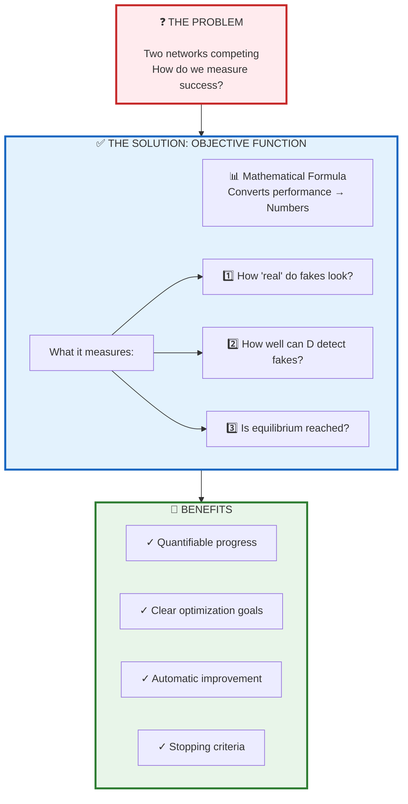
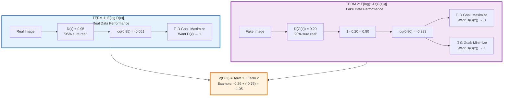
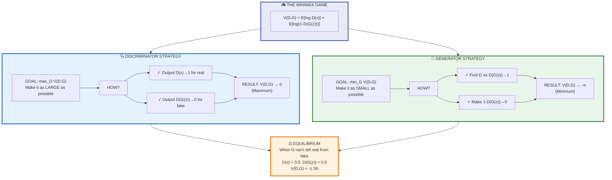
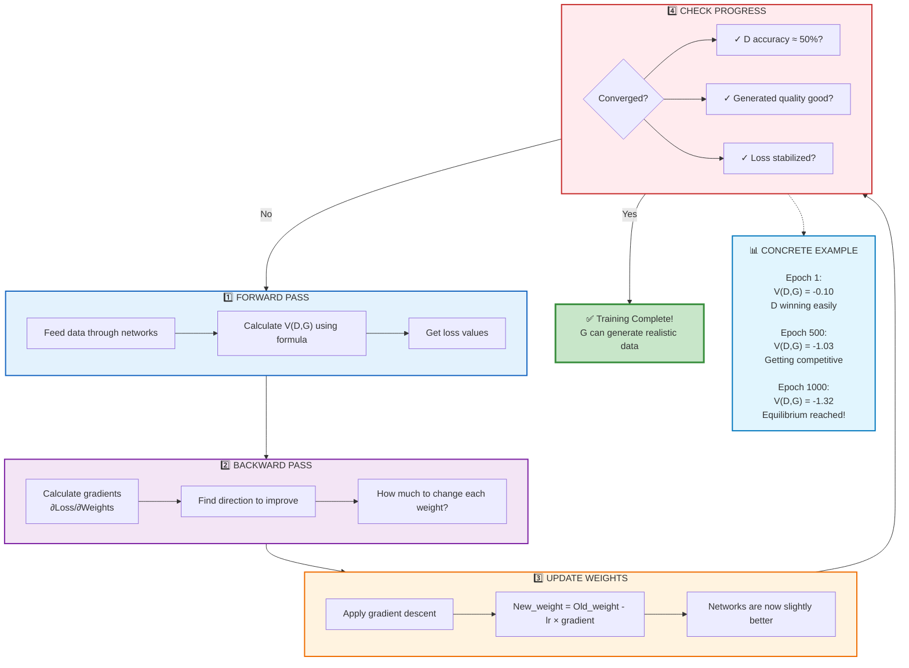
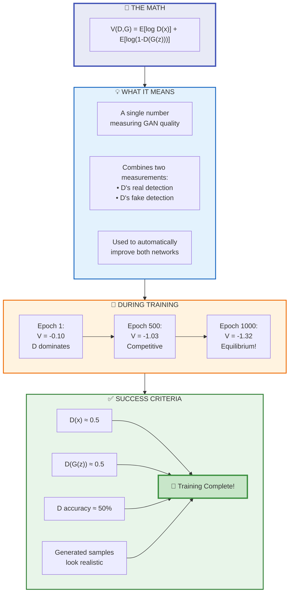

```mermaid
flowchart LR
    subgraph Variables["📝 VARIABLES"]
        V1["x<br/>Real Data<br/>🖼️ Real cat photo"]
        V2["z<br/>Random Noise<br/>🎲 [0.5, -0.3, ...]"]
        V3["G(z)<br/>Fake Data<br/>🎨 Generated cat"]
        V4["D(x)<br/>Score for Real<br/>🔍 0.95"]
        V5["D(G(z))<br/>Score for Fake<br/>🔍 0.20"]
    end
    
    subgraph Operators["⚙️ OPERATIONS"]
        O1["E[...]<br/>Average<br/>Over many samples"]
        O2["log<br/>Logarithm<br/>Measure 'surprise'"]
        O3["min_G<br/>Generator<br/>Minimize loss"]
        O4["max_D<br/>Discriminator<br/>Maximize detection"]
    end
    
    subgraph Result["🎯 RESULT"]
        R1["V(D,G)<br/>Overall Score<br/>Measures GAN quality"]
    end
    
    Variables --> Operators
    Operators --> Result
    
    style Variables fill:#e3f2fd,stroke:#1565c0,stroke-width:2px
    style Operators fill:#f3e5f5,stroke:#7b1fa2,stroke-width:2px
    style Result fill:#e8f5e9,stroke:#2e7d32,stroke-width:3px
```

# Revised Slide 8: Mathematical Foundation (Split into 5 Easy Slides)

---

## **Slide 8A: Why Do We Need Math for GANs?**

### Understanding the Need for Mathematics

**The Problem:**
We have two neural networks competing. How do we:
- Measure who is "winning"?
- Decide when to stop training?
- Know if the Generator is improving?
- Quantify the Discriminator's performance?

**The Solution: A Mathematical Objective Function**

Think of it like a **scoreboard in a game**:
- The scoreboard tells us the current score
- Each player tries to maximize their own score
- The game continues until equilibrium is reached

**What the Math Does:**
✅ Gives us a single number to measure performance
✅ Tells Generator how to improve
✅ Tells Discriminator how to improve
✅ Helps us know when training is complete

**Simple Analogy:**
- **Without math**: "This fake looks... pretty good, I guess?"
- **With math**: "Generator loss = 0.34, Discriminator accuracy = 52% → Nearly perfect!"

---

**Mermaid Diagram:**



---

## **Slide 8B: Breaking Down the Formula - Part by Part**

### The GAN Objective Function (Simplified Explanation)

**The Famous Formula:**
```
min_G max_D V(D,G) = E[log D(x)] + E[log(1-D(G(z)))]
```

**Don't panic! Let's break it into pieces:**

---

### **Part 1: The Variables (What Each Letter Means)**

| Symbol | Name | Simple Explanation | Example |
|--------|------|-------------------|---------|
| **x** | Real data | Actual samples from your dataset | Real photo of a cat |
| **z** | Random noise | Random numbers fed to Generator | [0.5, -0.3, 0.8, ...] |
| **G(z)** | Generated fake | Output from Generator given noise z | Fake cat photo created by G |
| **D(x)** | D's judgment on real | Probability that D thinks x is real | 0.95 = "95% sure it's real" |
| **D(G(z))** | D's judgment on fake | Probability that D thinks fake is real | 0.20 = "20% sure it's real" |

---

### **Part 2: The Mathematical Operations**

**E[...]** = Expected Value (Average)
- Don't calculate just one sample
- Average over many samples
- Makes the result more stable

**log** = Logarithm (Measuring information)
- Converts probabilities to "surprise" levels
- log(0.95) ≈ -0.05 (not surprised, it's real)
- log(0.05) ≈ -3.0 (very surprised, unusual)

**min_G** = Generator Minimizes
- G tries to make the function **smaller**

**max_D** = Discriminator Maximizes
- D tries to make the function **larger**

---

**Mermaid Diagram:**



---

## **Slide 8C: Understanding Each Term with Concrete Examples**

### The Two Parts of the Formula Explained

**The Complete Formula:**
```
V(D,G) = E[log D(x)] + E[log(1-D(G(z)))]
         └─────┬─────┘   └───────┬────────┘
           TERM 1          TERM 2
```

---

### **TERM 1: E[log D(x)]** - "Reward for Correct Real Detection"

**What it means:**
- D looks at **real data** (x)
- D outputs a probability: D(x)
- We take the log of this probability
- We average across all real samples

**Example with Numbers:**

| Real Image | D(x) Output | log D(x) | Interpretation |
|------------|-------------|----------|----------------|
| Cat photo #1 | 0.95 | -0.051 | D is confident it's real ✓ |
| Cat photo #2 | 0.88 | -0.128 | D is pretty sure it's real ✓ |
| Cat photo #3 | 0.50 | -0.693 | D is confused ✗ |

**Average (E):** (-0.051 + -0.128 + -0.693) / 3 = **-0.29**

**Goal for Discriminator:**
- When D correctly identifies real as real → D(x) close to 1 → log D(x) close to 0
- **Higher is better** for D
- D wants to **maximize** this term

---

### **TERM 2: E[log(1-D(G(z)))]** - "Reward for Correct Fake Detection"

**What it means:**
- G creates **fake data** G(z)
- D looks at the fake and outputs: D(G(z))
- We calculate: 1 - D(G(z))
- We take the log and average

**Example with Numbers:**

| Generated Fake | D(G(z)) Output | 1 - D(G(z)) | log(1-D(G(z))) | Interpretation |
|----------------|----------------|-------------|-----------------|----------------|
| Fake cat #1 | 0.20 | 0.80 | -0.223 | D correctly detects fake ✓ |
| Fake cat #2 | 0.15 | 0.85 | -0.163 | D is confident it's fake ✓ |
| Fake cat #3 | 0.85 | 0.15 | -1.897 | D got fooled! ✗ |

**Average (E):** (-0.223 + -0.163 + -1.897) / 3 = **-0.76**

**Goals:**
- **Discriminator wants to maximize** this (catch fakes → high 1-D(G(z)))
- **Generator wants to minimize** this (fool D → high D(G(z)) → low 1-D(G(z)))

---

**Mermaid Diagram:**



---

## **Slide 8D: The Minimax Game - Who Wants What?**

### Understanding "min_G max_D" - Opposite Goals

**The Complete Objective:**
```
min_G max_D V(D,G)
  ↑     ↑
  |     |
  |     └─ Discriminator wants to MAXIMIZE
  └─────── Generator wants to MINIMIZE
```

---

### **Discriminator's Perspective (Maximization)**

**D wants V(D,G) to be as LARGE as possible:**

✅ **When D is doing well:**
- D(x) close to 1 for real data → log D(x) ≈ 0 (large)
- D(G(z)) close to 0 for fake data → log(1-D(G(z))) ≈ 0 (large)
- **Total V(D,G) = close to 0 (maximum possible)**

❌ **When D is doing poorly:**
- D(x) = 0.5 for real data → log D(x) = -0.69
- D(G(z)) = 0.5 for fake data → log(1-D(G(z))) = -0.69
- **Total V(D,G) = -1.38 (bad for D)**

---

### **Generator's Perspective (Minimization)**

**G wants V(D,G) to be as SMALL as possible:**

✅ **When G is doing well (fooling D):**
- D(G(z)) close to 1 → (1 - D(G(z))) close to 0 → log(1-D(G(z))) = -∞ (very negative)
- **V(D,G) becomes very negative (good for G!)**

❌ **When G is doing poorly:**
- D(G(z)) close to 0 → (1 - D(G(z))) close to 1 → log(1-D(G(z))) = 0
- **V(D,G) stays close to 0 (bad for G)**

---

### **Real Training Example:**

| Epoch | D(x)<br/>(Real) | D(G(z))<br/>(Fake) | Term 1 | Term 2 | V(D,G) | Who's Winning? |
|-------|---------|------------|--------|--------|--------|----------------|
| 1 | 0.95 | 0.05 | -0.05 | -0.05 | **-0.10** | D winning (easy to detect) |
| 100 | 0.88 | 0.30 | -0.13 | -0.36 | **-0.49** | D still winning but harder |
| 500 | 0.65 | 0.55 | -0.43 | -0.60 | **-1.03** | Getting competitive |
| 1000 | 0.52 | 0.48 | -0.65 | -0.67 | **-1.32** | **Equilibrium! ✓** |

---

**Mermaid Diagram:**



---

## **Slide 8E: How Optimization Works in Practice**

### From Math to Actual Training

**The 3-Step Process:**

---

### **Step 1: Calculate the Loss (Use the Formula)**

```python
# Simplified pseudocode
real_loss = -log(D(real_images))        # Term 1
fake_loss = -log(1 - D(G(noise)))       # Term 2

# Discriminator wants to minimize negative V(D,G)
D_loss = real_loss + fake_loss

# Generator wants D to think fakes are real
G_loss = -log(D(G(noise)))
```

---

### **Step 2: Calculate Gradients (How to Improve)**

**Gradient = Direction to move weights**

For Discriminator:
- "If I increase weight W by 0.01, does D_loss decrease?"
- Calculate ∂(D_loss)/∂W for all weights
- This tells D how to update its parameters

For Generator:
- "If I change weight V by 0.01, does G fool D better?"
- Calculate ∂(G_loss)/∂V for all weights
- This tells G how to update its parameters

---

### **Step 3: Update Weights (Gradient Descent)**

```python
# Simplified weight update
D_weights = D_weights - learning_rate * D_gradient
G_weights = G_weights - learning_rate * G_gradient
```

**Real Example:**
- Learning rate = 0.0002
- D gradient for weight W₁ = 0.5
- New W₁ = Old W₁ - 0.0002 * 0.5 = Old W₁ - 0.0001

---

### **Complete Training Loop:**

```
FOR each epoch:
    # Step 1: Train Discriminator
    1. Sample real data and noise
    2. Calculate D_loss using objective function
    3. Compute gradients ∂(D_loss)/∂(D_weights)
    4. Update D_weights
    
    # Step 2: Train Generator
    5. Sample new noise
    6. Calculate G_loss using objective function
    7. Compute gradients ∂(G_loss)/∂(G_weights)
    8. Update G_weights
    
    # Step 3: Check convergence
    9. IF D_accuracy ≈ 50% AND quality good:
           STOP training
       ELSE:
           Continue to next epoch
```

---

**Mermaid Diagram:**



---

## **Slide 8F: Summary - The Math in Plain English**

### Key Takeaways from GAN Mathematics

**🎯 The Core Formula (One More Time):**
```
min_G max_D V(D,G) = E[log D(x)] + E[log(1-D(G(z)))]
```

---

### **Plain English Translation:**

**V(D,G)** = A number that measures how well the GAN is working

**E[log D(x)]** = "How good is D at recognizing real data?"
- Perfect: D(x) = 1, log(1) = 0
- Terrible: D(x) = 0.5, log(0.5) = -0.69

**E[log(1-D(G(z)))]** = "How good is D at detecting fakes?"
- Perfect: D(G(z)) = 0, so 1-0 = 1, log(1) = 0
- Fooled: D(G(z)) = 1, so 1-1 = 0, log(0) = -∞

**min_G max_D** = They have opposite goals
- D tries to push V(D,G) toward 0 (maximum)
- G tries to push V(D,G) toward -∞ (minimum)

---

### **What Success Looks Like:**

| Metric | Early Training | Mid Training | Success (Equilibrium) |
|--------|---------------|--------------|----------------------|
| D(x) | 0.95 | 0.75 | **0.52** |
| D(G(z)) | 0.05 | 0.35 | **0.48** |
| V(D,G) | -0.10 | -0.70 | **-1.32** |
| D Accuracy | 95% | 75% | **50%** ✓ |
| Interpretation | D dominates | Competitive | **Perfect balance** |

---

### **Why This Math Matters:**

✅ **Objective Measurement**: Numbers don't lie - we know exactly how well we're doing

✅ **Automatic Improvement**: Gradients tell us exactly how to improve

✅ **Scientific Comparison**: Can compare different GAN architectures objectively

✅ **Debugging**: When training fails, the math tells us where the problem is

---

### **Remember These Principles:**

1. **Higher D(x)** = D correctly identifies real data ✓
2. **Lower D(G(z))** = D correctly identifies fake data ✓
3. **Higher D(G(z))** = G successfully fools D ✓
4. **D(x) ≈ 0.5 and D(G(z)) ≈ 0.5** = Perfect equilibrium ✓

---

**Mermaid Diagram:**



---

## **Teaching Notes:**

### **Recommended Approach:**

1. **Slide 8A** (5 min): Motivate why we need math - make it relevant
2. **Slide 8B** (7 min): Explain variables slowly - ensure everyone understands notation
3. **Slide 8C** (8 min): Work through concrete examples - use real numbers
4. **Slide 8D** (6 min): Clarify the minimax game - emphasize opposite goals
5. **Slide 8E** (6 min): Show how it connects to actual training code
6. **Slide 8F** (3 min): Quick recap and Q&A

**Total: ~35 minutes for complete mathematical foundation**

### **Common Student Questions to Anticipate:**

❓ "Why logarithm and not just regular probabilities?"
💡 Answer: Log converts probabilities to "information" and makes gradients more stable

❓ "What if D(G(z)) = 0? Won't log(1-0) = log(1) = 0?"
💡 Answer: Exactly! That means D perfectly detected the fake - maximum score for D

❓ "Why does V(D,G) go negative?"
💡 Answer: Because log of values less than 1 is negative. The absolute value doesn't matter - we care about the trend (improving = more negative for G)

---

**Benefits of This Revised Structure:**

✅ **Progressive Complexity**: Start with motivation, build up gradually
✅ **Concrete Examples**: Real numbers make abstract concepts tangible
✅ **Visual Learning**: Mermaid diagrams for every concept
✅ **Practical Connection**: Shows how math connects to actual code
✅ **Student-Friendly**: Assumes no advanced math background
